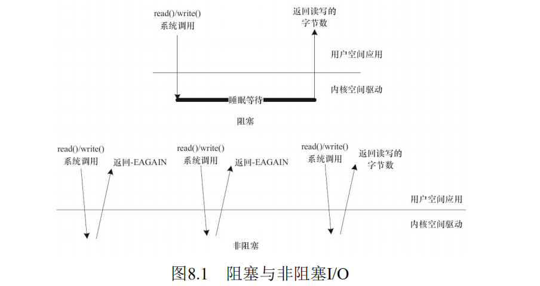
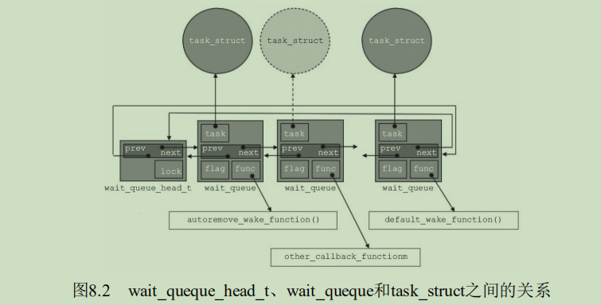

## 8.1 阻塞与非阻塞`I/O`

**`阻塞操作`**是指在执行设备操作时，若不能获得资源，则挂起进程直到满足可操作的条件后再进行操作。被挂起的进程进入睡眠状态，被从调度器的运行队列移走，直到等待的条件被满足。而**`非阻塞操作`**的进程在不能进行设备操作时，并不挂起，它要么放弃，要么不停地查询，直至可以进行操作为止。

驱动程序通常需要提供这样的能力：当应用程序进行read()、write()等系统调用时，若设备的资源不能获取，而用户又希望以阻塞的方式访问设备，驱动程序应在设备驱动的xxx_read()、xxx_write()等操作中将进程阻塞直到资源可以获取，此后，应用程序的read()、write()等调用才返回，整个过程仍然进行了正确的设备访问，用户并没有感知到；若用户以非阻塞的方式访问设备文件，则当设备资源不可获取时，设备驱动的xxx_read()、xxx_write()等操作应立即返回，read()、write()等系统调用也随即被返回，应用程序收到-EAGAIN返回值。

如图8.1所示，在阻塞访问时，不能获取资源的进程将进入休眠，它将CPU资源“礼让”给其他进程。因为阻塞的进程会进入休眠状态，所以必须确保有一个地方能够唤醒休眠的进程，否则，进程就真的“寿终正寝”了。唤醒进程的地方最大可能发生在中断里面，因为在硬件资源获得的同时往往伴随着一个中断。而非阻塞的进程则不断尝试，直到可以进行I/O。



下面的两段分别演示了以阻塞和非阻塞方式读取串口一个字符的代码。

```c
/// 阻塞地读串口一个字符
char buf;
fd = open("/dev/ttyS1", O_RDWR);
...
res = read(fd,&buf,1); /* 当串口上有输入时才返回 */
if(res==1)
printf("%c\n", buf);
```

```c
/// 非阻塞地读串口一个字符
char buf;
fd = open("/dev/ttyS1", O_RDWR| O_NONBLOCK); 
...
while(read(fd,&buf,1)!=1)
continue; /* 串口上无输入也返回，所以要循环尝试读取串口 */
printf("%c\n", buf);
```

除了在打开文件时可以指定阻塞还是非阻塞方式以外，在文件打开后，也可以通过ioctl()和fcntl()改变读写的方式，如从阻塞变更为非阻塞或者从非阻塞变更为阻塞。例如，调用fcntl(fd,F_SETFL，O_NONBLOCK)可以设置fd对应的I/O为非阻塞。

### 8.1.1 等待队列(`Wait Queue`)

在Linux驱动程序中，可以使用等待队列（Wait Queue）来实现阻塞进程的唤醒。等待队列很早就作为一个基本的功能单位出现在Linux内核里了，它以队列为基础数据结构，与进程调度机制紧密结合，可以用来同步对系统资源的访问，第7章中所讲述的信号量在内核中也依赖等待队列来实现。

Linux内核提供了如下关于等待队列的操作:

```c
//// 1.定义等待队列头部
wait_queue_head_t my_queue;

//// 2. 初始化等待队列头部
init_waitqueue_head(&my_queue);

//下面的DECLARE_WAIT_QUEUE_HEAD()宏可以作为定义并初始化等待队列头部的“快捷方式”
DECLARE_WAIT_QUEUE_HEAD(queue_name);

//// 3. 定义等待队列元素
DECLARE_WAITQUEUE(name, tsk); //该宏用于定义并初始化一个名为name的等待队列元素

//// 4. 向队列头添加/移除等待队列
void add_wait_queue(struct wait_queue_head *wq_head, struct wait_queue_entry *wq_entry);
void add_wait_queue_exclusive(struct wait_queue_head *wq_head, struct wait_queue_entry *wq_entry);
void remove_wait_queue(struct wait_queue_head *wq_head, struct wait_queue_entry *wq_entry);

//// 5. 等待事件
//等待以queue作为等待队列头部的队列被唤醒,而且condition必须被满足，否则继续阻塞
wait_event(queue, condition)
//wait_event与wait_event_interruptible具有同样的功能，区别在于后者可以被信号打断，而前者不能
wait_event_interruptible(queue, condition)

 /*
 加上timeout后的宏意味着阻塞等待的超时时间，以jiffy(0.01s)为单位，
 在第3个参数的timeout到达时，不论condition是否满足，均返回
 */
wait_event_timeout(queue, condition, timeout)
wait_event_interruptible_timeout(queue, condition, timeout)
 
//// 6. 唤醒队列
void wake_up(wait_queue_head_t *queue);
void wakeupinterruptible(wait_queue_head_t *queue);
/*
wake_up()应该与wait_event()或wait_event_timeout()成对使用，而wake_up_interruptible()则应与wait_event_interruptible()或wait_event_interruptible_timeout()成对使用。wake_up()可唤醒处于TASK_INTERRUPTIBLE和TASK_UNINTERRUPTIBLE的进程，而wake_up_interruptible()只能唤醒处于TASK_INTERRUPTIBLE的进程。
*/

//// 7. 在等待队列上睡眠
sleep_on(wait_queue_head_t *q );
interruptible_sleep_on(wait_queue_head_t *q );
/*
sleep_on()函数的作用就是将目前进程的状态置成 TASK_UNINTERRUPTIBLE，并定义一个等待队列，之后把它附属到等待队列头 q，直到资源可获得，q 引导的等待队列被唤醒。interruptible_sleep_on()与 sleep_on()函数类似，其作用是将目前进程的状态置成 TASK_INTERRUPTIBLE，并定义一个等待队列，之后把它附属到等待队列头 q，直到资源可获得，q 引导的等待队列被唤醒或者进程收到信号
*/
```

下面展示一个在设备驱动中使用等待队列的代码模版:

```c
/*
 在进行写I/O操作的时候，判断设备是否可写，如果不可写且为阻塞I/O，则进程睡眠并挂起到等待队列。
*/
static ssize_t xxx_write(struct file *file, const char *buffer, size_t count, loff_t *ppos)
{
    ...
    DECLARE_WAITQUEUE(wait, current); /* 定义等待队列元素 */
    add_wait_queue(&xxx_wait, &wait); /* 添加元素到等待队列 */
    /* 等待设备缓冲区可写 */
    do
    {
        avail = device_writable(...);
        if (avail < 0)
        {
            if (file->f_flags & O_NONBLOCK)
            { /* 非阻塞 */
                ret = -EAGAIN;
                goto out;
            }
            __set_current_state(TASK_INTERRUPTIBLE); /* 改变进程状态 */
            schedule();                              /* 调度其他进程执行 */
            if (signal_pending(current))  /* 如果是因为信号唤醒 */
            {
                ret = -ERESTARTSYS;
                goto out;
            }
        }
    } while (avail < 0);

    /* 写设备缓冲区 */
    device_write(...);
out : remove_wait_queue(&xxx_wait, &wait); /* 将元素移出xxx_wait指引的队列 */
    set_current_state(TASK_RUNNING);               /* 设置进程状态为TASK_RUNNING */
    return ret;
}
```

上面代码的几个要点如下:

`1.` 设备忙时, 如果是非阻塞访问(O_NONBLOCK被设置)，直接返回“-EAGAIN”。

`2.` 对于阻塞访问，会调用`__set_current_state(TASK_INTERRUPTIBLE)`进行进程状态切换并显示通过`schedule()`调度其他进程执行。

`3.` 醒来的时候要注意，由于调度出去的时候，进程状态是TASK_INTERRUPTIBLE，即浅度睡眠，所以唤醒它的有可能是信号，因此，我们首先通过signal_pending（current）了解是不是信号唤醒的，如果是，立即返回“-ERESTARTSYS”。

DECLARE_WAITQUEUE、add_wait_queue这两个动作加起来完成的效果如图8.2所示。在wait_queue_head_t 指向的链表上，新定义的wait_queue_entry元素被插入，而这个新插入的元素绑定了一个task_struct(当前做xxx_write的current，这也是DECLARE_WAITQUEUE使用“current”作为参数的原因)。



## 8.2 轮询操作

