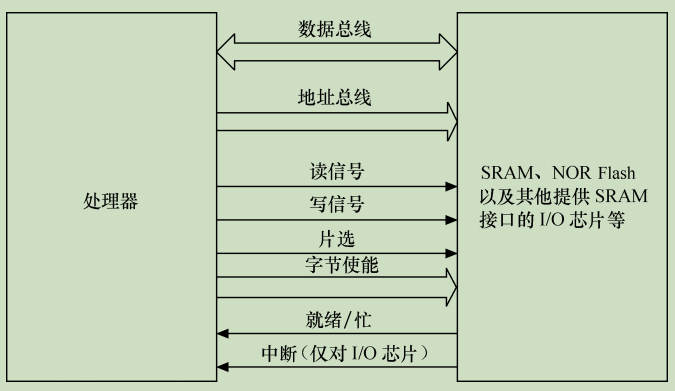
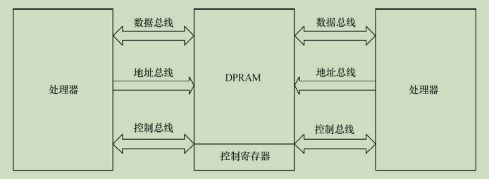
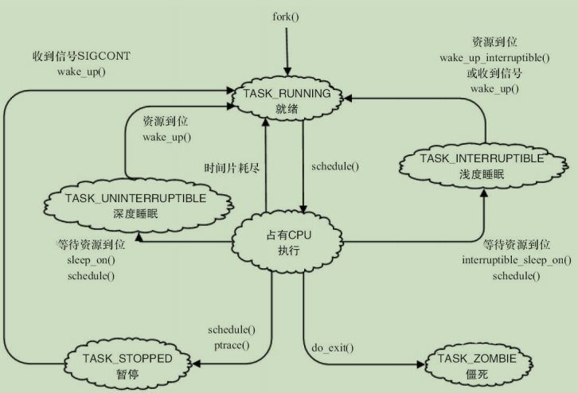
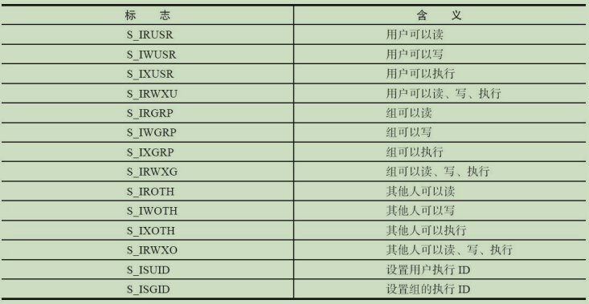
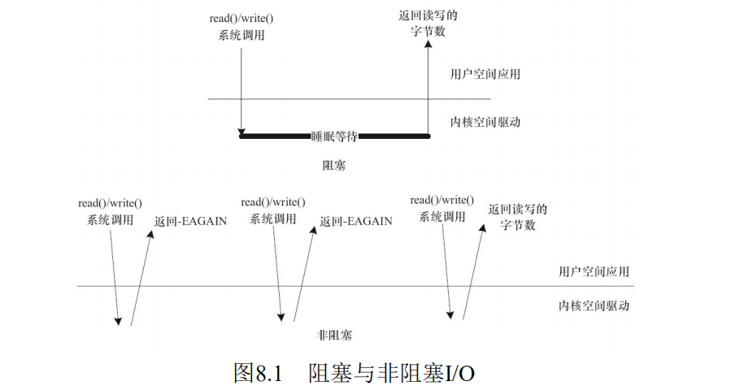

## 驱动开发概述

### 1.1 设备驱动的作用

对设备驱动最通俗的解释就是`驱使硬件设备行动`。

设备驱动程序的本质是实现逻辑设备到物理设备的转换，启动相应的`I/O设备`，发出 `I/O命令`，完成相应的 `I/O操作`，它是`内核`与`外围设备`数据交流的核心代码。

设备驱动程序为应用程序屏蔽了硬件的细节。

> 从应用程序看来，硬件设备只是一个设备文件，应用程序可以像跟操作普通文件一样对硬件设备进行操作。

驱动程序负责硬件和应用软件之间的沟通，而驱动工程师则负责硬件工程师和应用软件工程师之间的沟通。

### 1.2 无操作系统时的设备驱动

虽然不存在操作系统，但是设备驱动则无论如何都必须存在。

在没有操作系统的情况下，设备驱动的接口被直接提交给应用软件工程师，应用软件没有跨越任何层次就直接访问设备驱动的接口。驱动包含的接口函数也与硬件的功能直接吻合，没有任何附加功能。图1.1所示为无操作系统情况下硬件、设备驱动与应用软件的关系。

 

### 1.3 有操作系统时的设备驱动

当系统中存在操作系统的时候，驱动变成了连接硬件和内核的桥梁。如图1.4所示，操作系统的存在势必要求设备驱动附加更多的代码和功能，把单一的“驱使硬件设备行动”变成了操作系统内与硬件交互的模块，它对外呈现为操作系统的API，不再给应用软件工程师直接提供接口。

 

简而言之，操作系统通过给驱动制造麻烦来达到给上层应用提供便利的目的。当驱动都按照操作系统给出的独立于设备的接口而设计时，那么，应用程序将可使用统一的系统调用接口来访问各种设备。对于类UNIX的VxWorks、Linux等操作系统而言，当应用程序通过write（）、read（）等函数读写文件就可访问各种字符设备和块设备，而不论设备的具体类型和工作方式，那将是多么便利。

### 1.4 Linux设备驱动

#### 1.4.1 设备的分类及特点

计算机系统的硬件主要由CPU、存储器和外设组成。`驱动针对的对象是存储器和外设（包括CPU内部集成的存储器和外设）`，而不是针对CPU内核。

Linux将存储器和外设分为3个基础大类:

- 字符设备 `--` 是指那些必须以串行顺序依次进行访问的设备

  > 它不经过系统的快速缓存(自己负责管理自己的缓冲区结构)
  >
  > 比如：触摸屏、磁带驱动器、鼠标，串行口等

- 块设备　 `--` 可以按任意顺序进行访问，以`块`为单位在`内核地址空间中的IO缓冲区`进行操作

  > 比如： 硬盘、eMMC等

- 网络设备 `--` 面向数据包的接收和发送而设计，它并不倾向于对应于文件系统的节点。 内核与网络设备的通信主要还是`使用套接字接口`。

  > 在网络子系统和驱动程序之间定义有专门的数据结构(`sk_buff`)进行数据传递。

#### 1.4.2 Linux设备驱动和整个软硬件系统的关系

 

如图1.5所示，除网络设备外，字符设备与块设备都被映射到Linux文件系统的文件和目录，通过文件系统的系统调用接口open/write/read/close等即可访问字符设备和块设备。所有字符设备和块设备都统一呈现给用户。

Linux块设备有两种访问方法：

- > 一种是类似dd命令对应的`原始块设备`，如“/dev/sdb1”等；
- > 一种是在块设备上建立FAT、EXT4、BTRFS等文件系统，然后以文件路径 如“/home/barry/hello.txt”的形式进行访问。

在Linux中，Linux的虚拟文件系统(`VFS -- virtual filesystem`)对不同类型的块设备们进行了统一抽象,并

- > 针对NOR、NAND等提供了独立的内存技术设备(Memory Technology Device，MTD)子系统，其上运行YAFFS2、JFFS2、UBIFS等具备擦除和负载均衡能力的文件系统。
- > 针对磁盘或者Flash设备的FAT、EXT4、YAFFS2、JFFS2、UBIFS等文件系统定义了文件和目录在存储介质上的组织。

Linux网络设备不存在于Linux文件系统中，而是在内核中以一个device数据结构表示，称为网络接口(`network interface`)。

`比对:`

- > 对字符设备或块设备的访问：`--` 都需要通过文件操作界面；
- > 网络设备在做数据包发送和接收时，直接通过`接口`访问，不需要进行文件的操作。

应用程序可以使用Linux的系统调用接口编程，但也可使用C库函数。

> 出于代码可移植性的目的，后者更值得推荐。

## 驱动设计硬件基础

### 2.1 处理器(Processor)

#### 2.1.1 通用处理器(GPP `--` General Purpose Processor)

一般而言，在嵌入式微控制器（MCU）和微处理器（MPU）中会包含一个通用处理器核。

> - `MPU` 通常代表一个 CPU（中央处理器）;
> - 而 `MCU` 则强调把中央处理器、存储器和外围电路集成在一个芯片中。

一个典型的集成了外围电路的 MCU的结构图示如下:

 

目前主流的通用处理器（GPP）多采用`SoC（片上系统,在一个芯片上设计了整个系统）`的芯片设计方法，集成了各种功能模块，每一种功能都是由硬件描述语言设计程序，然后在SoC内由电路实现的。在SoC中，每一个模块不是一个已经设计成熟的ASIC器件，而是利用芯片的一部分资源去实现某种传统的功能，将各种组件采用类似搭积木的方法组合在一起。

ARM内核的设计技术被授权给数百家半导体厂商，做成不同的SoC芯片。很多ARM主控芯片的集成度非常高，除了集成多核ARM以外，还可能集成图形处理器、视频编解码器、浮点协处理器、GPS、WiFi、蓝牙、基带、Camera等一系列功能。

中央处理器的体系结构可以分为两类:

- 一类为冯·诺依曼(或**普林斯顿**)结构 `--`  将程序指令存储器和数据存储器合并在一起的存储器
- 一类为哈佛结构 `--` 将程序指令和数据分开存储，指令和数据可以有不同的数据宽度。

 

${ARM9^+}$ 系列的处理器已经是 切换到 改进后的 `哈佛结构` 了。

 

从指令集的角度来讲，中央处理器也可以分为两类：

- RISC（精简指令集计算机）`--`强调尽量减少指令集、指令单周期执行，但是目标代码会更大。

- CISC（复杂指令集计算机）`--` 强调增强指令的能力、减少目标代码的数量，但是指令复杂，指令周期长

> ARM、MIPS、PowerPC等CPU内核都采用了RISC指令集。目前，RISC和CSIC两者的融合非常明显。

#### 2.1.2 数字信号处理器(`DSP -- Digital Signal Processor`)

数字信号处理器`(DSP)`针对通信、图像、语音和视频处理等领域的算法而设计。它包含独立的硬件乘法器。DSP的乘法指令一般在单周期内完成，且优化了卷积、数字滤波、FFT（快速傅里叶变换）、相关矩阵运算等算法中的大量重复乘法。

DSP分为两类：

- 定点DSP `--`  用定点运算模拟浮点运算。
- 浮点DSP `--` 浮点运算用硬件来实现，可以在单周期内完成

网络处理器是一种可编程器件，它应用于电信领域的各种任务，如包处理、协议分析、路由查找、声音/数据的汇聚、防火墙、QoS 等。网络处理器器件内部通常由若干个微码处理器和若干硬件协处理器组成，多个微码处理器在网络处理器内部并行处理，通过预先编制的微码来控制处理流程。而对于一些复杂的标准操作（如内存操作、路由表查找算法、QoS 的拥塞控制算法、流量调度算法等）则采用硬件协处理器来进一步提高处理性能，从而实现了业务灵活性和高性能的有机结合。

对于某些应用场合，使用 ASIC（专用集成电路）往往是低成本且高性能的方案。ASIC 专门针对特定应用而设计，不具备也不需要灵活的编程能力。

常见的术语：

| 术语名 | 解释                                      |
| ------ | ----------------------------------------- |
| `ASIC` | 专用集成电路                              |
| `ASP`  | 专用处理器                                |
| `LUT`  | 查找表(`LookUp Table`)                    |
| `DSC`  | 数字信号控制器（`MCU` + `DSP`）           |
| `GPU`  | 图形处理单元（`Graphic Processing Unit`） |
| `ISP`  | 图像信号处理器(`Image Signal Processor`)  |

#### 2.1.3 处理器分类总结

 

### 2.2 存储器

存储器主要可分类为`只读储存器（ROM）`、`闪存（Flash）`、`随机存取存储器（RAM）`、`光/磁介质储存器`。

目前 ROM 有被 Flash 替代的趋势，Flash闪存分为`NOR(或非) Flash` 和 `NAND(与非) Flash` 两种。

> - Intel 于 1988 年首先开发出 NOR Flash 技术
> - 1989 年，东芝公司发表了 NAND Flash 结构

NOR Flash 和 CPU 的接口属于典型的类 SRAM 接口，不需要增加额外的控制电路。

 

NOR Flash 的特点是可芯片内执行（XIP，eXecute In Place），`程序可以直接在 NOR 内运行`。而 NAND Flash 和 CPU 的接口必须由相应的控制电路进行转换，当然也可以通过地址线或 GPIO 产生 NAND Flash 接口的信号。`NAND FLASH 以块方式进行访问，不支持芯片内执行`。

一个NAND Flash的接口主要包含如下信号: 

NAND Flash 较 NOR Flash 容量大，价格低；NAND Flash 中每个块的最大擦写次数是一百万次，而 NOR 的擦写次数是十万次；NAND Flash 的擦除、编程速度远超过 NOR Flash。NAND Flash 发生位反转的几率要远大于 NOR Flash。位反转无法避免，因此，使用 NAND Flash 的同时，应采用`错误探测/错误更正（EDC/ECC）算法`。

Flash的编程原理都是**只能将1写为0，而不能将0写为1**。因此在Flash编程之前，必须将对应的块擦除，而擦除的过程就是把所有位都写为1的过程，块内的所有字节变为0xFF。

许多嵌入式系统都提供了 IDE（Integrated Drive Electronics）接口，以供连接硬盘控制器或光驱，`IDE 接口的信号与 SRAM 类似`。

以上所述的各种ROM、Flash和磁介质存储器都属于`非易失性存储器（NVM）`的范畴，掉电时信息不会丢失，而RAM则与此相反。

RAM也可再分为:

- 静态RAM（SRAM）`--` 是静态的， 只要供电它就会保持一个值，SRAM没有刷新周期。

  > SRAM每个SRAM存储单元由6个晶体管组成

- 动态RAM（DRAM）`--` 以电荷形式进行存储，数据存储在电容器中。由于电容器会因漏电而出现电荷丢失，所以DRAM器件需要定期刷新。

  > - 而DRAM存储单元由1个晶体管和1个电容器组成。

> 通常所说的SDRAM、DDR SDRAM皆属于DRAM的范畴，它们采用与`CPU外存控制器`同步的时钟工作.
>
> 与SDRAM相比，DDR SDRAM同时利用了时钟脉冲的上升沿和下降沿传输数据，因此在时钟频率不变的情况下，数据传输频率加倍。

#### 2.2.1 特定类型的RAM

- `DPRAM：双端口RAM`  可以通过两个端口同时访问，具有两套完全独立的数据总线、地址总线和读写控制线，通常用于两个处理器之间交互数据，如图2.6所示。

 

- `CAM: 内容寻址RAM`  一种特殊的存储阵列RAM，它的主要工作机制就是同时将一个输入数据项与存储在CAM中的所有数据项自动进行比较，判别该输入数据项与CAM中存储的数据项是否相匹配，并输出该数据项对应的匹配信息。

 

- `FIFO -- 先进先出队列`  是先进先出，进出有序，FIFO多用于数据缓冲。

#### 2.2.2 存储器分类总结

 

### 2.3 接口与总线

#### 2.3.1 串口

`RS-232`、`RS-422` 与 `RS-485` 都是串行数据接口标准，最初都是由电子工业协会（EIA）制订并发布的。

1969 年发布的 RS-232 修改版`RS-232C`是嵌入式系统中应用最广泛的串行接口，它为连接DTE（数据终端设备）与DCE（数据通信设备）而制定。

RS-232C标准接口常用的9根信号为:

 

在嵌入式系统中，并不太注重 DTE 和 DCE 的概念，多使用 RS-232C 进行对等通信，如 Windows 超级终端、Linux minicom 用来连接电路板控制台等。 组成一个RS-232C串口的硬件原理如下图：

 

依次为CPU、UART（通用异步接收器发送器，作用是完成并/串转换）、CMOS/TTL电平与RS-232C电平转换、DB9/DB25或自定义连接器。

#### 2.3.2  通用串行总线(`USB,Universal Serial Bus`)

USB（通用串行总线）是 Intel、Microsoft 等厂商为解决计算机外设种类的日益增加与有限的主板插槽和端口之间的矛盾而于 1995 年提出的，它具有`数据传输率高`、`易扩展`、`支持即插即用`和`热插拔`的优点，目前已得到广泛应用。

- USB 1.1 : `低速模式(1.5Mbit/s)` 和 `全速模式(12Mbit/s)`
- USB 2.0 : 新增 `高速模式(480Mbit/s;半双工)`
- USB 3.0 (Super Speed USB) `5.0 Gbit/s;全双工`

USB 的物理拓扑结构如图：

 

在嵌入式系统中，电路板若需要挂接 USB 设备（device），则需提供 USB 主机（host）控制器和连接器；若电路板需要作为 USB 设备，则需提供 USB 设备适配器和连接器。有的 MCU 集成了 USB 主机控制器和设备适配器。

USB 总线的机械连接非常简单,采用 4 芯的屏蔽线`一对差分线（D+，D-）传送信号`，`一对（VBUS，电源地）传送+5V 的直流电`。

USB 提供了 4 种传输方式以适应各种设备的需要：

- `控制（Control）传输方式` 双向传输，数据量通常较小，主要用来进行查询、配置和给 USB 设备发送通用的命令
- `同步（Synchronization）传输方式` 提供了确定的带宽和间隔时间
- `中断（Interrupt）传输方式` 单向的，对于 USB 主机而言，只有输入。主要应用在少量的、分散的、不可预测的数据传输场合，键盘、游戏杆和鼠标属于这一类型。
- `批量（Bulk）传输方式` 主要应用在没有带宽和间隔时间要求的批量数据的传送和接收，它要求保证传输质量。打印机和扫描仪属于这种类型

#### 2.3.3 以太网接口

以太网接口由 `MAC (以太网接入控制器)` 和 `PHY(物理接口收发器)` 组成。以太网MAC由 `IEEE 802.3` 以太网标准定义，实现了数据链路层;PHY则实现了物理层功能。

> 目前常用的MAC支持`100Mbit/s` 和`1000 Mbit/s` 两种速率。

MAC和PHY之间采用MII（媒体独立接口）连接，包括1个数据接口与MAC和PHY之间的1个管理接口。

数据接口包括分别用于发送和接收的两条独立信道,每条信道都有自己的数据、时钟和控制信号,MII数据接口总共需要16个信号。

MII管理接口包含两个信号，一个是时钟信号，另一个是数据信号。通过管理接口，上层能监视和控制PHY。
一个以太网接口的硬件电路原理如下图：(依次为`CPU、MAC、PHY、以太网隔离变压器、RJ45插座`)

 

> 以太网隔离变压器是以太网收发芯片与连接器之间的磁性组件，在其两者之间起着信号传输、阻抗匹配、波形修复、信号杂波抑制和高电压隔离作用。

#### 2.3.4  PCI 和 PCIe

PCI(外围部件互连,`Peripheral Component Interconnection`)是由 Intel 于 1991 年推出的一种局部总线，作为一种通用的总线接口标准，它在目前的计算机系统中得到了非常广泛的应用。PCI 提供了一组完整的总线接口规范，其目的是描述如何将计算机系统中的外围设备以一种结构化和可控化的方式连接在一起，给出了外围设备在连接时的电气特性和行为规约，并且详细定义了计算机系统中的各个不同部件之间应该如何正确地进行交互。PCI 总线具有如下特点：

- 数据总线 32 位，可扩充到 64 位

- 可进行突发（burst）模式传输

  > 突发方式传输是指取得总线控制权后连续进行多个数据的传输。
  >
  > 与突发方式对应的是`单周期方式`，它在1个总线周期只传送1个数据。

- 总线操作与处理器-存储器子系统操作并行

- 总线时钟频率为 33MHz 或 66MHz，最高传输率可达 528MB/s

- 采用中央集中式总线仲裁

- 支持全自动配置、资源分配，PCI 卡内有设备信息寄存器组为系统提供卡的信息，可实现即插即用

- PCI 总线规范独立于微处理器，通用性好

- PCI 设备可以完全作为主控设备控制总线

一个典型的基于 PCI 总线的计算机系统逻辑示意图如下：

 

`当 PCI 卡刚加电时，卡上只有配置空间是可被访问的`，因而 PCI 卡开始不能由驱动或用户程 序访问，这与 ISA 卡有本质的区别（CPU 可直接读取 ISA 卡在存储空间或 I/O 空间映射的地址）。PCI 配置空间保存着该卡工作所需的所有信息，如厂家、卡功能、资源要求、处理能力、功能模块数量、主控卡能力等。通过对这个空间信息的读取与编程，可完成对 PCI 卡的配置。

`PCI-E（PCI Express）`是Intel公司提出的新一代的总线接口，PCI Express采用了目前业内流行的点对点串行连接，比起PCI以及更早的计算机总线的共享并行架构，**每个设备都有自己的专用连接，采用串行方式传输数据，不需要向整个总线请求带宽，并可以把数据传输率提高到一个很高的频率**，达到PCI所不能提供的高带宽。

PCI Express在软件层面上兼容目前的PCI技术和设备，支持PCI设备和内存模组的初始化，也就是说无须推倒目前的驱动程序、操作系统，就可以支持PCI Express设备。

#### 2.3.5 SD和SDIO

`SD（Secure Digital）`是一种关于Flash存储卡的标准，也就是一般常见的SD记忆卡，在设计上与`MMC（Multi-Media Card）`保持了兼容。`SDHC（SD High Capacity）`是大容量SD卡，支持的最大容量为32GB。2009年发布的`SDXC（SD eXtended Capacity）`则支持最大2TB大小的容量。

`SDIO（Secure Digital Input and Output Card，安全数字输入输出卡）`在SD标准的基础上，定义了除存储卡以外的外设接口。SDIO主要有两类应用——可移动和不可移动。不可移动设备遵循相同的电气标准，但不要求符合物理标准。现在已经有非常多的手机或者手持装置都支持SDIO的功能，以连接WiFi、蓝牙、GPS等模块。

一般情况下，芯片内部集成的SD控制器同时支持MMC、SD卡，又支持SDIO卡。

> SD和SDIO的协议还是有不一样的地方，支持的命令也会有不同。

SD/SDIO的传输模式有：`SPI模式`、 `1位模式`、 `4位模式`

下表显示了SDIO接口的引脚定义:


其中: CLK为时钟引脚，每个时钟周期传输一个命令或数据位；CMD是命令引脚，命令在CMD线上串行传输，是双向半双工的（命令从主机到从卡，而命令的响应是从卡发送到主机）；`DAT[0]~DAT[3]`为数据线引脚；；在SPI模式中，第8脚位被当成中断信号。

一个SDIO单模块读、写的典型时序如下图：

 

`eMMC（Embedded Multi Media Card）`是当前移动设备本地存储的主流解决方案，目的在于简化手机存储器的设计。

eMMC就是NAND Flash、闪存控制芯片和标准接口封装的集合，它把NAND和控制芯片直接封装在一起成为一个多芯片封装（Multi-Chip Package，MCP）芯片。

eMMC支持DAT[0]~DAT[7]8位的数据线。上电或者复位后，默认处于1位模式，只使用DAT[0]，后续可以配置为4位或者8位模式。

### 2.4 原理图分析

原理图分析的含义是指通过阅读电路板的原理图获得各种存储器、外设所使用的硬件资源，主要包括存储器和外设控制芯片所使用的片选、中断和 DMA 资源。

若要整体理解整个电路板的硬件组成，原理图的分析方法是以主CPU为中心向存储器和外设辐射，步骤如下。

1. 阅读CPU部分，获知CPU的哪些片选、中断和集成的外设控制器在使用，列出这些元素a、b、c、…。
2. 对第1步中列出的元素，从原理图中对应的外设和存储器电路中分析出实际的使用情况。

硬件原理图中包含如下元素:

- `符号（symbol）`。符号描述芯片的外围引脚以及引脚的信号，对于复杂的芯片，可能会被分割为几个符号。

  > 在符号中，一般把属于同一个信号群的引脚排列在一起。

- `网络（net）`。描述芯片、接插件和分离元器件引脚之间的互连关系，每个网络需要根据信号的定义赋予一个合适的名字

  > 如果没有给网络取名字，EDA软件会自动添加一个默认的网络名。

- `描述(description)` 原理图中会添加一些文字来辅助描述原理图（类似源代码中的注释），如每页页脚会有该页的功能描述，对重要的信号，在原理图的相应符号和网络中也会附带文字说明。

### 2.5 硬件时序图

对驱动工程师或硬件工程师而言，时序分析的意思是让芯片之间的访问满足芯片数据手册中时序图信号有效的先后顺序、采样建立时间（Setup Time）和保持时间（Hold Time）的要求，在电路板工作不正常的时候，准确地定位时序方面的问题。

`建立时间`是指在触发器的时钟信号边沿到来以前，数据已经保持稳定不变的时间

> 如果建立时间不够，数据将不能在这个时钟边沿被打入触发器；

`保持时间`是指在触发器的时钟信号边沿到来以后，数据还需稳定不变的时间

> 如果保持时间不够，数据同样不能被打入触发器。

#### 2.5.1 典型的硬件时序

最典型的硬件时序是SRAM的读写时序，在读/写过程中涉及的信号包括地址、数据、片选、读/写、字节使能和就绪/忙。

> 对于一个16位、32位（甚至64位）的SRAM，字节使能表明哪些字节被读写。

 

上图给出了SRAM的读时序，写时序与此相似。

`首先`，地址总线上输出要读（写）的地址，`然后`发出SRAM片选信号，`接着`输出读（写）信号，`之后`读（写）信号要经历数个等待周期。

当SRAM读（写）速度比较慢时，等待周期可以由MCU的相应寄存器设置，也可以通过设备就绪/忙向CPU报告，这样，读写过程中会自动添加等待周期。

### 2.6 仪器仪表使用

#### 2.6.1 万用表

主要使用万用表两个功能：

- 测量电平
- 使用二极管档 测量电路板上网络的连通性(`连通的网络会发声`)

#### 2.6.2 示波器

示波器是利用电子示波管的特性，将人眼无法直接观测的交变电信号转换成图像，显示在荧光屏上以便测量的电子仪器。它是观察数字电路实验现象、分析实验中的问题、测量实验结果必不可少的重要仪器。

`奈奎斯特定理（即为采样定理）`，指当采样频率fsmax大于信号中最高频率fmax的两倍时，即fsmax≥2fmax时，采样之后的数字信号可完整地保留原始信息。

> 这条定理在信号处理领域中的地位相当高，大致相当于物理学领域中的牛顿定律。

#### 2.6.3 逻辑分析仪

逻辑分析仪是利用时钟从测试设备上采集数字信号并进行显示的仪器，其最主要的作用是用于时序的判定。

## Linux内核及内核编程

### 3.1 Linux 2.6 后的内核特点

- `新的调度器` Linux2.6 早期采用了`O(1)` 算法，之后转移到 `CFS算法(（Completely Fair Scheduler，完全公平调度)`。Linux 3.14中实现了`EDF（Earliest Deadline First，最早截止期限优先）`调度算法。

- `内核抢占` 在Linux 2.6以后版本的Linux内核中，一个内核任务可以被抢占，从而提高系统的实时性。

- `改进的线程模型` Linux 2.6以后版本中的线程采用`NPTL（Native POSIX Thread Library，本地POSIX线程库）模型`，操作速度得以极大提高。NPTL没有使用LinuxThreads模型中采用的管理线程，内核本身也增加了FUTEX（Fast Userspace Mutex，快 速用户态互斥体），从而减小多线程的通信开销。

- `虚拟内存的变化` 新内核融合了r-map（反向映射）技术，通过页结构体快速寻找到页面的映射。

- `文件系统` 增加了对日志文件系统功能的支持，增加了对扩展属性的支持，可以给指定的文件在文件系统中嵌入元数据。

- `音频` 采用高级Linux音频体系结构（Advanced Linux Sound Architecture，ALSA），ALSA支持USB音频和MIDI设备，并支持全双工重放等功能。

- `总线、设备和驱动模型` 在Linux 2.6以后的内核中，总线、设备、驱动三者之间因为一定的联系性而实现对设备的控制。总线是三者联系起来的基础，通过一种总线类型，将设备和驱动联系起来。总线类型中的match（）函数用来匹配设备和驱动，当匹配操作完成之后就会执行驱动程序中的probe（）函数。

- `电源管理` 支持高级配置和电源接口（Advanced Configuration and Power Interface，ACPI），用于调整CPU在不同的负载下工作于不同的时钟频率以降低功耗。

   > 目前，Linux内核的电源管理（PM）相对比较完善了，包括CPUFreq、CPUIdle、CPU热插拔、设备运行时PM、Linux系统挂起到内存和挂起到硬盘等全套的支持，在ARM上的支持也较完备。

- `联网和IPSec` Linux 2.6内核中加入了对IPSec的支持，加入了对新的NFSv4（网络文件系统）客户机/服务器的支持，并改进了对IPv6的支持。

- `用户界面层` Linux 2.6内核重写了帧缓冲/控制台层，人机界面层还加入了对近乎所有接口设备的支持。在内核API中增加了不

   少新功能（例如内存池）、sysfs文件系统、内核模块从.o变为.ko、驱动模块编译方式、模块使用计数、模块加载和卸载函数的定义等方面。

- `Linux 3.0后ARM架构的变更` ARM Linux的代码在时钟、DMA、pinmux、计时器刻度等诸多方面都进行了优化和调整，也删除了arch/arm/mach-xxx/include/mach头文件目录，以至于Linux 3.7以后的内核可以支持多平台，即用同一份内核镜像运行于多家SoC公司的多个芯片，实现“一个Linux可适用于所有的ARM系统” 。

### 3.2 Linux内核的组成

#### 3.2.1 Linux内核源代码的目录结构


内核一般要做到drivers与arch的软件架构分离，驱动中不包含板级信息，让驱动跨平台。同时内核的通用部分（如kernel、fs、ipc、net等）则与具体的硬件（arch和drivers）剥离。

#### 3.3.2 Linux内核的组成部分

 

如上图所示，Linux内核主要由`进程调度`、`内存管理`、`虚拟文件系统`、`网络接口`和`进程间通信`5个子系统组成。

##### 3.2.2.1 进程调度（`SCHED`）

进程调度控制系统中的多个进程对CPU的访问，使得多个进程能在CPU中“`微观串行，宏观并行`”地执行。

进程调度处于系统的中心位置，内核中其他的子系统都依赖它，因为每个子系统都需要挂起或恢复进程。

Linux进程在几个状态间进行切换如下：

 

在设备驱动编程中，当请求的资源不能得到满足时，驱动一般会调度其他进程执行，并使本进程进入睡眠状态，直到它请求的资源被释放，才会被唤醒而进入就绪状态。

> 睡眠分成可中断的睡眠和不可中断的睡眠，两者的区别在于可中断的睡眠在收到信号的时候会醒。
> 完全处于TASK_UNINTERRUPTIBLE 状态的进程甚至都无法被“杀死” ，所以Linux 2.6.26之后的内核也存在一种TASK_KILLABLE的状态，它等于“TASK_WAKEKILL|TASK_UNINTERRUPTIBLE” ，可以响应致命信号。

在Linux内核中，使用 `task_struct` 结构体来描述进程，该结构体中包含描述该进程内存资源、文件系统资源、文件资源、tty资源、信号处理等的指针。Linux的线程采用轻量级进程模型来实现，在用户空间通过 `pthread_create()` API创建线程的时候，本质上内核只是创建了一个新的task_struct，并将新task_struct的所有资源指针都指向创建它的那个task_struct的资源指针。

绝大多数进程（以及进程中的多个线程）是由用户空间的应用创建的，当它们存在底层资源和硬件访问的需求时，会通过系统调用进入内核空间。有时候，在内核编程中，如果需要几个并发执行的任务，可以启动内核线程，这些线程没有用户空间。启动内核线程的函数为：

>`pid_t kernel_thread(int (*fn)(void *), void *arg, unsigned long flags);`

##### 3.2.2.2 内存管理(`MM`)

内存管理的主要作用是控制多个进程安全地共享主内存区域。当CPU提供内存管理单元（MMU）时，Linux内存管理对于每个进程完成从虚拟内存到物理内存的转换。`Linux 2.6引入了对无MMU CPU的支持`。

 

如上图所示，一般而言，32位处理器的Linux的每个进程享有4GB的内存空间，`0~3GB`属于用户空间，`3~4GB`属于内核空间，内核空间对常规内存、I/O设备内存以及高端内存有不同的处理方式。

> 当然，内核空间和用户空间的具体界限是可以调整的，在内核配置选项`Kernel Features --> Memory split`下，可以设置界限为2GB或者3GB。

 

如上图所示，Linux内核的内存管理总体比较庞大，包含底层的Buddy算法，它用于`管理每个页的占用情况`，`内核空间的slab`以及`用户空间的C库的二次管理`。另外，内核也提供了页缓存的支持，用内存来缓存磁盘，per-BDIflusher线程用于刷回脏的页缓存到磁盘。Kswapd（交换进程）则是Linux中用于页面回收（包括file-backed的页和匿名页）的内核线程，它采用`最近最少使用（LRU）算法`进行内存回收。

##### 3.2.2.3 虚拟文件系统(`VFS`)

 

Linux虚拟文件系统隐藏了各种硬件的具体细节，为所有设备提供了统一的接口。而且，它独立于各个具体的文件系统，是对各种文件系统的一个抽象。它为上层的应用程序提供了统一的vfs_read（）、vfs_write（）等接口，并调用具体底层文件系统或者设备驱动中实现的file_operations结构体的成员函数。

##### 3.2.2.4 网络接口(`NET`)

 

网络接口提供了对各种网络标准的存取和各种网络硬件的支持。如上图所示，在Linux中网络接口可分为：

- `网络协议部分`负责实现每一种可能的网络传输协议
- `网络设备驱动程序`负责与硬件设备通信，`每一种可能的硬件设备都有相应的设备驱动程序`。

Linux内核支持的协议栈种类较多, 上层的应用程序统一使用 `BSD套接字` 接口。

##### 3.2.2.5 进程间通信(`IPC`)

Linux提供了多种通信机制来支持进程间通信，包含：`信号量`、`共享内存`、`消息队列`、`管道`、`UNIX域套接字`等，这些机制可协助多个进程、多资源的互斥访问、进程间的同步和消息传递。

> 在实际的Linux应用中，人们更多地趋向于使用UNIX域套接字，而不是System V IPC中的消息队列等机制。Android内核则新增了`Binder`进程间通信方式。

Linux内核5个组成部分之间的依赖关系如下。

- `SCHED`与`MM`：这两个子系统互相依赖。在多程序环境下，程序要运行，则必须为之创建进程，而创建进程的第一件事情，就是将程序和数据装入内存。
- `IPC`与`MM`：进程间通信子系统要依赖内存管理支持共享内存通信机制，这种机制允许两个进程除了拥有自己的私有空间之外，还可以存取共同的内存区域。
- `VFS`与`NET`：虚拟文件系统利用网络接口支持网络文件系统（NFS），也利用内存管理支持RAMDISK设备。
- `MM`与`VFS`：内存管理利用虚拟文件系统支持交换，交换进程定期由调度程序调度，这也是内存管理依赖于进程调度的原因。当一个进程存取的内存映射被换出时，内存管理向虚拟文件系统发出请求，同时，挂起当前正在运行的进程。

除了这些依赖关系外，内核中的所有子系统还要依赖于一些共同的资源。这些资源包括所有子系统都用到的API，如分配和释放内存空间的函数、输出警告或错误消息的函数及系统提供的调试接口等。

#### 3.2.3 Linux 内核空间与用户空间

现代CPU内部往往实现了不同操作模式(级别)，不同模式有不同功能，高层程序往往不能访问低级功能，而必须以某种方式切换到低级模式。例如，ARM处理器分为7种工作模式。

- `用户模式(usr)`：大多数应用程序运行在此模式下,当处理器运行在此模式下时,某些被保护的系统资源是不能访问的。
- `快速中断模式(fiq)`：用于高速数据传输或通道处理。
- `外部中断模式(irq)`：用于通用的中断处理。
- `管理模式(svc)`：操作系统使用的保护模式。
- `数据访问中止模式(abt)`：当数据或指令预取中止时进入该模式，可用于虚拟存储及存储保护。
- `系统模式(sys)`:  运行具有特权的操作系统任务。
- `未定义指令中止模式(und)`:  当未定义的指令执行时进入该模式，可用于支持硬件协处理器的软件仿真。

ARM Linux的系统调用实现原理是: **采用swi软中断从用户(usr)模式陷入管理模式(svc)**。

又如，x86处理器包含4个不同的特权级，称为`Ring0 ~ Ring3`。

> 在`Ring0`下，可以执行特权级指令，对任何`I/O设备`都有访问权等，而`Ring3`则被限制很多操作。

Linux系统可充分利用CPU的这一硬件特性(`不同操作模式`)，但它只使用了`两级`。在Linux系统中，内核可进行任何操作，而应用程序则被禁止对硬件的直接访问和对内存的未授权访问。

例如，若使用x86处理器，则用户代码运行在特权级3，而系统内核代码则运行在特权级0。

内核空间和用户空间这两个名词用来区分程序执行的两种不同状态，它们使用不同的地址空间。Linux只能通过`系统调用`和`硬件中断`完成从用户空间到内核空间的控制转移。

### 3.3 Linux 内核的编译及加载

#### 3.3.1 Linux内核的编译

Linux驱动开发者需要牢固地掌握Linux内核的编译方法以为嵌入式系统构建可运行的Linux操作系统映像。

```bash
#### 配置内核
make config     #基于文本的最为传统的配置界面，不推荐使用
make menuconfig #基于文本菜单的配置界面(推荐使用)
make xconfig    #要求QT被安装
make gconfig    #要求GTK+被安装

#### 编译内核和模块
make zImage
make modules
```

#### 3.3.2 Linux内核的引导

引导Linux系统的过程包括很多阶段，这里将以引导ARM Linux为例来进行讲解(见下图)：

 

一般的SoC内嵌入了bootrom，上电时bootrom运行。对于CPU0而言，bootrom会去引导bootloader，而其他CPU则判断自己是不是CPU0，进入WFI的状态等待CPU0来唤醒它。CPU0引导bootloader，bootloader引导Linux内核，在内核启动阶段，CPU0会发中断唤醒CPU1，之后CPU0和CPU1都投入运行。CPU0会引起用户空间的init程序被调用，init程序再派生其他进程，派生出来的进程再派生其他进程。CPU0和CPU1共担这些负载，进行负载均衡。

bootrom是各个SoC厂家根据自身情况编写的，目前的SoC一般都具有从SD、eMMC、NAND、USB等介质启动的能力，这证明这些`bootrom内部的代码具备读SD、NAND等能力`。嵌入式Linux领域最著名的bootloader是`U-Boot`。在ARM Linux支持设备树（Device Tree）后，bootloader则需要把dtb的地址放入r2寄存器中。当然，ARM Linux也支持直接把dtb和zImage绑定在一起的模式（内核ARM_APPENDED_DTB选项“Use appended device tree blob to zImage”），这样r2寄存器就不再需要填充dtb地址了。

类似zImage的内核镜像实际上是由没有压缩的解压算法和被压缩的内核组成，所以在bootloader跳入zImage以后，它自身的解压缩逻辑就把内核的镜像解压缩出来了。

用户空间的init程序常用的有busybox init、SysVinit、systemd等，它们的职责类似，把整个系统启动，最后形成一个进程树。

#### 3.3.3 Linux内核在`x86` 平台引导

在 X86 PC 上有一个从 `BIOS(基本输入/输出系统)`转移到 Bootloader 的过程，而嵌入式系统往往复位后就直接运行 Bootloader。

 

上图为 X86 PC 上从上电/复位到运行 Linux 用户空间初始进程的流程。在进入与 Linux相关代码之间，会经历如下阶段。

`(1)` **当系统上电或复位时，CPU 会将 PC 指针赋值为一个特定的地址 0xFFFF0 并执行该地址处的指令**。在 PC 机中，该地址位于 BIOS 中，它保存在主板上的 ROM 或 Flash 中。

`(2)`  **BIOS 运行时按照 CMOS 的设置定义的启动设备顺序来搜索处于活动状态并且可以引导的设备**。若从硬盘启动，BIOS 会将硬盘 MBR（主引导记录）中的内容加载到 RAM。当 MBR 被加载到 RAM中之后，BIOS 就会将控制权交给 MBR。

`(3)` **主引导加载程序查找并加载次引导加载程序**。它在分区表中查找活动分区，当找到一个活动分区时，扫描分区表中的其他分区，以确保它们都不是活动的。当这个过程验证完成之后，就将活动分区的引导记录从这个设备中读入 RAM 中并执行它。

`(4)` **次引导加载程序加载 Linux 内核和可选的初始 RAM 磁盘，将控制权交给 Linux 内核源代码**。

`(5)` **运行被加载的内核，并启动用户空间应用程序**。

不论具体以怎样的方式实现，只要具备如下特征就可以称其为 `Bootloader`。

1. `可以在系统上电或复位的时候以某种方式执行`，这些方式包括

   > `被BIOS引导执行`、`直接在NOR Flash中执行`、`NAND Flash中的代码被MCU自动拷入内部或外部 RAM执行`等

2. 能将 U 盘、磁盘、光盘、NOR/NAND Flash、ROM、SD 卡等存储介质，甚或网口、串口中的操作系统加载到 RAM 并把控制权交给操作系统源代码执行。

完成上述功能的 Bootloader 的实现方式非常多样化，甚至本身也可以是一个简化版的操作系统。著名的 Linux Bootloader 包括应用于 PC 的 LILO 和 GRUB，应用于嵌入式系统的 U-Boot、RedBoot 等。

我们有必要对上述流程的第 5 个阶段进行更详细的分析，它完成`启动内核并运行用户空间的init 进程`。

当内核映像被加载到 RAM 之后，Bootloader 的控制权被释放，内核阶段就开始了。内核映像并不是完全可直接执行的目标代码，而是一个压缩过的 zImage（小内核）或 bzImage（大内核，bzImage 中的 b 是“big”的意思）。

实际上，映像中包含未被压缩的部分，这部分中包含解压缩程序，解压缩程序会解压映像中被压缩的部分。zImage 和 bzImage 都是用 gzip 压缩的，它们不仅是一个压缩文件，而且在这两个文件的开头部分内嵌有 gzip 解压缩代码。

 

当 bzImage（用于 i386 映像）被调用时，它从/arch/i386/boot/head.S 的 start 汇编例程开始执行。

这个程序执行一些基本的硬件设置，并调用/arch/i386/boot/compressed/head.S 中的startup_32 例程。

startup_32 程序设置一些基本的运行环境（如堆栈）后，清除 BSS 段，调用/arch/i386/boot/compressed/misc.c 中的 decompress_kernel() C 函数解压内核。

内核被解压到内存中之后，会再调用/arch/i386/kernel/head.S 文件中的 startup_32 例程，这个新的 startup_32 例程（称为清除程序或进程 0）会初始化页表，并启用内存分页机制，接着为任何可选的浮点单元（FPU）检测CPU 的类型，并将其存储起来供以后使用。这些都做完之后，/init/main.c 中的 start_kernel()函数被调用，进入与体系结构无关的 Linux 内核部分。start_kernel()会调用一系列初始化函数来设置中断，执行进一步的内存配置。之后，/arch/i386/kernel/process.c 中 kernel_thread()被调用以启动第一个核心线程，该线程执行 init()函数，而原执行序列会调用 cpu_idle()等待调度。

作为核心线程的 init()函数完成外设及其驱动程序的加载和初始化，挂接根文件系统。init()打开/dev/console 设备，重定向 stdin、stdout 和 stderr 到控制台。之后，它搜索文件系统中的 init程序（也可以由“init=”命令行参数指定 init 程序），并使用 execve()系统调用执行 init 程序。搜索 init 程序的顺序为：/sbin/init、/etc/init、/bin/init 和/bin/sh。在嵌入式系统中，多数情况下，可以给内核传入一个简单的 shell 脚本来启动必需的嵌入式应用程序。

至此，漫长的 Linux 内核引导和启动过程就此结束，而 init()对应的这个由 start_kernel()创建的第一个线程也进入用户模式。

### 3.4 Linux下C编程特点

#### 3.4.1 `GNU C` 与 `ANSI C`

Linux上可用的C编译器是GNU C编译器，GNU C对标准C进行一系列扩展，以增强标准C的功能。

- `零长度和变量长度数组`

  GNU C允许使用零长度数组，在定义变长对象的头结构时，这个特性非常有用。例如：

  > ```c
  > struct var_data {
  >   int len;
  >   char data[0];
  > };
  > ```
  >
  > char data[0]仅仅意味着程序中通过var_data结构体实例的data[index]成员可以访问len之后的第index个地址，它并没有为data[]数组分配内存，因此 `sizeof（struct var_data）=sizeof（int）`。

  GNU C中也可以使用1个变量定义数组，例如如下代码中定义的“double x[n]”：

  ```c
  int main (int argc, char *argv[])
  {
    int i, n = argc;
    double x[n];
    for (i = 0; i < n; i++)
      x[i] = i;

    return 0;
  }
  ```

- `case范围`

  GNU C支持case x…y这样的语法，区间[x，y]中的数都会满足这个case的条件.

  ```c
  switch (ch) {
  case '0'... '9': c -= '0';
    break;
  case 'a'... 'f': c -= 'a' - 10;
    break;
  case 'A'... 'F': c -= 'A' - 10;
    break;
  }
  ```

- `语句表达式`

  GNU C把包含在括号中的复合语句看成是一个表达式，称为语句表达式，它可以出现在任何允许表达式的地方。我们可以在语句表达式中使用原本只能在复合语句中使用的循环、局部变量等，例如：

  ```c
  #define min_t(type,x,y) \
    (｛type _ _x =(x);type _ _y = (y); _ _x<_ _y _ _x: _ _y; })

  int ia, ib, mini;
  float fa, fb, minf;
  mini = min_t(int, ia, ib);
  minf = min_t(float, fa, fb);
  ```

  因为重新定义了__xx和__y这两个局部变量，所以用上述方式定义的宏将不会有副作用。

- `typeof关键字`

  typeof（x）语句可以获得x的类型，因此，可以借助typeof重新定义min这个宏：

  ```c
  #define min(x,y) ({       \
    const typeof(x) _x=(x); \
    const typeof(y) _y=(y); \
    (void)(&_x == &_y);     \  //作用是检查_x和_y的类型是否一致
    _x < _y ? _x : _y; })
  ```

- `可变参数宏`

  在GNU C中，宏也可以接受可变数目的参数，例如：

  `#define pr_debug(fmt,arg...)  printk(fmt,##arg)`

  这里arg表示其余的参数，可以有零个或多个参数，这些参数以及参数之间的逗号构成arg的值，在宏扩展时替换arg

  >使用 `##` 是为了处理arg不代表任何参数的情况，这时候，前面的逗号就变得多余了。使用“##”之后，GNU C预处理器会丢弃前面的逗号

- `标号元素`

  在GNU C中，通过指定索引或结构体成员名，允许初始化值以任意顺序出现。

  指定数组索引的方法是在初始化值前添加“[INDEX]=” ，当然也可以用“[FIRST...LAST]=”的形式指定一个范围。例如

  ```c
  unsigned char data[MAX] = { [0 ... MAX-1] = 0 }; //定义了一个数组，并把其中的所有元素赋值为0：
  ```

  下面的代码借助结构体成员名初始化结构体：

  ```c
  struct file_operations ext2_file_operations = {
  .llseek = generic_file_llseek,
      .read = generic_file_read,
      .write = generic_file_write,
      .aio_read = generic_file_aio_read,
      .aio_write = generic_file_aio_write,
      .ioct = ext2_ioctl,
      .mmap = generic_file_mmap,
      .open = generic_file_open,
      .release = ext2_release_file,
      .fsync = ext2_sync_file,
      .readv = generic_file_readv,
      .writev = generic_file_writev,
      .sendfile = generic_file_sendfile,
  };
  ```

- `当前函数名`

  请尽量使用 `C99`标准里支持的宏 `__func__`

- `特殊属性声明`

  GNU C允许声明函数、变量和类型的特殊属性，以便手动优化代码和定制代码检查的方法。

  要指定一个声明的属性，只需要在声明后添加`__attribute__((ATTRIBUTE))`。

  > GNU C支持`noreturn`、`format`、`section`、`aligned`、`packed`等十多个属性。

  `noreturn` 属性作用于函数，表示该函数从不返回。这会让编译器优化代码，并消除不必要的警告信息。例如：

  ```c
  # define ATTRIB_NORET __attribute__((noreturn)) //....
  asmlinkage NORET_TYPE void do_exit(long error_code) ATTRIB_NORET;
  ```

  `format` 属性也用于函数，表示该函数使用printf、scanf或strftime风格的参数，指定format属性可以让编译器根据格式串检查参数类型。例如：

  ```c
  asmlinkage int printk(const char * fmt, ...) __attribute__ ((format (printf, 1, 2)));
  //上述代码中的第1个参数是格式串，从第2个参数开始都会根据 printf() 函数的格式串规则检查参数。
  ```

  `unused`属性作用于函数和变量，表示该函数或变量可能不会用到，这个属性可以避免编译器产生警告信息。

  `aligned` 属性用于变量、结构体或联合体，指定变量、结构体或联合体的对齐方式，以字节为单位，例如：

  ```c
  struct example_struct {
    char a;
    int b;
    long c;
  } __attribute__((aligned(4)));
  //表示该结构类型的变量以4字节对齐。
  ```

  `packed` 属性作用于变量和类型，用于变量或结构体成员时表示使用最小可能的对齐，用于枚举、结构体或联合体类型时表示该类型使用最小的内存。例如：

  ```c
  struct example_struct {
  char a;
  int b;
  long c __attribute__((packed));
  };
  ```

- `内建函数`

  GNU C提供了大量内建函数，其中大部分是标准C库函数的GNU C编译器内建版本。

  不属于库函数的其他内建函数的命名通常以__builtin开始，如下所示。

  - 内建函数 `__builtin_return_address（LEVEL）` 返回当前函数或其调用者的返回地址

    > 参数LEVEL指定调用栈的级数，如0表示当前函数的返回地址，1表示当前函数的调用者的返回地址。

  - 内建函数 `__builtin_constant_p（EXP）`用于判断一个值是否为编译时常数

    > 如果参数EXP的值是常数，函数返回1，否则返回0。

  - 内建函数 `__builtin_expect（EXP，C）`用于为编译器提供分支预测信息

    > 其返回值是整数表达式EXP的值，C的值必须是编译时常数。

    Linux内核编程时常用的likely（）和unlikely（）底层调用的likely_notrace（）、unlikely_notrace（）就是基于__builtin_expect（EXP，C）实现的。

    ```c
    #define likely_notrace(x) __builtin_expect(!!(x), 1)
    #define unlikely_notrace(x) __builtin_expect(!!(x), 0)
    ```

    若代码中出现分支，则即可能中断流水线，我们可以通过likely（）和unlikely（）暗示分支容易成立还是不容易成立，例如：

    ```c
    if (likely(!IN_DEV_ROUTE_LOCALNET(in_dev)))
      if (ipv4_is_loopback(saddr))
        goto e_inval;
    ```

  - **在使用gcc编译C程序的时候，请尽可能的避免使用 `-ansi–pedantic`编译选项**

#### 3.3.2 `do {} while (0)` 语句

  其实 `do{}while(0)` 的用法主要用于宏定义中。

  它使用完全是为了保证宏定义的使用者能无编译错误地使用宏，它不对其使用者做任何假设。

#### 3.3.3 `goto`语句

Linux内核源代码中对goto的应用非常广泛，但是一般只限于错误处理中，其结构如：

```c
if(register_a()!=0)
goto err;
if(register_b()!=0)
goto err1;
if(register_c()!=0)
goto err2;
if(register_d()!=0)
goto err3;
...
err3:
unregister_c();
err2:
unregister_b();
err1:
unregister_a();
err:
return ret;
```

这种将goto用于错误处理的用法实在是简单而高效，只需保证在错误处理时注销、资源释放等，与正常的注册、资源申请顺序相反。

## Linux内核模块

### 4.1 Linux内核模块简介

编译出的内核本身并不需要包含所有功能，而在某些功能需要被使用的时候，其对应的代码被动态地加载到内核中的机制被称为`模块（Module）`。其特点如下：

- 模块本身不被编译入内核映像，从而控制了内核的大小。
- 模块一旦被加载，它就和内核中的其他部分完全一样。

内核模块相关的Linux命令有 `lsmod` `rmmod` `modinfo` `modprobe`。

### 4.2 Linux内核模块程序结构

一个Linux内核模块主要由如下几个部分组成：

- `模块加载函数`

  当通过insmod或modprobe命令加载内核模块时，模块的加载函数会自动被内核执行，完成本模块的相关初始化工作。

- `模块卸载函数`

  当通过rmmod命令卸载某模块时，模块的卸载函数会自动被内核执行，完成与模块卸载函数相反的功能。

- `模块许可证声明`

  许可证声明描述内核模块的许可权限，如果不声明LICENSE，模块被加载时，将收到内核被污染(`Kernel Tainted`)的警告。

  大多数情况下，内核模块应遵循GPL兼容许可权。Linux内核模块最常见的是以`MODULE_LICENSE（“GPL v2”）`语句声明。

- `模块参数(可选)`

  模块参数是模块被加载的时候可以传递给它的值，它本身对应模块内部的全局变量。

- `模块导出符号(可选)`

  内核模块可以导出的符号（symbol，对应于函数或变量），若导出，其他模块则可以使用本模块中的变量或函数。

- `模块作者等信息声明（可选）`

### 4.3 模块加载函数

Linux内核模块加载函数一般以__init标识声明，典型的模块加载函数的形式如下面的代码所示：

```c
static int __init initialization_function(void)
{
    /* 初始化代码 */
}
module_init(initialization_function);
```

加载模块函数以“`module_init（函数名）`”的形式被指定。它返回整型值，

- 若初始化成功，应返回0

- 而在初始化失败时，应该返回错误编码。

  > 在Linux内核里，错误编码是一个接近于0的负值，在 `<linux/errno.h>` 中定义.

在Linux内核编程过程中，可以使用 `request_module(const char*fmt，…)` 函数灵活地加载其他内核模块。

在Linux中，所有标识为 `__init` 的函数如果直接编译进入内核，成为内核镜像的一部分，在连接的时候都会放在`.init.text`这个区段内。

```c
##define __init __attribute__((__section__(".init.text")))
```

此外，所有的 `__init` 函数在区段`.initcall.init`中还保存了一份函数指针，在初始化时内核会通过这些函数指针调用这些`__init` 函数，并在初始化完成后，释放init区段（包括.init.text、.initcall.init等）的内存。

除了函数以外，数据也可以被定义为 `__initdata`，对于只是初始化阶段需要的数据，内核在初始化完后，也可以释放它们占用的内存。

### 4.4 模块卸载函数

Linux内核模块卸载函数一般以 `__exit` 标识声明，典型的模块卸载函数的形式如代码：

```c
static void __exit cleanup_function(void)
{
    /* 释放代码 */
}
module_exit(cleanup_function);
```

模块卸载函数在模块卸载的时候执行，而不返回任何值，且必须以“`module_exit（函数名）`”的形式来指定。

通常来说，模块卸载函数要完成与模块加载函数相反的功能。

- 若模块加载函数注册了 XXX，则模块卸载函数应该注销 XXX。
- 若模块加载函数动态申请了内存，则模块卸载函数应释放该内存。
- 若模块加载函数申请了硬件资源（中断、DMA 通道、I/O 端口和 I/O 内存等）的占用，则模块卸载函数应释放这些硬件资源。
- 若模块加载函数开启了硬件，则卸载函数中一般要关闭之。

除了函数以外，只是退出阶段采用的数据也可以用 `__exitdata` 来形容。

实际上，`__init`、`__initdata`、`__exitdata` 和 `__exit` 都是宏，其定义分别为：

```c
##define __init __attribute__((__section__(".init.text")))

##ifdef MODULE
##define __exit __attribute__((__section__(".exit.text")))
##else
##define __exit __attribute_used__attribute_((__section__(".exit.text")))
##endif

##define __initdata __attribute__((__section__(".init.data")))
##define __exitdata __attribute__((__section__(".exit.data")))
```

### 4.5 模块参数

我们可以用“`module_param（参数名，参数类型，参数读/写权限）`”为模块定义一个参数。

例如下列代码定义了1个整型参数和1个字符指针参数：

```c
static char *book_name = "dissecting Linux Device Driver";
module_param(book_name, charp, S_IRUGO);
static int book_num = 4000;
module_param(book_num, int, S_IRUGO);
```

在装载内核模块时，用户可以向模块传递参数，形式为“`insmode（或modprobe）模块名 参数名=参数值`”。如果不传递，参数将使用模块内定义的缺省值。

> 如果模块被内置，就无法insmod了，但是 `bootloader`  可以通过在bootargs里设置“`模块名.参数名=值`”的形式给该内置的模块传递参数。

参数类型可以是 `byte、short、ushort、int、uint、long、ulong、charp（字符指针）、bool或invbool（布尔的反）`，在模块被编译时会将module_param中声明的类型与变量定义的类型进行比较，判断是否一致。

除此之外，模块也可以拥有参数数组，形式为“`module_param_array（数组名，数组类型，数组长，参数读/写权限）`” 。

模块被加载后，在 `/sys/module/` 目录下将出现以此模块名命名的目录。当“参数读/写权限”为 0时，表示此参数不存在 sysfs 文件系统下对应的文件节点，如果此模块存在“参数读/写权限”不为 0的命令行参数，在此模块的目录下还将出现 parameters 目录，包含一系列以参数名命名的文件节点，这些文件的权限值就是传入 module_param()的“参数读/写权限”，而文件的内容为参数的值。

### 4.6 导出符号

Linux的 `/proc/kallsyms` 文件对应着内核符号表，它记录了符号以及符号所在的内存地址。

模块可以使用如下宏导出符号到内核符号表中：

```c
EXPORT_SYMBOL(符号名);
EXPORT_SYMBOL_GPL(符号名);
```

导出的符号可以被其他模块使用，只需使用前声明一下即可。

```c
##include <linux/init.h>
##include <linux/module.h>

int add_integar(int a, int b)
{
return a + b;
}
EXPORT_SYMBOL_GPL(add_integar);

int sub_integar(int a, int b)
{
return a - b;
}
EXPORT_SYMBOL_GPL(sub_integar);

MODULE_LICENSE("GPL v2");
```

### 4.7 模块声明与描述

在Linux内核模块中，我们可以用MODULE_AUTHOR、MODULE_DESCRIPTION、MODULE_VERSION、MODULE_DEVICE_TABLE、MODULE_ALIAS分别声明模块的作者、描述、版本、设备表和别名，例如：

```c
MODULE_AUTHOR(author);
MODULE_DESCRIPTION(description);
MODULE_VERSION(version_string);
MODULE_DEVICE_TABLE(table_info);
MODULE_ALIAS(alternate_name);
```

对于USB、PCI等设备驱动，通常会创建一个MODULE_DEVICE_TABLE，以表明该驱动模块所支持的设备:

```c
/* table of devices that work with this driver */
static struct usb_device_id skel_table [] = {
    { USB_DEVICE(USB_SKEL_VENDOR_ID,USB_SKEL_PRODUCT_ID) },
    { } /* terminating enttry */
};
MODULE_DEVICE_TABLE (usb, skel_table);
```

### 4.8 模块的使用计数

Linux 2.6以后的内核提供了模块计数管理接口 `try_module_get（&module）`和 `module_put（&module）`

```c
//函数用于增加模块使用计数；若返回为0，表示调用失败，希望使用的模块没有被加载或正在被卸载中。
int try_module_get(struct module *module);

//该函数用于减少模块使用计数。
void module_put(struct module *module);
```

Linux 2.6以后的内核为不同类型的设备定义了`struct module* owner`域，用来指向管理此设备的模块。

- 当开始使用某个设备时，内核使用 `try_module_get（dev->owner）`去增加管理此设备的owner模块的使用计数；
- 当不再使用此设备时，内核使用  `module_put（dev->owner）`减少对管理此设备的管理模块的使用计数。

这样，当设备在使用时，管理此设备的模块将不能被卸载。只有当设备不再被使用时，模块才允许被卸载。

在Linux 2.6以后的内核下，对于设备驱动而言，很少需要亲自调用try_module_get（）与 module_put（）。

### 4.9 模块的编译

Linux内核模块可以通过如下命令进行编译:

```bash
make -C 内核源码绝对路径 M=模块源码文件所在的绝对路径 modules

##此命令的解释：
##1）进入到内核源码目录
##2）读取内核源码目录的Makefile
##3）执行内核源码Makefile中的 modules 目标
##4）根据 modules 目标的命令编译M所指向的文件路径 Makefile指定 的 C 文件
```

因此有如下的 编译模块所需的 Makefile 文件模板：

```Makefile
KVERS := $(shell uname -r)
##若定义了HC_KSD变量, 则以HC_KSD的取值替换默认的linux内核代码路径(/lib/modules/$(KVERS)/build)
KSRCDIR = /lib/modules/$(KVERS)/build
ifdef HC_KSD
KSRCDIR := $(HC_KSD)
endif

MAKE = make #代码默认不进行交叉编译
##若定义了HC_CC变量, 则使用【aarch64-linux-gnu-】交叉编译工具链交叉编译到arm64上
ifdef HC_CC
MAKE := make CROSS_COMPILE=aarch64-linux-gnu- ARCH=arm64
endif

## WHAT_YOU_NEED_TO_CHANGED
##指定驱动模块的名字，注意：驱动模块的名字千万不能和本文件夹内的任何源文件同名！
MOD_NAME := hello
##指定驱动模块的所有依赖源文件
MOD_SRCS := hc_hello.c

##最终由XXX-objs链接生成$(MOD_NAME).o ，再生成$(MOD_NAME).ko
$(MOD_NAME)-objs := $(MOD_SRCS:.c=.o)
obj-m += $(MOD_NAME).o

## 模块编译额外FLAG, 放开后将以【完全不优化】模式编译模块
## EXTRA_CFLAGS = -g -O0

build: modules
modules clean:
	$(MAKE) -C $(KSRCDIR) M=$(CURDIR) $@
help:
	@echo -e '\n[HC_KSD=/path/to/kernel/srcdir HC_CC=1] make\n'
```

该Makefile文件应该与源代码hello.c位于同一目录，开启其中的EXTRA_CFLAGS=-g-O0，可以得到包含调试信息的hello.ko模块.

**`内核用EXPORT_SYMBOL_GPL（）导出的符号是不可以被非GPL模块引用的`**。

是一般而言，产品在启动过程中应该加载模块，在嵌入式产品 Linux 的启动过程中，加载企业自己的模块的最简单的方法是修改启动过程的 rc 脚本，增加 insmod /.../xxx.ko 这样的命令。用 busybox 做出的文件系统，通常修改 etc/init.d/rcS 文件。

## Linux文件系统与设备文件

### 5.1 Linux文件操作

#### 5.1.1 文件操作系统调用

Linux的文件操作 `系统调用` 涉及创建、打开、读写和关闭文件。

##### 1. `创建`

```c
int creat(const char* filename, mode_t mode);
```

参数 `mode` 指定新建文件的存取权限。它同umask一起决定文件的最终权限（mode&umask），其中，`umask` 代表了文件在创建时需要去掉的一些存取权限。

umask可通过系统调用umask（）来改变：

```c
int umask(int newmask);
```

该调用将umask设置为newmask，然后返回旧的umask，它只影响读、写和执行权限。

##### 2. `打开`

```c
int open(const char* pathname, int flags);
int open(const char* pathname, int flags, mode_t mode);
```

open（）函数有两个形式，其中pathname是我们要打开的文件名（包含路径名称，缺省是认为在当前路径下面），flags可以是表5.1中的一个值或者是几个值的组合。

 

- O_RDONLY、O_WRONLY、O_RDWR三个标志只能使用任意的一个。
- 如果使用了O_CREATE标志，则使用的函数是int open（const char*pathname，int flags，mode_t mode）；这个时候我们还要指定mode标志，以表示文件的访问权限。

mode可以是下表中所列值的组合:

 

除了可以通过上述宏进行“或”逻辑产生标志以外，我们也可以自己用数字来表示。

Linux用5个数字来表示文件的各种权限：

- 第一位表示设置用户ID；
- 第二位表示设置组ID；
- 第三位表示用户自己的权限位；
- 第四位表示组的权限；
- 最后一位表示其他人的权限。

每个数字可以取1（执行权限）、2（写权限）、 4（读权限）、0（无）或者是这些值的和。

如果文件打开成功，open函数会返回一个文件描述符，以后对该文件的所有操作就可以通过对这个文件描述符进行操作来实现。

##### 3. `读写`

在文件打开以后，我们才可对文件进行读写，Linux中提供文件读写的系统调用是read、write函数：

```c
int read(int fd, const void *buf, size_t length);
int write(int fd, const void *buf, size_t length);
```

- 参数buf为指向缓冲区的指针，length为缓冲区的大小（以字节为单位）。
- `read` 实现从文件描述符fd所指定的文件中读取length个字节到buf所指向的缓冲区中，返回值为实际读取的字节数。
- `write`实现把length个字节从buf指向的缓冲区中写到文件描述符fd所指向的文件中，返回值为实际写入的字节数。

##### 4. `定位`

对于随机文件，我们可以随机指定位置进行读写，使用如下函数进行定位：

```c
int lseek(int fd, offset_t offset, int whence);
```

lseek（）将文件读写指针相对whence移动offset个字节。`操作成功时，返回文件指针相对于文件头的位置`。

参数whence可使用下述值：

- `SEEK_SET`: 相对文件开头
- `SEEK_CUR`: 相对文件读写指针的当前位置
- `SEEK_END`: 相对文件末尾

offset可取负值，例如下述调用可将文件指针相对当前位置向前移动5个字节： `lseek(fd, -5, SEEK_CUR);`

下列调用的返回值就是文件的长度：`lseek(fd,0,SEEK_END);`

##### 5. `关闭`

当我们操作完成以后，要关闭文件，此时，只要调用close就可以了，其中fd是我们要关闭的文件描述符：

```c
int close(int fd);
```

#### 5.1.2 C库文件操作

C库函数的文件操作实际上独立于具体的操作系统平台。

##### 1. `创建与打开`

```c
FILE* fopen(const char* path, const char* mode);
```

fopen用于打开指定文件filename，其中的mode为打开模式，C库函数中支持的打开模式如下：

 

> 其中，b用于区分二进制文件和文本文件，`但Linux不区分二进制文件和文本文件`

##### 2. `读写`

C库函数支持以字符、字符串等为单位，支持按照某种格式进行文件的读写，这一组函数为：

```c
int fgetc(FILE* stream);
int fputc(int c, FILE* stream);
char* fgets(char* s, int n, FILE* stream);
int fputs(const char* s, FILE* stream);
int fprintf(FILE* stream, const char* format, ...);
int fscanf (FILE* stream, const char* format, ...);
size_t fread(void* ptr, size_t size, size_t n, FILE* stream);
size_t fwrite (const void* ptr, size_t size, size_t n, FILE* stream);
```

`fread` 实现从流（stream）中读取n个字段，每个字段为size字节，并将读取的字段放入ptr所指的字符数组中，返回实际已读取的字段数。

> 当读取的字段数小于n时，可能是在函数调用时出现了错误，也可能是读到了文件的结尾。因此要通过调用 `feof` 和`ferror` 来判断。

`fwrite` 实现从缓冲区ptr所指的数组中把n个字段写到流中，每个字段长为size个字节，返回实际写入的字段数。

另外，C库函数还提供了读写过程中的定位能力，这些函数包括：

```c
int fgetpos(FILE* stream, fpos_t* pos);
int fsetpos(FILE *stream, const fpos_t* pos);
int fseek(FILE *stream, long offset, int whence);
```

##### 3. `关闭`

利用C库函数关闭文件依然是很简单的操作：`int fclose(FILE* stream);`

### 5.2 Linux文件系统

#### 5.2.1 Linux 文件系统目录结构

 

 

#### 5.2.2 Linux文件系统与设备驱动

为 Linux 中虚拟文件系统、磁盘文件（存放于 Ramdisk、Flash、ROM、SD 卡、U盘等文件系统中的文件也属于此列）及一般的设备文件与设备驱动程序之间的关系如下图所示:

 

应用程序和VFS之间的接口是`系统调用`，而VFS与磁盘文件系统以及普通设备文件之间的接口是`file_operations结构体成员函数`，这个结构体包含对文件进行打开、关闭、读写、控制的一系列成员函数，其关系如下图:

 

由于字符设备的上层没有类似于磁盘的ext2等文件系统，所以字符设备的file_operations成员函数就直接由设备驱动提供了。

块设备有两种访问方法:

- 一种方法是`直接访问裸设备`。

  在Linux内核实现了统一的def_blk_fops这一file_operations，它的源代码位于fs/block_dev.c。所以当我们运行类似于`dd if=/dev/sdb1 of=sdb1.img` 的命令把整个`/dev/sdb1` 裸分区复制到sdb1.img的时候，内核走的是`def_blk_fops`这个file_operations。

- 另外一种方法是`通过文件系统来访问块设备`。

  file_operations的实现则位于文件系统内，文件系统会把针对文件的读写转换为针对块设备原始扇区的读写。文件系统中会实现针对VFS的file_operations成员函数，设备驱动层此时将看不到file_operations的存在。

在设备驱动程序的设计中，一般而言，会关心 file 和 inode 这两个结构体。

file 结构体代表一个打开的文件（设备对应于设备文件），系统中每个打开的文件在内核空间都有一个关联的 file结构体。它由内核在打开文件时创建，并传递给在文件上进行操作的任何函数。在文件的所有实例都关闭后，内核释放这个数据结构。在内核和驱动源代码中，struct file 的指针通常被命名为 file 或 filp（即 file pointer）。

```c
struct file {
union {
    struct llist_node fu_llist;
    struct rcu_head fu_rcuhead;
} f_u;
struct path f_path;
##define f_dentry f_path.dentry
struct inode *f_inode;                /* cached value */
const struct file_operations*f_op;    /* 和文件关联的操作*/

/* Protects f_ep_links, f_flags. Must not be taken from IRQ context.*/
spinlock_t f_lock;
atomic_long_t f_count;
unsigned int f_flags;               /*文件标志，如O_RDONLY、O_NONBLOCK、O_SYNC*/
fmode_t f_mode;                     /*文件读、写模式，FMODE_READ和FMODE_WRITE*/
struct mutex f_pos_lock;
loff_t f_pos;                       /* 当前读写位置 */
struct fown_struct f_owner;
const struct cred *f_cred;
struct file_ra_statef_ra;

u64 f_version;
##ifdef CONfiG_SECURITY
void *f_security;
##endif
/* needed for tty driver, and maybe others */
void *private_data;           /*文件私有数据*/

/* used by fs/eventpoll.c to link all the hooks to this file */
##ifdef CONfiG_EPOLL
struct list_head f_ep_links;
struct list_head f_tfile_llink;
##endif /* #ifdef CONfiG_EPOLL */

struct address_space*f_mapping;
} __attribute__((aligned(4)));  /* lest something weird decides that 2 is OK */
```

文件读/写模式 f_mode、标志 f_flags 都是设备驱动关心的内容，而私有数据指针 private_data 在设备驱动中被广泛应用，大多被指向设备驱动自定义用于描述设备的结构体。

```c
/*驱动程序中经常会使用如下类似的代码来检测用户打开文件的读写方式：*/

/* 用户要求可写 */
if (file->f_mode & FMODE_WRITE) {
    //...
}

/* 用户要求可读 */
if (file->f_mode & FMODE_READ) {
    //...
}

/*下面的代码可用于判断以阻塞还是非阻塞方式打开设备文件：*/
if (file->f_flags & O_NONBLOCK) /* 非阻塞 */
 pr_debug("open: non-blocking\n");
else /* 阻塞 */
 pr_debug("open: blocking\n");
```

`VFS inode` 包含文件访问权限、属主、组、大小、生成时间、访问时间、最后修改时间等信息。它是 Linux 管理文件系统的最基本单位，也是文件系统连接任何子目录、文件的桥梁，inode结构体的定义如下：

```c
struct inode {
//...
umode_t i_mode; /* inode 的权限 */
uid_t i_uid;    /* inode 拥有者的 id */
gid_t i_gid;    /* inode 所属的群组 id */
dev_t i_rdev;   /* 若是设备文件，此字段将记录设备的设备号 */
loff_t i_size;  /* inode 所代表的文件大小 */

struct timespec i_atime; /* inode 最近一次的存取时间 */
struct timespec i_mtime; /* inode 最近一次的修改时间 */
struct timespec i_ctime; /* inode 的产生时间 */

unsigned long i_blksize; /* inode 在做 I/O 时的区块大小 */
unsigned long i_blocks;  /* inode 所使用的 block 数，一个 block 为 512 byte*/

struct block_device *i_bdev;
/*若是块设备，为其对应的 block_device 结构体指针*/
struct cdev *i_cdev; /*若是字符设备，为其对应的 cdev 结构体指针*/
//...
};
```

对于表示设备文件的 inode 结构，i_rdev 字段包含设备编号。Linux 2.6 设备编号分为主设备编号和次设备编号，前者为 dev_t 的高 12 位，后者为 dev_t 的低 20 位。下列操作用于从一个 inode 中获得主设备号和次设备号：

```c
unsigned int iminor(struct inode *inode);
unsigned int imajor(struct inode *inode);
```

查看/proc/devices文件可以获知系统中注册的设备，第1列为主设备号，第2列为设备名

查看/dev目录可以获知系统中包含的设备文件，日期之前的两列给出了对应设备的主设备号和次设备号：

`主设备号是与驱动对应的概念`，同一类设备一般使用相同的主设备号，不同类的设备一般使用不同的主设备号（但是也不排除在同一主设备号下包含有一定差异的设备）。因为同一驱动可支持多个同类设备，因此用次设备号来描述使用该驱动的设备的序号，序号一般从 0 开始。

### 5.3 devfs设备文件系统(不推荐)

devfs是由Linux 2.4内核引入的，它的出现使得设备驱动程序能自主地管理自己的设备文件。具体来说，devfs具有如下优点：

`1.` 可以通过程序在设备初始化时在/dev 目录下创建设备文件，卸载设备时将它删除。

`2.` 设备驱动程序可以指定设备名、所有者和权限位，用户空间程序仍可以修改所有者和权限位。

`3.` 不再需要为设备驱动程序分配主设备号以及处理次设备号，在程序中可以直接给`register_chrdev()`传递`NULL`给主设备号以获得可用的主设备号，并在`devfs_register()`中指定次设备号。

```cpp
//// 驱动程序应调用下面这些函数来进行设备文件的创建和删除工作。

/* 创建设备目录 */
devfs_handle_t devfs_mk_dir(devfs_handle_t dir, const char *name, void *info);
/* 创建设备文件 */
devfs_handle_t devfs_register(devfs_handle_t dir, const char *name, unsigned int flags,
               unsigned int major, unsigned int minor, umode_t mode, void *ops, void *info);
/* 撤销设备文件 */
void devfs_unregister(devfs_handle_t de);
```

### 5.4 udev用户空间设备管理

#### 5.4.1 udev 与 devfs的区别

尽管devfs有这样和那样的优点，但是，在Linux 2.6内核中，devfs被认为是过时的方法，并最终被抛弃了，udev取代了它。

**`Linux设计中强调的一个基本观点是机制和策略的分离。机制是做某样事情的固定步骤、方法，而策略就是每一个步骤所采取的不同方式。机制是相对固定的，而每个步骤采用的策略是不固定的。机制是稳定的，而策略则是灵活的，因此，在Linux内核中，不应该实现策略。`**

比如Linux提供API可以让人把线程的优先级调高或者调低，或者调整调度策略为SCHED_FIFO什么的，但是Linux内核本身却不管谁高谁低。提供API属于机制，谁高谁低这属于策略，所以应该是应用程序自己去告诉内核要高或低，而内核不管这些杂事。同理，Greg Kroah-Hartman认为，属于策略的东西应该被移到用户空间中，谁爱给哪个设备创建什么名字或者想做更多的处理，谁自己去设定。内核只管把这些信息告诉用户就行了。这就是位于内核空间的devfs应该被位于用户空间的udev取代的原因。

下面举一个通俗的例子来理解udev设计的出发点。

> 以谈恋爱为例，Greg Kroah-Hartman认为，可以让内核提供谈恋爱的机制，但是不能在内核空间中限制跟谁谈恋爱，不能把谈恋爱的策略放在内核空间。因为恋爱是自由的，用户应该可以在用户空间中实现“萝卜白菜，各有所爱”的理想，可以根据对方的外貌、籍贯、性格等自由选择。对应devfs而言，第1个相亲的女孩被命名为/dev/girl0，第2个相亲的女孩被命名为/dev/girl1，以此类推。而在用户空间实现的udev则可以使得用户实现这样的自由：不管你中意的女孩是第几个，只要它与你定义的规则符合，都命名为/dev/mygirl！

udev 完全在用户态工作，利用设备加入或移除时内核所发送的热插拔事件（hotplug event）来工作。在热插拔时，设备的详细信息会由内核通过netlink套接字发送出来，发出的事情叫uevent。udev的设备命名策略、权限控制和事件处理都是在用户态下完成的，它利用从内核收到的信息来进行创建设备文件节点等工作。

> 热插拔时通过netlink套接字输出的设备的详细信息就是相亲对象的资料（外貌、年龄、性格、籍贯等），设备命名策略等就是择偶标准。devfs 是个蹩脚的婚姻介绍所，它直接指定了谁和谁谈恋爱，而 udev 则聪明地多，它只是把资料交给客户，让客户根据这些资料去选择和谁谈恋爱。

由于 udev 根据系统中硬件设备的状态动态更新设备文件，进行设备文件的创建和删除等，因此，在使用 udev 后，/dev 目录下就会只包含系统中真正存在的设备了。

udev接收到netlink消息后，并根据它的内容和用户设置给udev的规则做匹配来进行工作的。这里有一个问题，就是冷插拔的设备怎么办？冷插拔的设备在开机时就存在，在udev启动前已经被插入了。对于冷插拔的设备，Linux内核提供了sysfs下面一个uevent节点，可以往该节点写一个“add” ，导致内核重新发送netlink，之后udev就可以收到冷插拔的netlink消息了。

```bash
echo add >/sys/module/psmouse/uevent
```

`devfs 与 udev 的另一个显著区别`在于：采用 devfs，当一个并不存在的/dev 节点被打开的时候，devfs 能自动加载对应的驱动，而 udev 则不这么做。这是因为 udev 的设计者认为 Linux 应该在设备被发现的时候加载驱动模块，而不是当它被访问的时候。udev 的设计者认为系统中所有的设备都应该产生热插拔事件并加载恰当的驱动，而udev能注意到这点并且为它创建对应的设备节点。

#### 5.4.2 sysfs 文件系统与Linux设备模型

Linux 2.6 的内核引入了 sysfs 文件系统，sysfs 被看成是与 proc、devfs 和 devpty 同类别的文件系统，该文件系统是一个虚拟的文件系统，它可以产生一个包括所有系统硬件的层级视图，与提供进程和状态信息的 proc 文件系统十分类似。

sysfs 把连接在系统上的设备和总线组织成为一个分级的文件，它们可以由用户空间存取，向用户空间导出内核数据结构以及它们的属性。sysfs 的一个目的就是展示设备驱动模型中各组件的层次关系，其顶级目录包括 block、device、bus、drivers、class、power 和 firmware等。

```bash
##block    -- 目录包含所有的块设备；
##devices  -- 目录包含系统所有的设备，并根据设备挂接的总线类型组织成层次结构；
##bus      -- 目录包含系统中所有的总线类型；
##drivers  -- 目录包括内核中所有已注册的设备驱动程序；
##class    -- 目录包含系统中的设备类型（如网卡设备、声卡设备、输入设备等）。
```

大多数情况下，Linux 2.6 内核中的设备模型代码会作为“幕后黑手”处理好这些关系，内核中的总线级和其他内核子系统会完成与设备模型的交互，这使得驱动工程师几乎不需要关心设备模型，只需要按照每个框架的要求， “填鸭式”地填充xxx_driver里面的各种回调函数，xxx是总线的名字。

在 Linux 内核中，分别使用 bus_type、device_driver 和 device 来描述总线、驱动和设备，这 3个结构体定义于include/linux/device.h 头文件中。

device_driver和device分别表示驱动和设备，而这两者都必须依附于一种总线，因此都包含struct bus_type指针。在Linux内核中，设备和驱动是分开注册的，注册1个设备的时候，并不需要驱动已经存在，而1个驱动被注册的时候，也不需要对应的设备已经被注册。设备和驱动各自涌向内核，而每个设备和驱动涌入内核的时候，都会去寻找自己的另一半，而正是bus_type的match（）成员函数将两者捆绑在一起。简单地说，设备和驱动就是红尘中漂浮的男女，而bus_type的match（）则是牵引红线的月老，它可以识别什么设备与什么驱动是可配对的。

> 一旦配对成功，xxx_driver的probe（）就被执行（xxx是总线名，如platform、pci、i2c、spi、usb等）。

*注意:* 总线、驱动和设备最终都会落实为sysfs中的1个目录，因为进一步追踪代码会发现，它们实际上都可以认为是kobject的派生类，kobject可看作是所有总线、设备和驱动的抽象基类，1个kobject对应sysfs中的1个目录。总线、设备和驱动中的各个attribute则直接落实为sysfs中的1个文件，attribute会伴随着show（）和 store（）这两个函数，分别用于读写该attribute对应的sysfs文件。

**事实上，sysfs中的目录来源于bus_type、device_driver、device，而目录中的文件则来源于attribute。**

#### 5.4.3 udev 的组成

udev目前和systemd项目合并在一起了，可以从[github](https://github.com/systemd/systemd) 下载最新的代码。udev在用户空间中执行，动态建立/删除设备文件，允许每个人都不用关心主/次设备号而提供`LSB（Linux标准规范，Linux Standard Base）`名称，并且可以根据需要固定名称。

udev的工作过程如下：

`1)` 当内核检测到系统中出现了新设备后，内核会通过netlink套接字发送uevent。

`2)` udev获取内核发送的信息，进行规则的匹配。匹配的事物包括SUBSYSTEM、ACTION、atttribute、内核提供的名称（通过KERNEL=）以及其他的环境变量。

在x86上可以使用 udevadm ，在嵌入式系统中使用集成于busybox中的mdev 来查看 udev 各种信息。

## Linux字符设备驱动

### 6.1 Linux字符设备驱动结构

#### 6.1.1 cdev结构体

在Linux内核中，使用cdev结构体描述一个字符设备，cdev的定义代码如下：

```c
struct cdev {
  struct kobject kobj;
  struct module *owner;
  struct file_operations *ops;
  struct list_head list;
  dev_t dev;
  unsigned int count;
};
```

cdev结构体的dev_t成员定义了设备号，为32位，其中12位为主设备号，20位为次设备号。

```c
// 使用下列宏可以从dev_t获得主设备号和次设备号
MAJOR(dev_t dev)
MINOR(dev_t dev)

// 使用下列宏则可以通过主设备号和次设备号生成dev_t
MKDEV(int major, int minor)

// Linux内核提供了一组函数以用于操作cdev结构体

//// 用于初始化cdev的成员，并建立cdev和file_operations之间的连接
void cdev_init(struct cdev *dev, struct file_operations *ops);
struct cdev *cdev_alloc(void);
void cdev_put(struct cdev *p);
int cdev_add(struct cdev *, dev_t, unsigned);
void cdev_del(struct cdev *);
```

#### 6.1.2 分配和释放设备号

调用cdev_add函数向系统注册字符设备之前，应首先调用`register_chrdev_region`或`alloc_chrdev_region`函数向系统申请设备号，这两个函数的原型为：

```c
// 用于已知起始设备的设备号的情况
int register_chrdev_region(dev_t from, unsigned count, const char *name);

// 用于设备号未知，向系统动态申请未被占用的设备号的情况(推荐使用)
///此函数调用成功之后，会把得到的设备号放入第一个参数dev中
int alloc_chrdev_region(dev_t *dev, unsigned baseminor, unsigned count, const char *name);
```

相应地，在调用cdev_del函数从系统注销字符设备之后，`unregister_chrdev_region`应该被调用以释放原先申请的设备号，这个函数的原型为：

```c
void unregister_chrdev_region(dev_t from, unsigned count);
```

#### 6.1.3 file_operations 结构体

file_operations 结构体中的成员函数是字符设备驱动程序设计的主体内容，这些函数实际会在应用程序进行 Linux 的 open()、write()、read()、close()等系统调用时最终被调用。file_operations结构体如下定义：

>```c
>struct file_operations {
>struct module *owner;
>loff_t (*llseek) (struct file *, loff_t, int);
>ssize_t (*read) (struct file *, char __user *, size_t, loff_t *);
>ssize_t (*write) (struct file *, const char __user *, size_t, loff_t *);
>ssize_t (*read_iter) (struct kiocb *, struct iov_iter *);
>ssize_t (*write_iter) (struct kiocb *, struct iov_iter *);
>int (*iterate) (struct file *, struct dir_context *);
>int (*iterate_shared) (struct file *, struct dir_context *);
>unsigned int (*poll) (struct file *, struct poll_table_struct *);
>long (*unlocked_ioctl) (struct file *, unsigned int, unsigned long);
>long (*compat_ioctl) (struct file *, unsigned int, unsigned long);
>int (*mmap) (struct file *, struct vm_area_struct *);
>int (*open) (struct inode *, struct file *);
>int (*flush) (struct file *, fl_owner_t id);
>int (*release) (struct inode *, struct file *);
>int (*fsync) (struct file *, loff_t, loff_t, int datasync);
>int (*fasync) (int, struct file *, int);
>int (*lock) (struct file *, int, struct file_lock *);
>ssize_t (*sendpage) (struct file *, struct page *, int, size_t, loff_t *, int);
>unsigned long (*get_unmapped_area)(struct file *, unsigned long, unsigned long, unsigned long, unsigned long);
>int (*check_flags)(int);
>int (*flock) (struct file *, int, struct file_lock *);
>ssize_t (*splice_write)(struct pipe_inode_info *, struct file *, loff_t *, size_t, unsigned int);
>ssize_t (*splice_read)(struct file *, loff_t *, struct pipe_inode_info *, size_t, unsigned int);
>int (*setlease)(struct file *, long, struct file_lock **, void **);
>long (*fallocate)(struct file *file, int mode, loff_t offset, loff_t len);
>void (*show_fdinfo)(struct seq_file *m, struct file *f);
>#ifndef CONFIG_MMU
>unsigned (*mmap_capabilities)(struct file *);
>#endif
>ssize_t (*copy_file_range)(struct file *, loff_t, struct file *, loff_t, size_t, unsigned int);
>int (*clone_file_range)(struct file *, loff_t, struct file *, loff_t, u64);
>ssize_t (*dedupe_file_range)(struct file *, u64, u64, struct file *, u64);
>} __randomize_layout;
>```

#### 6.1.4 Linux 字符设备驱动的组成

字符设备驱动由如下几个部分组成：

**1. `字符设备驱动模块加载与卸载函数`**

在字符设备驱动模块加载函数中应该实现设备号的申请和cdev的注册，而在卸载函数中应实现设备号的释放和cdev的注销。

> ```c
> /////##### 字符设备驱动模块加载与卸载函数模板 #####/////
> // 设备结构体(Linux内核的编码习惯)
> struct xxx_dev_t {
>  struct cdev cdev;
>  ...
> } xxx_dev;
> // 设备驱动模块加载函数
> static int __init xxx_init(void)
> {
>  ...
>  cdev_init(&xxx_dev.cdev, &xxx_fops); /* 初始化cdev */
>  xxx_dev.cdev.owner = THIS_MODULE;
>  /* 获取字符设备号*/
>  if (xxx_major) {
>  register_chrdev_region(xxx_dev_no, 1, DEV_NAME);
>  } else {
>  alloc_chrdev_region(&xxx_dev_no, 0, 1, DEV_NAME);
>  }
>
>  ret = cdev_add(&xxx_dev.cdev, xxx_dev_no, 1); /* 注册设备*/
>  ...
> }
> /* 设备驱动模块卸载函数*/
> static void __exit xxx_exit(void)
> {
>  unregister_chrdev_region(xxx_dev_no, 1); /* 释放占用的设备号*/
>  cdev_del(&xxx_dev.cdev); /* 注销设备*/
>  ...
> }
> ```

**2. `字符设备驱动的file_operations结构体中的成员函数`**

file_operations结构体中的成员函数是字符设备驱动与内核虚拟文件系统的接口，是用户空间对Linux进行系统调用最终的落实者。大多数字符设备驱动会实现read（）、write（）和ioctl（）函数，常见的字符设备驱动的这3个函数的形式如下:

> ```c
> /////##### 字符设备驱动读、写、I/O控制函数模板 #####/////
> /* 读设备*/
> ssize_t xxx_read(struct file *filp, char __user *buf, size_t count, loff_t *f_pos)
> {
> ...
> copy_to_user(buf, ..., ...);
> ...
> }
> /*写设备*/
> ssize_t xxx_write(struct file *filp, const char __user *buf, size_t count, loff_t *f_pos)
> {
> ...
> copy_from_user(..., buf, ...);
> ...
> }
> /* ioctl函数 */
> long xxx_ioctl(struct file *filp, unsigned int cmd, unsigned long arg)
> {
> ...
> switch (cmd) {
> case XXX_CMD1:
> ...
> break;
> case XXX_CMD2:
> ...
> break;
> default:
> /* 不能支持的命令 */
> return - ENOTTY;
> }
> return 0;
> }
> ```

设备驱动的读、写函数中，filp是文件结构体指针，buf是用户空间内存的地址，该地址在内核空间不宜直接读写，count是要读的字节数，f_pos是读的位置相对于文件开头的偏移。

由于用户空间不能直接访问内核空间的内存，因此借助了函数`copy_from_user()`完成用户空间缓冲区到内核空间的复制，以及`copy_to_user()`完成内核空间到用户空间缓冲区的复制。两者的原型如下:

```c
unsigned long copy_from_user(void *to, const void __user *from, unsigned long count);
unsigned long copy_to_user(void __user *to, const void *from, unsigned long count);
///上述函数均返回不能被复制的字节数。如果完全复制成功，返回值为0。如果复制失败，则返回负值。

//读和写函数中的_user是一个宏，表明其后的指针指向用户空间，实际上更多地充当了代码自注释的功能。
///这个宏定义为：
##ifdef __CHECKER__
## define __user __attribute__((noderef, address_space(1)))
##else
## define __user
##endif
```

内核空间虽然可以访问用户空间的缓冲区，但是在访问之前，一般需要先检查其合法性，通过`access_ok(type,addr,size)`进行判断，以确定传入的缓冲区的确属于用户空间，例如：

> ```c
> static ssize_t read_port(struct file *file, char __user *buf, size_t count, loff_t *ppos)
> {
>   unsigned long i = *ppos;
>   char __user *tmp = buf;
>   if (!access_ok(VERIFY_WRITE, buf, count))
>     return -EFAULT;
>
>   while (count-- > 0 && i < 65536) {
>     if (__put_user(inb(i), tmp) < 0)
>       return -EFAULT;
>     i++;
>     tmp++;
>   }
>   *ppos = i;
>   return tmp - buf;
> }
> ```

`特别要提醒读者注意的是`：在内核空间与用户空间的界面处，内核检查用户空间缓冲区的合法性显得尤其必要，Linux内核的许多安全漏洞都是因为遗忘了这一检查造成的，非法侵入者可以伪造一片内核空间的缓冲区地址传入系统调用的接口，让内核对这个evil指针指向的内核空间填充数据。

其实copy_from_user（）、copy_to_user（）内部也进行了这样的检查：

> ```c
> static inline unsigned long __must_check copy_from_user(void *to,
>        const void __user *from, unsigned long n)
> {
>     if (access_ok(VERIFY_READ, from, n))
>       n = __copy_from_user(to, from, n);
>     else /* security hole - plug it */
>       memset(to, 0, n);
>     return n;
> }
> static inline unsigned long __must_check copy_to_user(void __user *to,
>        const void *from, unsigned long n)
> {
>   if (access_ok(VERIFY_WRITE, to, n))
>     n = __copy_to_user(to, from, n);
>   return n;
> }
> ```

在字符设备驱动中，需要定义一个file_operations的实例，并将具体设备驱动的函数赋值给file_operations的成员，如代码所示：

> ```c
> struct file_operations xxx_fops = {
>        .owner = THIS_MODULE,
>        .read = xxx_read,
>        .write = xxx_write,
>        .unlocked_ioctl= xxx_ioctl,
>        ...
>};
> ```

下图所示即为字符设备驱动的结构、字符设备驱动与字符设备以及字符设备驱动与用户空间访问该设备的程序之间的关系:

 

### 6.2 总结

字符设备是3大类设备（字符设备、块设备和网络设备）中的一类，其驱动程序完成的主要工作是初始化、添加和删除cdev结构体，申请和释放设备号，以及填充file_operations结构体中的操作函数，实现file_operations结构体中的read()、write()和ioctl()等函数是驱动设计的主体工作。

## Linux设备驱动中的并发控制

### 7.1 并发与竞态

`并发(Concurrency)`指的是多个执行单元同时、并行被执行，而并发的执行单元对共享资源(`硬件资源和软件上的全局变量、静态变量等`)的访问则很容易导致`竞态(Race Conditions)`。

并发大量存在于设备驱动中，只要并发的多个执行单元存在对共享资源的访问，竞态就可能发生。在Linux内核中，主要的竞态发生于如下几种情况：

**`1)` 对称多处理器（SMP）的多个CPU**

SMP是一种紧耦合、共享存储的系统模型，其体系结构如下图所示，它的特点是多个CPU使用共同的系统总线，因此可访问共同的外设和储存器。

 

在SMP的情况下，两个核（CPU0和CPU1）的竞态可能发生于CPU0的进程与CPU1的进程之间、CPU0的进程与CPU1的中断之间以及CPU0的中断与CPU1的中断之间，下图中任何一条线连接的两个实体都有核间并发可能性。

 

**`2)` 单CPU内进程与抢占它的进程**

Linux 2.6以后的内核支持内核抢占调度，一个进程在内核执行的时候可能耗完了自己的时间片（timeslice），也可能被另一个高优先级进程打断，进程与抢占它的进程访问共享资源的情况类似于SMP的多个CPU。

**`3)` 中断（硬中断、软中断、Tasklet、底半部）与进程之间**

中断可以打断正在执行的进程，如果中断服务程序访问进程正在访问的资源，则竞态也会发生。此外，中断也有可能被新的更高优先级的中断打断，因此，多个中断之间本身也可能引起并发而导致竞态。

> 但是Linux 2.6.35之后，就取消了中断的嵌套。

上述并发的发生除了SMP是真正的并行以外，其他的都是单核上的“宏观并行，微观串行” ，但其引发的实质问题和SMP相似。

**解决竞态问题的途径是`保证对共享资源的互斥访问`**.

> `互斥访问`是指一个执行单元在访问共享资源的时候，其他的执行单元被禁止访问。

访问共享资源的代码区域称为临界区（Critical Sections），临界区需要被以某种互斥机制加以保护。

> `中断屏蔽`、`原子操作`、`自旋锁`、`信号量`、`互斥体`等是Linux设备驱动中可采用的互斥途径。

### 7.2 编译乱序与执行乱序

理解Linux内核的锁机制，还需要理解编译器和处理器的特点。现代的高性能编译器在目标码优化上都具备对指令进行乱序优化的能力。编译器可以对访存的指令进行乱序，减少逻辑上不必要的访存，以及尽量提高Cache命中率和CPU的Load/Store单元的工作效率。因此在打开编译器优化以后，看到生成的汇编码并没有严格按照代码的逻辑顺序，这是正常的。

解决编译乱序问题，需要通过barrier（）编译屏障进行。我们可以在代码中设置barrier（）屏障，这个屏障可以阻挡编译器的优化。对于编译器来说，设置编译屏障可以保证屏障前的语句和屏障后的语句不乱“串门” 。在嵌入式Linux下面一般定义宏如下:

```c
##define barrier() __asm__ __volatile__("": : :"memory")
```

> 关于解决编译乱序的问题，C语言volatile关键字的作用较弱，它更多的只是避免内存访问行为的合并，对C编译器而言，volatile是暗示除了当前的执行线索以外，其他的执行线索也可能改变某内存，所以它的含义是“易变的” 。另外，volatile也不具备保护临界资源的作用。总之，Linux内核明显不太喜欢volatile。

编译乱序是编译器的行为，而执行乱序则是处理器运行时的行为。

对于大多数体系结构而言，尽管每个CPU都是乱序执行，但是这一乱序对于单核的程序执行是不可见的，因为单个CPU在碰到依赖点(后面的指令依赖于前面指令的执行结果)的时候会等待，所以程序员可能感觉不到这个乱序过程。但是这个依赖点等待的过程，在SMP处理器里面对于其他核是不可见的。

处理器为了解决多核间一个核的内存行为对另外一个核可见的问题,引入了一些内存屏障的指令.譬如,ARM处理器的屏障指令包括:

- `DMB（数据内存屏障）`：在DMB之后的显式内存访问执行前，保证所有在DMB指令之前的内存访问完成；
- `DSB（数据同步屏障）`：等待所有在DSB指令之前的指令完成（位于此指令前的所有显式内存访问均完成，位于此指令前的所有缓存、跳转预测和TLB维护操作全部完成）；
- `ISB（指令同步屏障）`：Flush流水线，使得所有ISB之后执行的指令都是从缓存或内存中获得的。

Linux内核的自旋锁、互斥体等互斥逻辑，需要用到上述指令:在请求获得锁时，调用屏障指令;在解锁时，也需要调用屏障指令。

```asm
/// 基于内存屏障指令的互斥逻辑
LOCKED EQU 1
UNLOCKED EQU 0
lock_mutex
 ; 互斥量是否锁定
 LDREX r1, [r0]     ; 检查是否锁定
 CMP r1, #LOCKED    ; 和"locked"比较
 WFEEQ              ; 互斥量已经锁定，进入休眠
 BEQ lock_mutex     ; 被唤醒，重新检查互斥量是否锁定

 ; 尝试锁定互斥量
 MOV r1, #LOCKED
 STREX r2, r1, [r0] ; 尝试锁定
 CMP r2, #0x0       ; 检查STR指令是否完成
 BNE lock_mutex     ; 如果失败，重试
 DMB                ; 进入被保护的资源前需要隔离，保证互斥量已经被更新
 BX lr

unlock_mutex
 DMB                ; 保证资源的访问已经结束
 MOV r1, #UNLOCKED  ; 向锁定域写"unlocked"
 STR r1, [r0]

 DSB                ; 保证在CPU唤醒前完成互斥量状态更新
 SEV                ; 像其他CPU发送事件，唤醒任何等待事件的CPU

 BX lr
```

在Linux内核中，定义了`读写屏障mb()`、`读屏障rmb()`、`写屏障wmb()`、以及作用于寄存器读写的`__iormb()`、`__iowmb()`这样的屏障API。读写寄存器的readl_relaxed()和readl()、writel_relaxed()和writel()API的区别就体现在有无屏障方面。

```c
##define readb(c)    ({ u8 __v = readb_relaxed(c); __iormb(); __v; })
##define readw(c)    ({ u16 __v = readw_relaxed(c); __iormb(); __v; })
##define readl(c)    ({ u32 __v = readl_relaxed(c); __iormb(); __v; })
##define writeb(v,c) ({ __iowmb(); writeb_relaxed(v,c); })
##define writew(v,c) ({ __iowmb(); writew_relaxed(v,c); })
##define writel(v,c) ({ __iowmb(); writel_relaxed(v,c); })
```

比如我们通过`writel_relaxed()`写完DMA的开始地址、结束地址、大小之后，我们一定要调用`writel()`来启动DMA。

```c
writel_relaxed(DMA_SRC_REG, src_addr);
writel_relaxed(DMA_DST_REG, dst_addr);
writel_relaxed(DMA_SIZE_REG, size);
writel (DMA_ENABLE, 1);
```

### 7.3 中断屏蔽

在单CPU范围内避免竞态的一种简单而有效的方法是在进入临界区之前屏蔽系统的中断，但是在驱动编程中不值得推荐，驱动通常需要考虑跨平台特点而不假定自己在单核上运行。CPU一般都具备屏蔽中断和打开中断的功能，这项功能可以保证正在执行的内核执行路径不被中断处理程序所抢占，防止某些竞态条件的发生。

具体而言，中断屏蔽将使得中断与进程之间的并发不再发生，而且，由于Linux内核的进程调度等操作都依赖中断来实现，内核抢占进程之间的并发也得以避免了。

中断屏蔽的使用方法为：

```c
local_irq_disable() /* 屏蔽中断 */
. . .
critical section /* 临界区*/
. . .
local_irq_enable() /* 开中断*/
```

其底层的实现原理是**让CPU本身不响应中断**，比如，对于ARM处理器而言，其底层的实现是屏蔽ARM CPSR的`i`位：

```c
static inline void arch_local_irq_disable(void)
{
    asm volatile(" cpsid i @ arch_local_irq_disable": : :"memory","cc");
}
```

由于Linux的异步I/O、进程调度等很多重要操作都依赖于中断，中断对于内核的运行非常重要，在屏蔽中断期间所有的中断都无法得到处理，因此长时间屏蔽中断是很危险的，这有可能造成数据丢失乃至系统崩溃等后果。这就要求在屏蔽了中断之后，当前的内核执行路径应当尽快地执行完临界区的代码。

`local_irq_disable()`和`local_irq_enable()`都只能禁止和使能本CPU内的中断，因此，并不能解决SMP多CPU引发的竞态。因此，单独使用中断屏蔽通常不是一种值得推荐的避免竞态的方法（换句话说，驱动中使用local_irq_disable/enable（）通常意味着一个bug），它适合与下文将要介绍的自旋锁联合使用。

与`local_irq_disable()`不同的是，`local_irq_save(flags)`除了进行禁止中断的操作以外，还保存目前CPU的中断位信息，`local_irq_restore(flags)`进行的是与`local_irq_save(flags)`相反的操作。对于ARM处理器而言，其实就是保存和恢复CPSR。

如果只是想禁止中断的底半部，应使用`local_bh_disable()`，使能被`local_bh_disable()`禁止的底半部应该调用`local_bh_enable()`。

### 7.4 原子操作

原子操作指的是在执行过程中不会被别的代码路径所中断的操作。

Linux内核提供了一系列函数来实现内核中的原子操作，这些函数又分为两类，分别针对位和整型变量进行原子操作。位和整型变量的原子操作都依赖于底层CPU的原子操作，因此所有这些函数都与CPU架构密切相关。

> 对于ARM处理器而言,底层使用LDREX和STREX指令,比如`atomic_inc()` 底层的实现会调用到`atomic_add()`, 其代码如下:
>
> ```c
> static inline void atomic_add(int i, atomic_t *v)
> {
> unsigned long tmp;
> int result;
> prefetchw(&v->counter);
> __asm__ __volatile__("@ atomic_add\n"
> "1: ldrex %0, [%3]\n"
> " add %0, %0, %4\n"
> " strex %1, %0, [%3]\n"
> " teq %1, #0\n"
> " bne 1b"
> : "=&r" (result),
> "=&r" (tmp),
> "+Qo" (v->counter)
> : "r" (&v->counter),
> "Ir" (i)
> : "cc");
> }
> ```

#### 7.4.1 整形原子操作

```c
///1. 设置原子变量的值
void atomic_set(atomic_t *v, int i); /* 设置原子变量的值为i */
atomic_t v = ATOMIC_INIT(0);         /* 定义原子变量v并初始化为0 */

///2. 获取原子变量的值
atomic_read(atomic_t *v); /* 返回原子变量的值*/

///3. 原子变量加/减
void atomic_add(int i, atomic_t *v); /* 原子变量增加i */
void atomic_sub(int i, atomic_t *v); /* 原子变量减少i */

///4. 原子变量自增/自减
void atomic_inc(atomic_t *v); /* 原子变量增加1 */
void atomic_dec(atomic_t *v); /* 原子变量减少1 */

///5. 操作并测试
//对原子变量执行自增、自减和减操作后（注意没有加），测试其是否为0，为0返回true，否则返回false。
int atomic_inc_and_test(atomic_t *v);
int atomic_dec_and_test(atomic_t *v);
int atomic_sub_and_test(int i, atomic_t *v);

///6. 操作并返回
//对原子变量进行加/减和自增/自减操作，并返回新的值。
int atomic_add_return(int i, atomic_t *v);
int atomic_sub_return(int i, atomic_t *v);
int atomic_inc_return(atomic_t *v);
int atomic_dec_return(atomic_t *v);
```

#### 7.4.2 位原子操作

所谓 **`设置位`即是将位写为`1`;`清除位`即是将位写为 `0`**。

```c
///1. 设置位
void set_bit(int nr,void *addr); //作设置 addr 地址的第 nr(bitsize>n>=0) 位

///2. 清除位
void clear_bit(int nr,void *addr); //清除 addr 地址的第 nr 位

///3. 改变位
void change_bit(int nr,void *addr); //对addr地址的第nr位进行反置

///4. 测试位
int test_bit(int nr,void *addr); //返回addr地址的第nr位

///5. 测试并操作位
int test_and_set_bit(int nr, void *addr);
int test_and_clear_bit(int nr, void *addr);
int test_and_change_bit(int nr, void *addr);
```

```c
///使用原子变量实现设备只能被一个进程打开
static atomic_t xxx_available = ATOMIC_INIT(1); /*定义原子变量*/

static int xxx_open(struct inode *inode, struct file *filp)
{
  ...
  if (!atomic_dec_and_test(&xxx_available)) {
    atomic_inc(&xxx_available);
    return - EBUSY; /*已经打开*/
  }
  ...
  return 0; /* 成功 */
}

static int xxx_release(struct inode *inode, struct file *filp)
{
  atomic_inc(&xxx_available); /* 释放设备 */
  return 0;
}
```

### 7.5 自旋锁

#### 7.5.1 自旋锁的使用

自旋锁（Spin Lock）是一种典型的对临界资源进行互斥访问的手段，其名称来源于它的工作方式。为了获得一个自旋锁，在某CPU上运行的代码需先执行一个原子操作，该操作测试并设置（Test-And-Set）某个内存变量。由于它是原子操作，所以在该操作完成之前其他执行单元不可能访问这个内存变量。如果测试结果表明锁已经空闲，则程序获得这个自旋锁并继续执行；如果测试结果表明锁仍被占用，程序将在一个小的循环内重复这个“测试并设置”操作，**即进行所谓的“自旋” ，通俗地说就是“在原地打转”** 。当自旋锁的持有者通过重置该变量释放这个自旋锁后，某个等待的“测试并设置”操作向其调用者报告锁已释放。

在ARM体系结构下，自旋锁的实现借用了ldrex指令、strex指令、ARM处理器内存屏障指令dmb和dsb、wfe指令和sev指令。

Linux中与自旋锁相关的操作主要有以下4种：

```c
///1. 定义自旋锁
spinlock_t lock;

///2. 初始化自旋锁
spin_lock_init(lock)

///3. 获得自旋锁
//该宏用于获得自旋锁lock，如果能够立即获得锁，它就马上返回，否则，它将在那里自旋，直到该自旋锁的保持者释放。
spin_lock(lock)

//该宏用于尝试获得自旋锁lock，如果能够立即获得锁，它就马上返回true，否则立即返回false(实际上不再“原地打转”)。
spin_trylock(lock)

///4. 释放自旋锁
spin_unlock(lock)
```

自旋锁一般这样被使用：

```c
spinlock_t lock;      /* 定义一个自旋锁*/
spin_lock_init(&lock);
spin_lock (&lock) ;   /* 获取自旋锁，保护临界区 */
. . ./* 临界区*/
spin_unlock (&lock) ; /* 解锁*/
```

**自旋锁主要针对`SMP`或`单CPU但内核可抢占`的情况，对于单CPU和内核不支持抢占的系统，自旋锁退化为空操作**。在单CPU和内核可抢占的系统中，自旋锁持有期间中内核的抢占将被禁止。另外，在多核SMP的情况下，任何一个核拿到了自旋锁，该核上的抢占调度也暂时禁止了，但是没有禁止另外一个核的抢占调度。

尽管用了自旋锁可以保证临界区不受别的CPU和本CPU内的抢占进程打扰，但是得到锁的代码路径在执行临界区的时候，还可能受到中断和底半部（BH）的影响。为了防止这种影响，就需要用到自旋锁的衍生。

```c
spin_lock_irq() = spin_lock() + local_irq_disable()
spin_unlock_irq() = spin_unlock() + local_irq_enable()
spin_lock_irqsave() = spin_lock() + local_irq_save()
spin_unlock_irqrestore() = spin_unlock() + local_irq_restore()
spin_lock_bh() = spin_lock() + local_bh_disable()
spin_unlock_bh() = spin_unlock() + local_bh_enable()
```

`spin_lock_irq()`、`spin_lock_irqsave()`、`spin_lock_bh()`类似函数会为自旋锁的使用系好“安全带”以避免突如其来的中断驶入对系统造成的伤害。

在多核编程的时候，如果进程和中断可能访问同一片临界资源，我们一般需要在进程上下文中调用spin_lock_irqsave() / spin_unlock_irqrestore()，在中断上下文中调用spin_lock()/spin_unlock()，如下图所示。这样，在CPU0上，无论是进程上下文，还是中断上下文获得了自旋锁，此后，如果CPU1无论是进程上下文，还是中断上下文，想获得同一自旋锁，都必须忙等待，这避免一切核间并发的可能性。同时，由于每个核的进程上下文持有锁的时候用的是spin_lock_irqsave()，所以该核上的中断是不可能进入的，这避免了核内并发的可能性。

 

驱动工程师应谨慎使用自旋锁，而且在使用中还要特别注意如下几个问题。

`1)` 自旋锁实际上是忙等锁，当锁不可用时，CPU 一直循环执行“测试并设置”该锁直到可用而取得该锁，CPU 在等待自旋锁时不做任何有用的工作，仅仅是等待。因此，只有在占用锁的时间极短的情况下，使用自旋锁才是合理的。当临界区很大，或有共享设备的时候，需要较长时间占用锁，使用自旋锁会降低系统的性能。

`2)` 自旋锁可能导致系统死锁。引发这个问题最常见的情况是递归使用一个自旋锁，即如果一个已经拥有某个自旋锁的 CPU 想第二次获得这个自旋锁，则该 CPU 将死锁。

`3)` 自旋锁锁定期间不能调用可能引起进程调度的函数。如果进程获得自旋锁之后再阻塞，如调用 copy_from_user()、copy_to_user()、kmalloc()和 msleep()等函数，则可能导致内核的崩溃。

`4)` 在单核情况下编程的时候，也应该认为自己的CPU是多核的，驱动特别强调跨平台的概念。比如，在单CPU的情况下，若中断和进程可能访问同一临界区，进程里调用spin_lock_irqsave()是安全的，在中断里其实不调用spin_lock()也没有问题，因为spin_lock_irqsave()可以保证这个CPU的中断服务程序不可能执行。但是，若CPU变成多核，spin_lock_irqsave()不能屏蔽另外一个核的中断，所以另外一个核就可能造成并发问题。因此，**无论如何，我们在中断服务程序里也应该调用spin_lock()**。

```c
////使用自旋锁使设备只能被一个进程打开
int xxx_count = 0;/* 定义文件打开次数计数*/

static int xxx_open(struct inode *inode, struct file *filp)
{
  ...
  spinlock(&xxx_lock);
  if (xxx_count) { /* 已经打开*/
    spin_unlock(&xxx_lock);
    return -EBUSY;
  }
  xxx_count++;/* 增加使用计数*/
  spin_unlock(&xxx_lock);
  ...

  return 0;/* 成功 */
}

static int xxx_release(struct inode *inode, struct file *filp)
{
  ...
  spinlock(&xxx_lock);
  xxx_count--;/* 减少使用计数*/
  spin_unlock(&xxx_lock);

  return 0;
}
```

#### 7.5.2 读写自旋锁

自旋锁不关心锁定的临界区究竟在进行什么操作，不管是读还是写，它都一视同仁。实际上，对共享资源并发访问时，多个执行单元同时读取它是不会有问题的，自旋锁的衍生锁`读写自旋锁（rwlock）可允许读的并发`。读写自旋锁是一种比自旋锁粒度更小的锁机制，它保留了“自旋”的概念，但是**在写操作方面，只能最多有1个写进程，在读操作方面，同时可以有多个读执行单元。当然，读和写也不能同时进行**。

读写自旋锁涉及的操作如下：

```c
///1.定义和初始化读写自旋锁
rwlock_t my_rwlock;
rwlock_init(&my_rwlock); /* 动态初始化 */

///2.读锁定
void read_lock(rwlock_t *lock);
void read_lock_irqsave(rwlock_t *lock, unsigned long flags);
void read_lock_irq(rwlock_t *lock);
void read_lock_bh(rwlock_t *lock);

///3.读解锁
void read_unlock(rwlock_t *lock);
void read_unlock_irqrestore(rwlock_t *lock, unsigned long flags);
void read_unlock_irq(rwlock_t *lock);
void read_unlock_bh(rwlock_t *lock);
////在对共享资源进行读取之前，应该先调用读锁定函数，完成之后应调用读解锁函数。

///4.写锁定
void write_lock(rwlock_t *lock);
void write_lock_irqsave(rwlock_t *lock, unsigned long flags);
void write_lock_irq(rwlock_t *lock);
void write_lock_bh(rwlock_t *lock);
int write_trylock(rwlock_t *lock);
///5.写解锁
void write_unlock(rwlock_t *lock);
void write_unlock_irqrestore(rwlock_t *lock, unsigned long flags);
void write_unlock_irq(rwlock_t *lock);
void write_unlock_bh(rwlock_t *lock);
////在对共享资源进行写之前，应该先调用写锁定函数，完成之后应调用写解锁函数。和spin_trylock()一样，write_trylock()也只是尝试获取读写自旋锁，不管成功失败，都会立即返回。
```

读写自旋锁一般这样被使用：

```c
rwlock_t lock; /* 定义rwlock */
rwlock_init(&lock); /* 初始化rwlock */
/* 读时获取锁*/
read_lock(&lock);
... /* 临界资源 */
read_unlock(&lock);
/* 写时获取锁*/
write_lock_irqsave(&lock, flags);
... /* 临界资源 */
write_unlock_irqrestore(&lock, flags);
```

#### 7.5.3 顺序锁

顺序锁（seqlock）是对读写锁的一种优化，若使用顺序锁，读执行单元绝不会被写执行单元阻塞，也就是说，读执行单元在写执行单元对被顺序锁保护的共享资源进行写操作时仍然可以继续读，而不必等待写执行单元完成写操作，写执行单元也不需要等待所有读执行单元完成读操作才去进行写操作。但是，写执行单元与写执行单元之间仍然是互斥的，即如果有写执行单元在进行写操作，其他写执行单元必须自旋在那里，直到写执行单元释放了顺序锁。

对于顺序锁而言，尽管读写之间不互相排斥，但是如果读执行单元在读操作期间，写执行单元已经发生了写操作，那么，读执行单元必须重新读取数据，以便确保得到的数据是完整的。此时，读端可能反复读多次同样的区域才能读到有效的数据。

在Linux内核中，写执行单元涉及的顺序锁操作如下：

```c
///1. 获得顺序锁
void write_seqlock(seqlock_t *sl);
int write_tryseqlock(seqlock_t *sl);
write_seqlock_irqsave(lock, flags)
write_seqlock_irq(lock)
write_seqlock_bh(lock)
///其中宏的含义如下，
write_seqlock_irqsave() = loal_irq_save() + write_seqlock()
write_seqlock_irq() = local_irq_disable() + write_seqlock()
write_seqlock_bh() = local_bh_disable() + write_seqlock()

///2. 释放顺序锁
void write_sequnlock(seqlock_t *sl);
write_sequnlock_irqrestore(lock, flags)
write_sequnlock_irq(lock)
write_sequnlock_bh(lock)
///其中宏的含义如下，
write_sequnlock_irqrestore() = write_sequnlock() + local_irq_restore()
write_sequnlock_irq() = write_sequnlock() + local_irq_enable()
write_sequnlock_bh() = write_sequnlock() + local_bh_enable()
```

写执行单元使用顺序锁的模式如下：

```c
write_seqlock(&seqlock_a);
.../* 写操作代码块 */
write_sequnlock(&seqlock_a);
```

读执行单元涉及的顺序锁操作如下：

```c
///1. 读开始
unsigned read_seqbegin(const seqlock_t *sl);
read_seqbegin_irqsave(lock, flags)
//读执行单元在对被顺序锁s1保护的共享资源进行访问前需要调用该函数，该函数返回顺序锁s1的当前顺序号。其中，
read_seqbegin_irqsave() = local_irq_save() + read_seqbegin()

///2.重读
int read_seqretry(const seqlock_t *sl, unsigned iv);
read_seqretry_irqrestore(lock, iv, flags)
//读执行单元在访问完被顺序锁s1保护的共享资源后需要调用该函数来检查，在读访问期间是否有写操作。如果有写操作，读执行单元就需要重新进行读操作。其中，
read_seqretry_irqrestore() = read_seqretry() + local_irq_restore()
```

读执行单元使用顺序锁的模式如下：

```c
do {
seqnum = read_seqbegin(&seqlock_a);
/* 读操作代码块 */
...
} while (read_seqretry(&seqlock_a, seqnum));
```

#### 7.5.4 RCU(Read-Copy Update,读-拷贝-更新)

RCU并不是新的锁机制，早在20世纪80年代就有了这种机制，而在Linux中是在开发内核2.5.43时引入该技术的，并正式包含在2.6内核中。

不同于自旋锁，使用RCU的读端没有锁、内存屏障、原子指令类的开销，几乎可以认为是直接读(只是简单地标明读开始和读结束)，而RCU的写执行单元在访问它的共享资源前首先复制一个副本，然后对副本进行修改，最后使用一个回调机制在适当的时机把指向原来数据的指针重新指向新的被修改的数据，这个时机就是所有引用该数据的CPU都退出对共享数据读操作的时候。等待适当时机的这一时期称为`宽限期（Grace Period）`。

假设进程A要修改链表中某个节点N的成员a、b。自旋锁的思路是排他性地访问这个链表，等所有其他持有自旋锁的进程或者中断把自旋锁释放后，进程A再拿到自旋锁访问链表并找到N节点，之后修改它的a、b两个成员，完成后解锁。而RCU的思路则不同，它直接制造一个新的节点M，把N的内容复制给M，之后在M上修改a、b，并用M来代替N原本在链表的位置。之后进程A等待在链表前期已经存在的所有读端结束后（即宽限期，通过下文说的`synchronize_rcu()` API完成），再释放原来的N。用代码来描述这个逻辑就是：

```c
struct foo {
    struct list_head list;
    int a;
    int b;
    int c;
};
LIST_HEAD(head);
/* . . . */
p = search(head, key);
if (p == NULL) {
/* Take appropriate action, unlock, and return. */
}
q = kmalloc(sizeof(*p), GFP_KERNEL);
*q = *p;
q->b = 2;
q->c = 3;
list_replace_rcu(&p->list, &q->list);
synchronize_rcu();
kfree(p);
```

RCU可以看作读写锁的高性能版本，相比读写锁，RCU的优点在于既允许多个读执行单元同时访问被保护的数据，又允许多个读执行单元和多个写执行单元同时访问被保护的数据。但是，RCU不能替代读写锁，因为如果写比较多时，对读执行单元的性能提高不能弥补写执行单元同步导致的损失。因为使用RCU时，写执行单元之间的同步开销会比较大，它需要延迟数据结构的释放，复制被修改的数据结构，它也必须使用某种锁机制来同步并发的其他写执行单元的修改操作。

Linux中提供的RCU操作如下：

`1.`读锁定

```c
rcu_read_lock()
rcu_read_lock_bh()
```

`2.`读解锁

```c
rcu_read_unlock()
rcu_read_unlock_bh()
```

使用RCU进行读的模式如下：

```c
rcu_read_lock()
.../* 读临界区*/
rcu_read_unlock()
```

`3.`同步RCU

```c
synchronize_rcu()
```

该函数由RCU写执行单元调用，它将阻塞写执行单元，直到当前CPU上所有的已经存在（Ongoing）的读执行单元完成读临界区，写执行单元才可以继续下一步操作。`synchronize_rcu()` 并不需要等待后续（Subsequent）读临界区的完成。

`4.`挂接回调

```c
void call_rcu(struct rcu_head *head, void (*func)(struct rcu_head *head));
```

函数call_rcu（）也由RCU写执行单元调用，与 synchronize_rcu() 不同的是，它不会使写执行单元阻塞，因而可以在中断上下文或软中断中使用。该函数把函数func挂接到RCU回调函数链上，然后立即返回。挂接的回调函数会在一个宽限期结束（即所有已经存在的RCU读临界区完成）后被执行。

### 7.6 信号量

信号量（Semaphore）是操作系统中最典型的用于同步和互斥的手段，`信号量的值可以是0、1或者n`。信号量与操作系统中的经典概念PV操作对应。

`P(S)`：**`①`将信号量S的值减1,即S=S-1; `②`如果S≥0,则该进程继续执行;否则该进程置为等待状态,排入等待队列**.

`V(S)`：**`①`将信号量S的值加1，即S=S+1；`②`如果S>0，唤醒队列中等待信号量的进程**。

Linux中与信号量相关的操作主要有下面几种：

`1.`定义信号量

```c
struct semaphore sem;
```

`2.`初始化信号量

```c
//该函数初始化信号量，并设置信号量sem的值为val。
void sema_init(struct semaphore *sem, int val);
```

`3.`获得信号量

```c
///该函数用于获得信号量sem，它会导致睡眠，因此不能在中断上下文中使用
/////因down()进入睡眠状态的进程不能被信号打断
void down(struct semaphore * sem);

///因down_interruptible（）进入睡眠状态的进程能被信号打断，信号也会导致该函数返回，这时候函数的返回值非0。
int down_interruptible(struct semaphore * sem);

///该函数尝试获得信号量sem，如果能够立刻获得，它就获得该信号量并返回0，否则，返回非0值。它不会导致调用者睡眠，可以在中断上下文中使用。
int down_trylock(struct semaphore * sem);
```

 在使用down_interruptible（）获取信号量时，对返回值一般会进行检查，如果非0，通常立即返回`-ERESTARTSYS`，如：

```c
if (down_interruptible(&sem))
  return -ERESTARTSYS;
```

`4.`释放信号量

```c
///该函数释放信号量sem，唤醒等待者。
void up(struct semaphore *sem);
```

作为一种可能的互斥手段，信号量可以保护临界区，它的使用方式和自旋锁类似。与自旋锁相同，只有得到信号量的进程才能执行临界区代码。但是，与自旋锁不同的是，当获取不到信号量时，进程不会原地打转而是进入休眠等待状态。

用作互斥时，信号量一般这样被使用：

 

> 由于新的Linux内核倾向于直接使用mutex作为互斥手段，信号量用作互斥不再被推荐使用。

信号量也可以用于同步，一个进程A执行 `down()` 等待信号量，另外一个进程B执行 `up()` 释放信号量，这样进程A就同步地等待了进程B。其过程类似：

 

此外，对于关心具体数值的生产者/消费者问题，使用信号量则较为合适。因为生产者/消费者问题也是一种同步问题。

### 7.7 互斥体(Mutex)

尽管信号量已经可以实现互斥的功能，但是“正宗”的mutex在Linux内核中还是真实地存在着，并被优先使用着。

`1.`定义互斥体

```c
struct mutex my_mutex;
mutex_init(&my_mutex);
```

`2.`获取互斥体

```c
void mutex_lock(struct mutex *lock);  //引起的睡眠不能被信号打断
int mutex_lock_interruptible(struct mutex *lock); //引起的睡眠能被信号打断
int mutex_trylock(struct mutex *lock);  //用于尝试获得mutex，获取不到mutex时不会引起进程睡眠。
```

`3.`释放互斥体

```c
void mutex_unlock(struct mutex *lock);
```

mutex的使用方法和信号量用于互斥的场合完全一样：

```c
struct mutex my_mutex; /* 定义mutex */
mutex_init(&my_mutex); /* 初始化mutex */
mutex_lock(&my_mutex); /* 获取mutex */
... /* 临界资源*/
mutex_unlock(&my_mutex); /* 释放mutex */
```

自旋锁和互斥体都是解决互斥问题的基本手段，面对特定的情况，应该如何取舍这两种手段呢？选择的依据是`临界区的性质和系统的特点`。

从严格意义上说，互斥体和自旋锁属于不同层次的互斥手段，前者的实现依赖于后者。在互斥体本身的实现上，为了保证互斥体结构存取的原子性，需要自旋锁来互斥。所以`自旋锁属于更底层`的手段。

互斥体是进程级的，用于多个进程之间对资源的互斥，虽然也是在内核中，但是该内核执行路径是以进程的身份，代表进程来争夺资源的。如果竞争失败，会发生进程上下文切换，当前进程进入睡眠状态，CPU将运行其他进程。鉴于进程上下文切换的开销也很大，因此，`只有当进程占用资源时间较长时，用互斥体才是较好的选择`。

当所要保护的临界区访问时间比较短时，用自旋锁是非常方便的，因为它可节省上下文切换的时间。但是CPU得不到自旋锁会在那里空转直到其他执行单元解锁为止，所以要求锁不能在临界区里长时间停留，否则会降低系统的效率。

由此，可以总结出自旋锁和互斥体选用的3项原则：

`1）`当锁不能被获取到时，使用互斥体的开销是进程上下文切换时间，使用自旋锁的开销是等待获取自旋锁（由临界区执行时间决定）。若临界区比较小，宜使用自旋锁，若临界区很大，应使用互斥体。

`2）`互斥体所保护的临界区可包含可能引起阻塞的代码，而自旋锁则绝对要避免用来保护包含这样代码的临界区。因为阻塞意味着要进行进程的切换，如果进程被切换出去后，另一个进程企图获取本自旋锁，死锁就会发生。

`3）`互斥体存在于进程上下文，因此，如果被保护的共享资源需要在中断或软中断情况下使用，则在互斥体和自旋锁之间只能选择自旋锁。当然，如果一定要使用互斥体，则只能通过mutex_trylock（）方式进行，不能获取就立即返回以避免阻塞。

### 7.8 完成量(Completion)

Linux提供了完成量，它用于一个执行单元等待另一个执行单元执行完某事。

Linux中与完成量相关的操作如下:

```c
///1.定义完成量
//下列代码定义名为my_completion的完成量：
struct completion my_completion;

///2.初始化完成量
//下列代码初始化或者重新初始化my_completion这个完成量的值为0（即没有完成的状态）：
init_completion(&my_completion);
reinit_completion(&my_completion)

///3.等待完成量
///下列函数用于等待一个完成量被唤醒：
void wait_for_completion(struct completion *c);

///4.唤醒完成量
//下面两个函数用于唤醒完成量：前者只唤醒一个等待的执行单元，后者释放所有等待同一完成量的执行单元。
void complete(struct completion *c);
void complete_all(struct completion *c);
```

使用完成量实现同步功能：

 

### 7.9 总结

并发和竞态广泛存在，中断屏蔽、原子操作、自旋锁和信号量都是解决并发问题的机制。中断屏蔽很少单独被使用，原子操作只能针对整数进行，因此自旋锁和信号量应用最为广泛。

自旋锁会导致死循环，锁定期间不允许阻塞，因此要求锁定的临界区小。互斥体允许临界区阻塞，可以适用于临界区大的情况。

读写自旋锁和读写信号量分别是放宽了条件的自旋锁和信号量，它们允许多个执行单元对共享资源的并发读。

## 设备驱动中的阻塞与非阻塞IO

### 8.1 阻塞与非阻塞`I/O`

**`阻塞操作`**是指在执行设备操作时，若不能获得资源，则挂起进程直到满足可操作的条件后再进行操作。被挂起的进程进入睡眠状态，被从调度器的运行队列移走，直到等待的条件被满足。而**`非阻塞操作`**的进程在不能进行设备操作时，并不挂起，它要么放弃，要么不停地查询，直至可以进行操作为止。

驱动程序通常需要提供这样的能力：当应用程序进行read()、write()等系统调用时，若设备的资源不能获取，而用户又希望以阻塞的方式访问设备，驱动程序应在设备驱动的xxx_read()、xxx_write()等操作中将进程阻塞直到资源可以获取，此后，应用程序的read()、write()等调用才返回，整个过程仍然进行了正确的设备访问，用户并没有感知到；若用户以非阻塞的方式访问设备文件，则当设备资源不可获取时，设备驱动的xxx_read()、xxx_write()等操作应立即返回，read()、write()等系统调用也随即被返回，应用程序收到-EAGAIN返回值。

如图8.1所示，在阻塞访问时，不能获取资源的进程将进入休眠，它将CPU资源“礼让”给其他进程。因为阻塞的进程会进入休眠状态，所以必须确保有一个地方能够唤醒休眠的进程，否则，进程就真的“寿终正寝”了。唤醒进程的地方最大可能发生在中断里面，因为在硬件资源获得的同时往往伴随着一个中断。而非阻塞的进程则不断尝试，直到可以进行I/O。



下面的两段分别演示了以阻塞和非阻塞方式读取串口一个字符的代码。

```c
/// 阻塞地读串口一个字符
char buf;
fd = open("/dev/ttyS1", O_RDWR);
...
res = read(fd,&buf,1); /* 当串口上有输入时才返回 */
if(res==1)
printf("%c\n", buf);
```

```c
/// 非阻塞地读串口一个字符
char buf;
fd = open("/dev/ttyS1", O_RDWR| O_NONBLOCK);
...
while(read(fd,&buf,1)!=1)
continue; /* 串口上无输入也返回，所以要循环尝试读取串口 */
printf("%c\n", buf);
```

除了在打开文件时可以指定阻塞还是非阻塞方式以外，在文件打开后，也可以通过ioctl()和fcntl()改变读写的方式，如从阻塞变更为非阻塞或者从非阻塞变更为阻塞。例如，调用fcntl(fd,F_SETFL，O_NONBLOCK)可以设置fd对应的I/O为非阻塞。

#### 8.1.1 等待队列(`Wait Queue`)

在Linux驱动程序中，可以使用等待队列（Wait Queue）来实现阻塞进程的唤醒。等待队列很早就作为一个基本的功能单位出现在Linux内核里了，它以队列为基础数据结构，与进程调度机制紧密结合，可以用来同步对系统资源的访问，第7章中所讲述的信号量在内核中也依赖等待队列来实现。

Linux内核提供了如下关于等待队列的操作:

```c
//// 1.定义等待队列头部
wait_queue_head_t my_queue;

//// 2. 初始化等待队列头部
init_waitqueue_head(&my_queue);

//下面的DECLARE_WAIT_QUEUE_HEAD()宏可以作为定义并初始化等待队列头部的“快捷方式”
DECLARE_WAIT_QUEUE_HEAD(queue_name);

//// 3. 定义等待队列元素
DECLARE_WAITQUEUE(name, tsk); //该宏用于定义并初始化一个名为name的等待队列元素

//// 4. 向队列头添加/移除等待队列
void add_wait_queue(struct wait_queue_head *wq_head, struct wait_queue_entry *wq_entry);
void add_wait_queue_exclusive(struct wait_queue_head *wq_head, struct wait_queue_entry *wq_entry);
void remove_wait_queue(struct wait_queue_head *wq_head, struct wait_queue_entry *wq_entry);

//// 5. 等待事件
//等待以queue作为等待队列头部的队列被唤醒,而且condition必须被满足，否则继续阻塞
wait_event(queue, condition)
//wait_event与wait_event_interruptible具有同样的功能，区别在于后者可以被信号打断，而前者不能
wait_event_interruptible(queue, condition)

 /*
 加上timeout后的宏意味着阻塞等待的超时时间，以jiffy(0.01s)为单位，
 在第3个参数的timeout到达时，不论condition是否满足，均返回
 */
wait_event_timeout(queue, condition, timeout)
wait_event_interruptible_timeout(queue, condition, timeout)

//// 6. 唤醒队列
void wake_up(wait_queue_head_t *queue);
void wakeupinterruptible(wait_queue_head_t *queue);
/*
wake_up()应该与wait_event()或wait_event_timeout()成对使用，而wake_up_interruptible()则应与wait_event_interruptible()或wait_event_interruptible_timeout()成对使用。wake_up()可唤醒处于TASK_INTERRUPTIBLE和TASK_UNINTERRUPTIBLE的进程，而wake_up_interruptible()只能唤醒处于TASK_INTERRUPTIBLE的进程。
*/

//// 7. 在等待队列上睡眠
sleep_on(wait_queue_head_t *q );
interruptible_sleep_on(wait_queue_head_t *q );
/*
sleep_on()函数的作用就是将目前进程的状态置成 TASK_UNINTERRUPTIBLE，并定义一个等待队列，之后把它附属到等待队列头 q，直到资源可获得，q 引导的等待队列被唤醒。interruptible_sleep_on()与 sleep_on()函数类似，其作用是将目前进程的状态置成 TASK_INTERRUPTIBLE，并定义一个等待队列，之后把它附属到等待队列头 q，直到资源可获得，q 引导的等待队列被唤醒或者进程收到信号
*/
```

下面展示一个在设备驱动中使用等待队列的代码模版:

```c
/*
 在进行写I/O操作的时候，判断设备是否可写，如果不可写且为阻塞I/O，则进程睡眠并挂起到等待队列。
*/
static ssize_t xxx_write(struct file *file, const char *buffer, size_t count, loff_t *ppos)
{
    ...
    DECLARE_WAITQUEUE(wait, current); /* 定义等待队列元素 */
    add_wait_queue(&xxx_wait, &wait); /* 添加元素到等待队列 */
    /* 等待设备缓冲区可写 */
    do
    {
        avail = device_writable(...);
        if (avail < 0)
        {
            if (file->f_flags & O_NONBLOCK)
            { /* 非阻塞 */
                ret = -EAGAIN;
                goto out;
            }
            __set_current_state(TASK_INTERRUPTIBLE); /* 改变进程状态 */
            schedule();                              /* 调度其他进程执行 */
            if (signal_pending(current))  /* 如果是因为信号唤醒 */
            {
                ret = -ERESTARTSYS;
                goto out;
            }
        }
    } while (avail < 0);

    /* 写设备缓冲区 */
    device_write(...);
out : remove_wait_queue(&xxx_wait, &wait); /* 将元素移出xxx_wait指引的队列 */
    set_current_state(TASK_RUNNING);               /* 设置进程状态为TASK_RUNNING */
    return ret;
}
```

上面代码的几个要点如下:

`1.` 设备忙时, 如果是非阻塞访问(O_NONBLOCK被设置)，直接返回“-EAGAIN”。

`2.` 对于阻塞访问，会调用`__set_current_state(TASK_INTERRUPTIBLE)`进行进程状态切换并显示通过`schedule()`调度其他进程执行。

`3.` 醒来的时候要注意，由于调度出去的时候，进程状态是TASK_INTERRUPTIBLE，即浅度睡眠，所以唤醒它的有可能是信号，因此，我们首先通过signal_pending（current）了解是不是信号唤醒的，如果是，立即返回“-ERESTARTSYS”。

DECLARE_WAITQUEUE、add_wait_queue这两个动作加起来完成的效果如图8.2所示。在wait_queue_head_t 指向的链表上，新定义的wait_queue_entry元素被插入，而这个新插入的元素绑定了一个task_struct(当前做xxx_write的current，这也是DECLARE_WAITQUEUE使用“current”作为参数的原因)。


### 8.2 轮询操作

TODO
