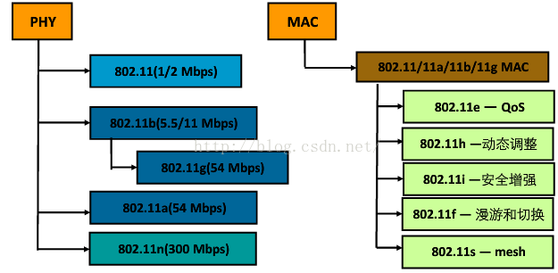
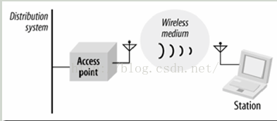
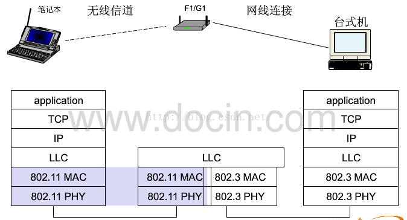
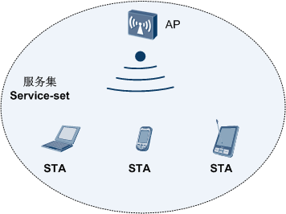
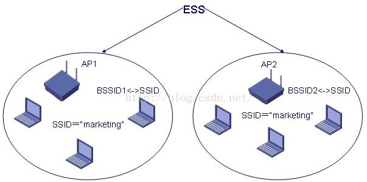
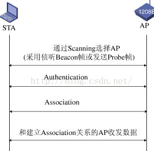
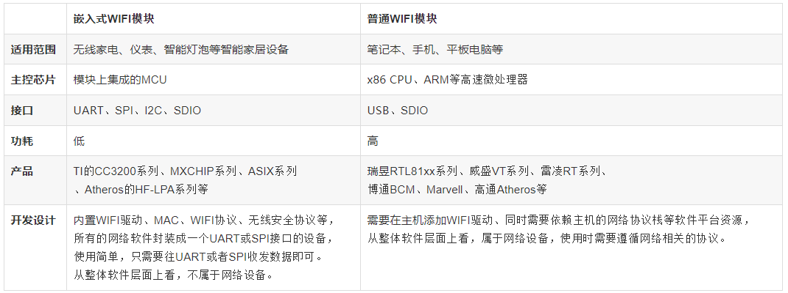
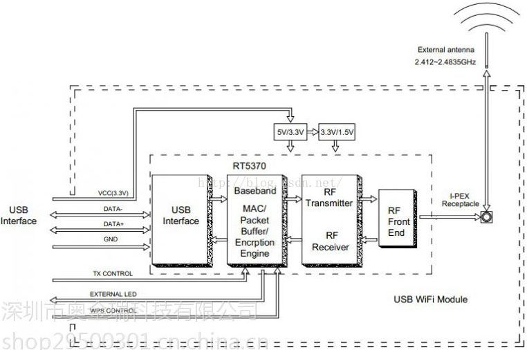
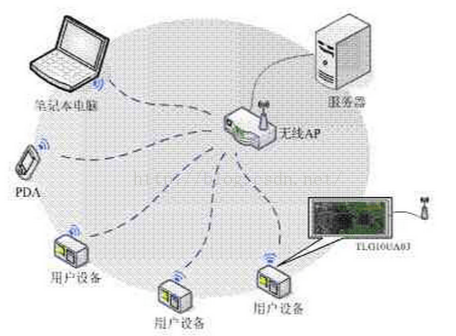
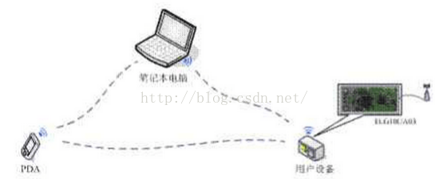

# Linux WiFi Driver

## 1、WiFi相关基础概念

### 1.1 什么是 `Wi-Fi`

我们看一下百度百科是如何定义的：

`Wi-Fi`是一种可以将个人电脑、手持设备(如pad、手机)等终端以无线方式互相连接的技术，事实上它是一个高频无线电信号。目的是改善基于IEEE 802.11标准的无线网路产品之间的互通性。

> `Wi-Fi` 英文全称是`WIreless-FIdelity`，翻译成中文就是无线保真，英文简称WiFi。无线保真是一个无线网络通信技术的品牌，由Wi-Fi联盟所持有。

有人把使用IEEE 802.11系列协议的局域网就称为无线保真。甚至把无线保真等同于无线网际网路。`实际上Wi-Fi是WLAN的重要组成部分`。

### 1.2 什么是`WLAN`

> 无线局域网络英文全名：Wireless Local Area Networks；简写为： WLAN。

它是相当便利的数据传输系统，它利用射频(`Radio Frequency - RF`)的技术，使用电磁波，取代旧式碍手碍脚的双绞铜线(`Coaxial`)所构成的局域网络，在空中进行数据通信。

> 该技术的出现绝不是用来取代有线局域网络，而是用来弥补有线局域网络之不足，以达到网络延伸之目的，使得无线局域网络能利用简单的存取架构让用户透过它，实现无网线、无距离限制的通畅网络。

其实很多时候，人们将`WiFi`和`WLAN`二者混用，其实`WiFi仅仅是实现WLAN的一种技术`。

> 其他比较常见的WLAN技术比如有 蓝牙(`BlueTooth`)、wimax等；

### 1.3 `无线网` VS `有线网`

无线网络相比有线网络，还是有许多的缺点的：

* 通信双方因为是无线通信，所以`通信之前需要建立连接`；而有线网络就直接用线缆连接，不用这个过程了。

* 通信双方通信方式是`半双工的通信方式`；而有线网络可以是全双工。

* 通信时在`网络层以下出错的概率非常高，所以帧的重传概率很大，需要在网络层之下的协议添加重传的机制`(不能只依赖上面TCP/IP的延时等待重传等开销来保证)；而有线网络出错概率非常小，无需在网络层有如此复杂的机制。

* 数据是在无线环境下进行的，所以`抓包非常容易，存在安全隐患`。

* 因为收发无线信号，所以`功耗较大`，对电池来说是一个考验。

* 相对有线网络吞吐量低，这一点正在逐步改善，802.11n协议可以达到600Mbps的吞吐量。

## 2、IEEE 802.11协议

IEEE802协议有点大，下面只介绍其中一些概念：

Ethenet 和 WiFi 采用的协议都属于IEEE 802协议集。其中，

* Ethenet 以`802.3协议`做为其网络层以下的协议；
* 而 WiFi 以 `802.11协议`做为其网络层以下的协议。

无论是有线网络，还是无线网络，其网络层以上的部分，基本一样。

### 2.1 802.11简介

IEEE802家族是由一系列局域网络(Local Area Network,LAN)技术规格所组成。802.11属于其中一员。
虽然WI-FI使用了802.11的`媒体访问控制层(MAC)` 和 `物理层(PHY)`，但是两者并不完全一致。

IEEE802.11协议族成员如下：

 

802.11基本规格涵盖了802.11 MAC 以及两种物理层(physical layer)：

* 一是`跳频展频(frequency-hopping spread-spectrum，简称FHSS)`物理层，
* 另一是`直接序列展频(direct-sequence spread-spectrum，简称DSSS)`物理层。

`802.11a` 所规范的物理层，主要是以`正交分频多工(orthogonal frequency division multiplexing，简称OFDM)`技术为基础.

802.11将PHY进一步划分为两个组成元件：

* 一是物理层`收敛程序(Physical Layer ConvergenceProcedure，简称PLCP)--` 负责将MAC帧对映到传输介质
* 另一是`实际搭配介质Physical Medium Dependent，简称PMD)--`负责传送这些帧。

### 2.2 802.11b

IEEE802.11b是无线局域网的一个标准。其`载波的频率为2.4GHz，传送速度为11Mbit/s`。

IEEE802.11b是所有无线局域网标准中最著名，也是普及最广的标准。

> 它有时也被错误地标为Wi-Fi。实际上Wi-Fi是无线局域网联盟(WLANA)的一个商标，该商标仅保障使用该商标的商品互相之间可以合作，与标准本身实际上没有关系。

在2.4-GHz-ISM频段共有14个频宽为22MHz的频道可供使用。IEEE802.11b的后继标准是`IEEE802.11g，其传送速度为54Mbit/s。`

### 2.3 802.11网络包含四种主要实体原件

 

* `工作站(Station) --`  具有无线网络接入功能的电子设备(笔记本，手持设备等).
* `基站(Access Point) --` 802.11网络所使用的帧必须经过转换才能被传到其它不同类型的网络，具有无线至有线桥接功能的设备称为基站(Access Point,AP).此外基站还有其它功能.
* `无线介质(Wireless Medium) --`802.11标准以无线介质(Wireless medium)在工作站之间传递帧.其所定义的物理层不只一种.
* `传输系统(Distribution System) --`传输系统是基站间转送帧的骨干网络(`backbone network`)。当几部基站串连以覆盖较大区域时，彼此之间必须相互通信，才能够掌握移动式工作站的行踪。而传输系统(distribution system )属于802.11的逻辑元件，负责将帧(frame)转送至目的地。

  > 大多数商用产品，是以`桥接引擎(bridging engine)`和`传输系统介质(distribution system medium)`共同组成传输系统.

### 2.4 802.11 工作方式

802.11定义了两种类型的设备：

* 一种是`无线站 --` 通常是通过一台PC机器加上一块无线网络接口卡构成的，
* 另一个称为`无线接入点(Access Point, AP) --` 它的作用是提供无线和有线网络之间的桥接。

一个无线接入点通常由`一个无线输出口`和`一个有线的网络接口(802.3接口)`构成，`桥接软件符合802.1d桥接协议`。

接入点就像是无线网络的一个无线基站，将多个无线的接入站聚合到有线的网络上。

> 无线的终端可以是802.11PCMCIA卡、PCI接口、ISA接口的，或者是在非计算机终端上的嵌入式设备(例如802.11手机)。

 

802.11的数据链路层由两个之层构成，`逻辑链路层LLC(Logic Link Control)` 和 `媒体控制层MAC(Media Access Control)`。

802.11使用和802.2完全相同的LLC层和802协议中的48位MAC地址，这使得无线和有线之间的桥接非常方便。但是`802.11的MAC地址只对无线局域网唯一`。  

802.11的MAC和802.3协议的MAC非常相似，都是在一个共享媒体之上支持多个用户共享资源，由发送者在发送数据前先进行探测网络的可用性。

> 在802.3协议中，是由`CSMA/CD(Carrier Sense Multiple Access with Collision Detection)协议`来完成调节，这个协议解决了在Ethernet上的各个工作站如何在线缆上进行传输的问题，利用它检测和避免当两个或两个以上的网络设备需要进行数据传送时网络上的冲突。在802.11无线局域网协议中，冲突的检测存在一定的问题，这个问题称为"Near/Far"现象，这是由于要检测冲突，设备必须能够一边接受数据信号一边传送数据信号，而这在无线系统中是无法办到的。

## 3、WiFi相关知识进阶

### 3.1 频谱划分

WiFi总共有14个信道，如下图所示：

 

1. IEEE 802.11b/g标准工作在2.4G频段，频率范围为2.400—2.4835GHz，共83.5M带宽
2. 划分为14个子信道(CN使用前13个,14信道仅在JP使用)
3. 每个子信道宽度为22MHz
4. 相邻信道的中心频点间隔5MHz
5. 相邻的多个信道存在频率重叠(如1信道与2、3、4、5信道有频率重叠)
6. 整个频段内只有3个(`1`、`6`、`11`)互不干扰信道

### 3.2 SSID和BSSID

* `基本服务集(BSS -- Basic Service Set)`

  基本服务集是802.11 LAN的基本组成模块。能互相进行无线通信的STA可以组成一个BSS(Basic Service Set) 。如果一个站移出BSS的覆盖范围，它将不能再与BSS的其它成员通信。

  > BSSID是一个BSS的标识，BSSID实际上就是`AP的MAC地址`。
  >
  > 在同一个AP内BSSID和SSID`一一映射`。(同一个AP的内部有多个BSSID则对应着多个SSID)

   

* `扩展服务集(ESS -- Extend Service Set)`

  多个BSS可以构成一个扩展网络，称为扩展服务集(ESS)网络，一个ESS网络内部的STA可以互相通信，是采用相同的SSID的多个BSS形成的更大规模的虚拟BSS。连接BSS的组件称为分布式系统(Distribution System，DS)。

* `服务集的标识SSID -- Service Set Identifier`

  > 在同一ESS内的所有STA和AP必须具有相同的SSID，否则无法进行通信

在一个ESS内SSID是相同的(也可以认为`SSID是一个ESS的网络标识(如:TP_Link_1201)`)，但对于ESS内的每个AP与`SSID`对应的BSSID是不相同的。`如果一个AP可以同时支持多个SSID的话，则AP会分配不同的BSSID来对应这些SSID。`

BSSID(MAC)<---->SSID 映射关系如下图:

 

### 3.3 无线接入过程三个阶段

STA(工作站)启动初始化、开始正式使用AP传送数据帧前，要经过三个阶段才能够接入:

> 802.11MAC层负责客户端与AP之间的通讯，功能包括扫描、接入、认证、加密、漫游和同步等功能

1. 扫描阶段(`SCAN`)
2. 认证阶段 (`Authentication`)
3. 关联(`Association`)

 

### 3.4 WiFi组成结构

一般架设无线网络的基本配备就是`无线网卡`及`一台AP`，如此便能以无线的模式，配合既有的有线架构来分享网络资源，架设费用和复杂程度远远低于传统的有线网络。

如果只是几台电脑的对等网，也可不要AP，只需要每台电脑配备无线网卡。

AP为`Access Point`简称，一般翻译为“`无线访问接入点`”，或“`桥接器`”。它主要在`媒体存取控制层MAC`中扮演无线工作站与有线局域网络的桥梁。

有了AP，就像一般有线网络的Hub一般，无线工作站可以快速且轻易地与网络相连。

特别是对于宽带的使用，无线保真更显优势，有线宽带网络(ADSL、小区LAN等)到户后，连接到一个AP，然后在电脑中安装一块无线网卡即可。

普通的家庭有一个AP已经足够，甚至用户的邻里得到授权后，则无需增加端口，也能以共享的方式上网。

## 4、什么是WiFi模块

百度百科上这样定义：

Wi-Fi模块又名串口Wi-Fi模块，属于物联网传输层，功能是将`串口或TTL电平转为符合Wi-Fi无线网络通信标准的嵌入式模块`，`内置无线网络协议IEEE802.11b.g.n协议栈以及TCP/IP协议栈`。传统的硬件设备嵌入Wi-Fi模块可以直接利用Wi-Fi联入互联网，是实现无线智能家居、M2M等物联网应用的重要组成部分。

### 4.1 WiFi 模块主要分类

Wi-Fi模块可分为三类：

*-* `通用Wi-Fi模块`
  
  比如手机、笔记本、平板电脑上的USB or SDIO接口模块，Wi-Fi协议栈和驱动是在安卓、Windows、IOS的系统里跑的，是需要非常强大的CPU来完成应用；

* `路由器方案Wi-Fi模块`

  典型的是家用路由器，协议和驱动是借助拥有强大Flash和Ram资源的芯片加Linux操作系统；

* `嵌入式Wi-Fi模块`
  
  32位单片机，内置Wi-Fi驱动和协议，接口为一般的MCU接口如UART等。适合于各类智能家居或智能硬件单品。

我觉得这里有必要普及一下`普通Wi-Fi模块` 与 `嵌入式Wi-Fi模块`的区别：

> 我们都知道笔记本、手机、平板电脑等这类产品具有强大的CPU和大容量的存储器进行网络通信数据的处理和存储，因此在使用WIFI时不需要额外的MCU，完全借助其高速处理器和庞大的软件系统。但是对于家电，仪表，LED灯等智能家居产品，因为该类产品的主控芯片可能是成本很低、功能简单的MCU，因此这类产品无法支持普通Wi-Fi的功能。同时，还有一个重要的原因就是普通WIFI的功耗比较高，而嵌入式WIFI在功耗上做了很大的改善，比较适合对功耗要求高的无线家电设备。

基于上述原因，各个无线厂商相继推出了嵌入式WIFI模块。嵌入式WIFI模块的特点是软硬件集成度高，整个嵌入式WIFI模块集成了射频收发器、MAC、WIFI驱动、所有WIFI协议、无线安全协议、一键连接等。总之，一句话：`嵌入式WIFI应物联网而生`！

下面我们针对嵌入式WIFI与普通WIFI来进行对比，通过下表的对比，我们大致上可以理解到什么是嵌入式WIFI:

 

下面是笔者所用一款USB接口的WiFi模块原理图：

 

### 4.2 WiFi模块主要功能

要说明无线网络的拓扑形式，首先要了解两个基本概念：

* AP `--` 也就是无线接入点，是一个无线网络的创建者，是网络的中心节点。

  > 一般家庭或办公室使用的无线路由器就是一个AP。

 

* STA站点 `--` 每一个连接到无线网络中的终端都可称为一个站点。

 

WiFi模块包括两种类型的拓扑形式:`基础网(Infra)`和`自组网(Adhoc)`。

1. 基于AP组建的基础无线网络（Infra）

   `Infra：也称为基础网`，是由AP创建，众多STA加入所组成的无线网络，这种类型的网络的特点是`AP是整个网络的中心`，网络中所有的通信都通过AP来转发完成。

   > AP是将wifi模块当路由器使用，这样手机和电脑就可以直接连接wifi模块了。
   >
   > Infra 是将wifi模块当基础设备使用，用于连接别的路由器。

2. 基于自组网的无线网络（Adhoc）

   `Adhoc：也称为自组网`，是`由两个及以上STA自己组成，网络中不存在AP`，这种类型的网络是一种松散的结构，网络中所有的STA都可以直接通信。

3. 安全机制

   本模块支持多种无线网络加密方式，能充分保证用户数据的安全传输

   > 包括：`WEP64/WEP128/ TKIP/CCMP(AES) WEP/WPA-PSK/WPA2-PSK`。

4. 快速联网

   本模块支持`通过指定信道号的方式来进行快速联网`。

   在通常的无线联网过程中，会首先对当前的所有信道自动进行一次扫描，来搜索准备连接的目的AP创建的（或Adhoc）网络。本模块提供了设置工作信道的参数，在已知目的网络所在信道的条件下，可以直接指定模块的工作信道，从而达到加快联网速度的目的。

5. 地址绑定

   本模块支持`在联网过程中绑定目的网络BSSID地址的功能`。

   根据802.11协议规定，不同的无线网络可以具有相同的网络名称（也就是SSID/ESSID），但是必须对应一个唯一的BSSID 地址。非法入侵者可以通过建立具有相同的SSID/ESSID的无线网络的方法，使得网络中的STA联接到非法的AP上，从而造成网络的泄密。`通过BSSID地址绑定的方式，可以防止STA 接入到非法的网络，从而提高无线网络的安全性`。

6. 无线漫游

   本模块支持`基于802.11协议的无线漫游功能`。

   无线漫游指的是为了扩大一个无线网络的覆盖范围，由多个AP共同创建一个具有相同的SSID/ESSID的无线网络，每个AP用来覆盖不同的区域，`接入到网络的STA可以根据所处位置的选择信号最强的AP接入，而且随着STA的移动自动在不同的AP之间切换`。

### 4.3 WiFi模块工作方式

* `主动(或PUSH)型串口设备联网`

  主动型串口设备联网指的是由设备主动发起连接，并与后台服务器进行数据交互（上传或下载）的方式。其中，

  > 后台服务器作为TCP Server端，设备通过无线AP/路由器接入到网络中，并作为TCP Client端。

* `被动型串口设备联网`

  被动型串口设备联网指的是`在系统中所有设备一直处于被动的等待连接状态，仅由后台服务器主动发起与设备的连接，并进行请求或下传数据的方式`。
  
  > 此时，后台服务器实际上作为TCP Client端，而设备则是作为TCP Server端

  典型的应用，如某些无线传感器网络，每个传感器终端始终实时的在采集数据，但是采集到的数据并没有马上上传，而是暂时保存在设备中。而后台服务器则周期性的每隔一段时间主动连接设备，并请求上传或下载数据。
