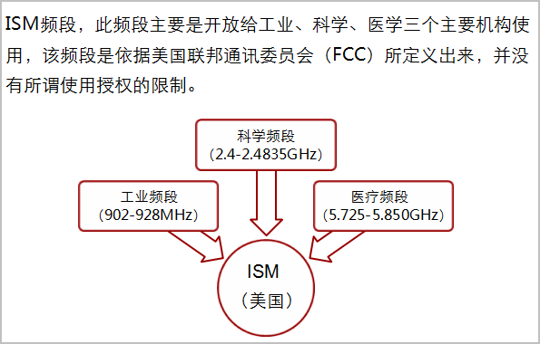
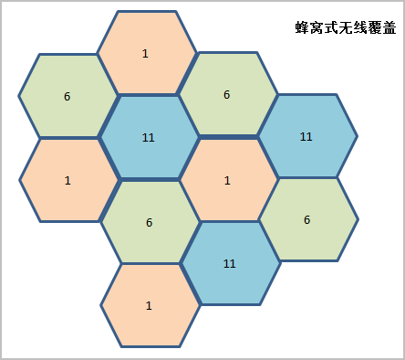
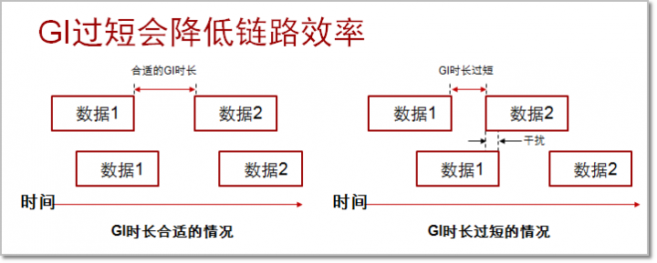
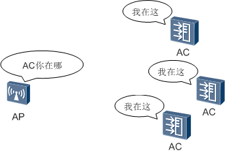
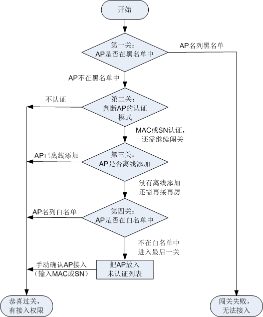
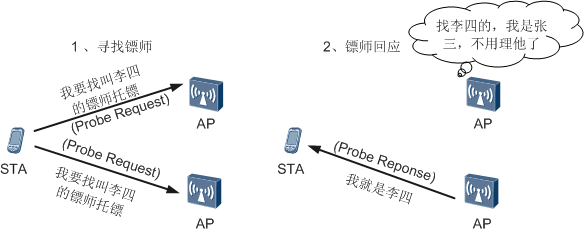
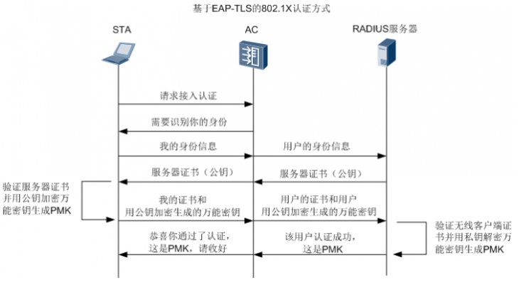
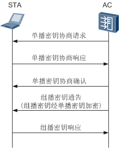

# WLAN 从入门到精通

## 1、WLAN定义和基本架构

关于WLAN，相信大家对它早已不陌生了。几乎每天我们都能体验到WLAN给我们的生活带来的高效和便捷。在家里，通过无线路由器，我们不必再端端正正的坐在电脑旁，可以坐在沙发上，躺在床上，甚至可以坐在马桶上收发邮件，在线欣赏欧美大片，尽情享受摆脱有线束缚带来的自由。在候车室，手捧笔记本和Pad的人们正逐渐代替手捧报纸和杂志的人们。走进咖啡厅，越来越多的人第一件事不是点餐，而是询问咖啡厅无线网络的密码……。

 

随着WLAN的来势汹汹，越来越多的人想了解WLAN技术，WLAN也成为当前热门话题之一。小编不才，愿意和大家一起学习探讨WLAN技术，解决一些WLAN方面的问题。下面请大家泡杯茶，耐心的读完下面这段文字，开始我们知道而又不知道的WLAN之旅吧。

### 1.1 WLAN定义

为什么说是知道而又不知道的WLAN呢？其中一个原因是很多人对WLAN已经很熟悉了，都知道WLAN，但是让大家完整的说出WLAN的定义，却很少人能说的出。**`WLAN`**的全称是**Wireless Local Area Network**，中文含义是无线局域网，WLAN的定义有广义和狭义两种：

> 广义上讲WLAN是以各种无线电波（如激光、红外线等）的无线信道来代替有线局域网中的部分或全部传输介质所构成的网络。
>
> WLAN的狭义定义是基于IEEE 802.11系列标准，利用高频无线射频（如2.4GHz或5GHz频段的无线电磁波）作为传输介质的无线局域网。

说到这里，大家不妨和我们日常生活中的WLAN联系一下，我们经常听到的“802.11n、2.4G、5G”是不是感觉和WLAN的狭义定义有种千丝万缕的关系呀？其实，我们日常生活中的WLAN，就是指的WLAN的狭义定义。在WLAN的演进和发展过程中，其实现技术标准有很多，如蓝牙、802.11系列、HyperLAN2等。而802.11系列标准由于其实现技术相对简单、通信可靠、灵活性高和实现成本相对较低等特点，成为了WLAN的主流技术标准，且802.11系列标准也成为了WLAN技术标准的代名词。

> *关于802.11系列标准我们后面会有详细介绍，这里大家先了解下WLAN的定义。*

了解了WLAN的定义之后，小编再问大家一个不太能想的到的问题，大家都有在家使用WLAN和在候车厅等大型场所使用WLAN的经历吧。大家有没有发现这两个地方的WLAN有什么不同呀？有没有想过这样一个问题：家庭房屋的面积相对较小，而候车厅面积很大，如果像家庭一样，候车厅也使用家庭使用的无线路由器，怎么覆盖候车厅那么大的面积。家庭接入的用户较少，一般不会超过几十个，而在候车厅里可能是成百上千的用户在使用WLAN，候车厅怎么满足那么多的用户接入呢？

有人会说是不是在候车厅里布放了很多无线路由器，以实现候车厅的大范围覆盖和多用户接入呢？但是，如果在候车厅布放很多无线路由器，当我们在硕大的候车厅来回移动时是不是要出现信号中断提醒你接入新的无线路由器的情况，就像从自己家移动到了邻居家一样，即使邻居家的无线网络名字和密码跟自己家的一样，也会出现网络中断重新获取IP地址的现象。有兴趣的童鞋可以回家和邻居试一试^_^。

 

那么，是什么造成有的WLAN仅可以满足家庭等小场所的使用，而有的WLAN却可以满足候车厅等中大型场所使用呢。下面小编就给大家介绍一下WLAN的基本架构，在大家了解了WLAN基本架构后，上面的问题就迎刃而解了。

### 1.2 WLAN的两种基本架构

- 一种是FAT AP架构，又叫自治式网络架构。
- 一种是AC FIT AP架构，又叫集中式网络架构。

我们先从最熟悉的家庭无线路由器入手，家庭无线路由器采用的是FAT AP架构，即自治式网络架构。FAT AP英文全称是**FAT Access Point**，中文称为胖接入点，也有很多人直接称为胖AP。FAT AP不仅可以发射射频提供无线信号供无线终端接入，还能独立完成安全加密、用户认证和用户管理等管控功能。想一下我们家里的无线路由器，我们可以为WLAN设置密码，可以配置黑名单或白名单控制用户接入，还可以管理接入的用户（如设置用户的接入速率）等，这些都符合FAT AP的特征。所以，家庭使用的无线路由器就是一种FAT AP。下面的组网图是一个简单的基于FAT AP架构的组网应用：

  

FAT AP功能强大，独立性强，具备自治能力，因此FAT AP架构人们又称为自治式网络架构。不需要介入专门的管控设备，独自就可以完成无线用户的接入，业务数据的加密和业务数据报文的转发等功能。

独立自治是FAT AP的特点，也是FAT AP的缺点。当单个部署时，由于FAT AP具备较好的独立性，不需要另外部署管控设备，部署起来很方便，成本也较低廉，在类如家庭WLAN或者小企业WLAN的使用场景中，FAT AP往往是最适合的选择。给我们感受最深刻的就是我们在家里使用一个无线路由器就能享受WLAN带给我们的便捷。但是，在大的使用场景中，如我们上面提到的候车厅，FAT AP的独立自治就变成了自身的缺点。由于WLAN覆盖面积较大，接入用户较多，需要部署许多FAT AP设备，而每个FAT AP又是独立自治的，缺少统一的管控设备，管理这些设备就变得十分麻烦。不说别的，光为这些FAT AP升一次级就是一场灾难。所以，在大量部署的情况下，FAT AP会带来巨大的管理维护成本。而且由于独自控制用户的接入，FAT AP无法解决用户的漫游问题。一般在中大型使用场景中人们往往不会选择FAT AP架构，而是使用我们下面要讲的 **`AC-FIT AP`** 架构。

> *如果大家不了解漫游，可以想象下我们日常使用的手机，当坐在高铁上从一个城市移动到另一个城市，手机信号要在沿途不停的断开旧网络，接入新网络。或者想象下，我们拿着Pad等无线终端，从自己家移动到邻居家并接入邻居家的WLAN，这个过程也可以理解为漫游。后面在介绍WLAN各种特性的时候会讲到什么是漫游，大家先了解下漫游大概的概念。*

 既然有胖AP，那对应的就应该有瘦AP。FIT AP英文全称是**FIT Access Point**，中文称为瘦接入点，也有很多人直接称为瘦AP。和胖AP不同，瘦AP除了提供无线射频信号外，基本不具备管控功能。也正是因为这一点，它被称为瘦AP，而上面具备管控功能的AP被称为了胖AP。为了实现WLAN的功能，除了FIT AP外，还需要具备管理控制功能的设备——AC。AC英文全称是**Access Controller**，中文称为无线接入控制器。AC的主要功能是对WLAN中的所有FIT AP进行管理和控制，AC不具备射频（AC只是管理控制设备，不能发射无线射频信号），它和FIT AP配合共同完成WLAN功能。这种架构就被称为了AC FIT AP架构。下图为某大型企业基于AC FIT AP架构部署的WLAN组网示意图。

 

由上图我们可以看到，根据AC所管控的区域和吞吐量的不同，AC可以出现在汇聚层，也可以出现在核心层。而FIT AP一般部署在接入层和企业分支。这种层级分明的协同分工，更能体现出AC FIT AP架构的集中控制的特点，这种架构又被大家称为集中式网络架构。

使用AC FIT AP架构为像候车厅这种大型场所部署WLAN时，比使用FAT AP架构更经济、高效。在AC FIT AP架构下，可以统一为FIT AP下发配置，统一为FIT AP进行软件升级，还可以按照时段控制FIT AP的工作数量等等，这些大大降低了WLAN的管控和维护的成本。而且，由于用户的接入认证可以由AC统一管理，解决用户漫游的问题就变得很容易。综上所述，AC FIT AP架构适用于中大型使用场景，而FAT AP架构适用于小型使用场景。

- *普通家庭使用的无线路由器是FAT AP架构*

 

- *大型场所一般使用AC FIT AP架构*

 

## 2、WLAN射频和信道

> 有这样一个段子“嫁到俺村吧，俺村条件不赖，穿衣基本靠纺，吃饭基本靠党，致富基本靠抢，娶妻基本靠想，交通基本靠走，通信基本靠吼，治安基本靠狗，取暖基本靠抖……”。拿这个段子作为本期的开篇，是想让大家开心一笑，然后借用里面的“通信基本靠吼”进入本期的主题。

通信靠吼看着很落后，但仔细想想它会很先进，它哪里先进呢？想出来了吗？………………

它可是“无线通信”啊！有没有被小编欺骗的感觉没想到大声喊话是无线通信，高科技啊。如果不留心的话我们不会想到人类历史上最早的通信手段和现在一样可以是“无线”的，而且还不止这些，古代的击鼓鸣金和烽火连天也可以称为某种“无线通信”吧。

学过物理的都知道，击鼓鸣金，是物体振动在介质中产生声波，传递信息到人耳，信息载体是传递声波的介质。烽火连天，或者更先进的旗语，是通过物体反射的可见光线传入人眼从而传递信息，载体是可见光。WLAN同样是无线通信的范畴，虽跟原始的“无线通信”有本质区别，但却有着共同点 `--` **都需要载体**。

WLAN跟日常生活中的无线广播、无线电视、手机通信一样，都是用**射频**作为载体。

> *射频是频率介于3赫兹（Hz）和约300G赫兹（Hz）之间的电磁波，也可以称为射频电波或射电。*

人们为这段电磁波又定义了无线频谱，按照频率范围划分为极低频、超低频、中频、高频、超高频等，WLAN使用的射频频率范围是2.4GHz频段（2.4GHz～2.4835GHz）和5GHz频段（频率范围是5.150GHz～5.350GHz和5.725GHz～5.850GHz），分别属于`特高频`(300MHz～3GHz)和`超高频`(3GHz～30GHz)，用一张图来看下我们WLAN射频所在频谱的位置。

 

> `5GHz频段的5.150GHz～5.350GHz和5.725GHz～5.850GHz为中国使用`，各个国家使用的频宽范围不一样。
> 贴子下方附有[国家信道顺从表](./img/wfm/ccl.pdf)的参考链接，感兴趣的同学可以查看各个国家使用的5GHz频段。

WLAN使用的2.4GHz频段和5GHz频段属于ISM频段。

> `ISM，即工业（Industrial）、科学（Scientific）与医疗（Medical）。`

ISM频段主要开放给工业、科学、医疗三个机构使用，只要设备的功率符合限制，不需要申请许可证（Free License）即可使用这些频段，大大方便了WLAN的应用和推广。

 

了解了什么是射频后，射频是怎么作为载体传递信息的呢？

我们高中物理都有学过射频传输信息的基本调制方式：**`调频`、`调相` 和 `调幅`**。

> 发送端将信息调制到载波上，通过改变载波的频率、相位和振幅传递信息，接收端收到信息后，再解调还原信息。

通过这样一个调制解调的过程，就实现了信息的传递。

我们日常生活中遇到的调频广播，调幅广播等就是这样传递信息的。

WLAN射频传输信息的基础也是调频、调相或调幅。只不过调频、调相和调幅通常用在模拟信号的传输，在数字通信领域射频的调制方式较为复杂，主要有：振幅键控、频率键控、相位键控和正交幅度调制（一种幅度、相位联合调制的技术，它同时利用了载波的幅度和相位来传递信息）。通过下图大家可以看下载波在调制后的样子。

 

这样看来使用射频通信和有线通信是不是没有多大区别？我们更为熟悉的有线通信其实也是将信号调制成电脉冲或光脉冲，然后放到电缆或光缆上传输。只不过射频需要解决更多的问题，如射频的反射、衍射等问题。无论是使用射频通信还是使用有线媒介的通信，其过程都可以简单的看成是`信源` -> `信道` -> `信宿`，信源是信息的发送者，信宿是信息的接收者。那么信道是什么呢？有线的信道我可以简单的理解为线缆，WLAN的信道是不是可以简单的理解为射频呢？根据“信源->信道->信宿”的描述，信道就是发送者和接收者的中间部分，那可不就是射频了。

WLAN的信道是具有一定频宽的射频，就像公路要有一定的宽度一样，以便可以承载要传输的信息。对于2.4GHz频段来说，2.4GHz频段的频宽是2.4835GHz-2.4GHz=0.0835GHz=83.5MHz，WLAN是不是就使用全部的83.5MHz的频宽作为一个信道呢？这里我们使用一个比喻，有助于大家对WLAN信道的理解。我们看广播电视的时候，都知道频道吧：1频道、2频道、中央1台、中央5台。我们要看中央1台，就不能看中央5台，每次只能选定1个频道。如果中央5台使用中央1台的频率发射信号会怎样？那两个频道大家都收不到，或满屏幕的雪花。高中物理告诉我们一条波如果遇到频率相同的波会产生干扰，会根据相位差进行叠加或衰减（如：频率相同，相位相差180°的波彼此会抵消）。所以，中央1台有个固定的频率，中央5台也有它的固定的频率，互不干扰。

 

我们可以把WLAN信道理解为电视机的频道，如果WLAN使用整个2.4GHz频段作为一个信道，当同一覆盖范围内有两个及两个以上的AP，大家都用相同的信道，会造成严重的干扰（如同中央5台使用了中央1台的频道一样），两个AP都无法有效提供WLAN服务。所以，在WLAN标准协议里将2.4GHz频段划分出13个相互交叠的信道，每个信道的频宽是20MHz（802.11g、802.11n每个信道占用20MHz，802.11b每个信道占用22MHz），每个信道都有自己的中心频率（如同CCTV-1的200MHz）。

这13个信道可以找出3个独立信道，即没有相互交叠的信道。独立信道由于没有频率的交叠区，相邻AP使用这3个独立信道不会彼此产生干扰。如下图中的1、6、11就是三个互不交叠的独立信道。

 

> *14信道是特别针对日本定义的，各个国家2.4GHz频段开放的信道不一样，北美地区（美国，加拿大）开放1～11信道，欧洲开放1～13信道，中国同样开放1～13信道。一般，我们更多的讲述是2.4GHz频段分13个相互交叠的信道。*

 

在部署WLAN时，为避免相邻AP产生同频干扰，多采用蜂窝式信道布局。蜂窝式布局中相邻AP间使用不交叠的独立信道，可以有效避免同频干扰。

 

国内友商华为AP产品2.4G射频默认使用1信道，如果用户在部署WLAN时忘了配置信道，可能会造成某些AP覆盖重合的区域产生同频干扰，使用户无法上线。但是，为众多AP配置信道也是件很累人的事情，华为产品支持射频信道的自动模式。AP上线后，AC会根据AP周围的无线环境，自动为AP射频设置信道，避免了用户为多个AP配置信道的繁杂工作。

> 射频调优功能，可以根据射频周围的无线环境自动调整信道和发射功率，保持整个无线网络处于一个最佳的状态。在WLAN初次部署完成后，建议执行一次射频调优。比如周围的卖场也有WLAN，很可能会和我们自己部署的WLAN有部分区域的射频冲突，射频调优可以让WLAN自己根据无线环境调整信道部署和发射功率，减少射频的冲突。而且无线环境可能是变化的，在低峰时段执行定期的射频调优也是有必要的。

2.4GHz频段射频在各个国家已经放开使用，越来越多的无线设备都工作在2.4GHz频段（如蓝牙设备），使得2.4GHz频段日益拥挤，信道干扰严重，有时会影响WLAN用户的正常业务。

WLAN 可以使用的另一个频段——5GHz频段，有更高的频率和频宽，可以提供更高的速率和更小的信道干扰。WLAN标准协议将5GHz频段分为24个20MHz宽的信道，且每个信道都为独立信道。这为WLAN提供了丰富的信道资源，更多的独立信道也使得信道绑定更有价值，信道绑定是将两个信道绑定成一个信道使用，能提供更大的带宽。如两个20MHz的独立信道绑定在一起可以获得20MHz两倍的吞吐量，这好比将两条道路合并成一条使用，自然就提高了道路的通过能力。

802.11n支持通过将相邻的两个20MHz信道绑定成40MHz，使传输速率成倍提高。802.11n也同时定义了2.4GHz频段的信道绑定，但由于2.4GHz频段较拥挤的信道资源，降低了2.4GHz频段信道绑定的实用性，一般不推荐使用2.4GHz频段的信道绑定。下图为5GHz频段的信道划分情况。

 

图中，黑色的半圆表示独立信道，红色的半圆表示标准协议推荐的信道绑定，UNII-2e为5GHz新增频段，该频段中国尚未放开使用。目前中国已放开使用的信道有36, 40, 44, 48, 52, 56, 60, 64, 149, 153, 157, 161, 165。各个国家开放的信道不一样，可以参照国家信道顺从表，参考地址：[国家信道顺从表](./img/wfm/ccl.pdf)。

5GHz频段并非只有WLAN设备在使用，很多国家的军用雷达也在使用5GHz频段，使用该频段的民用无线设备很可能对雷达等重要设施产生干扰。为了解决这一安全顾虑，在一些国家出售的WLAN产品必须具备TPS和DFS这两个功能，即发射功率控制和动态频率选择。TPS是为了防止无线产品发放过大的功率来干扰军方雷达。DFS是为了使无线产品能主动探测军方使用的频率，如频率冲突并主动选择另一个频率，以避开军方频率。在这些国家这两个功能是属于强制性的，不符合标准的产品将不会获得这些国家的上市许可。

大概了解了WLAN射频和信道之后，我们以WLAN里经常出现的dBm和dB是什么来结束本期内容。

dBm的含义是分贝毫瓦，通俗的说就是每1毫瓦产生多少分贝能量。dB是个相对值是增益的意思，X (dBm) - Y (dBm) = Z (dB)，如10dB=20dBm-10dBm。

dBm和毫瓦的换算关系是：P(dBm)=10logP(mW)，也就是100mW=10Log102=20dBm。

大家可以牢记一个规律:

> `功率减少10倍，换算出来的dBm降低10dB。`
>
> `功率减少一半，换算出来的dBm降低3dB。`
>
> 如：`50mW=17dBm，25mW=14dBm，5mW=7dBm`。

本期的问题：

在中国2.4GHz频段可以使用1～13信道，那么我们部署WLAN时只能使用1，6，11这三个独立信道吗？

## 3、WLAN标准协议

在WLAN的发展历程中，一度涌现了很多技术和协议，如IrDA、Blue Tooth和HyperLAN2等。但发展至今，在WLAN领域被大规模推广和商用的是IEEE 802.11系列标准协议，WLAN也被定义成基于IEEE 802.11标准协议的无线局域网。我们对802.11已不陌生，在购买支持WLAN功能的产品时都能看到802.11的影子。本期我们讲下802.11主要的具有里程碑意义的标准协议：`802.11a`、`802.11b`、`802.11g`、`802.11n`和`802.11ac`。

> 虽然协议比较枯燥乏味,但了解了这些协议,有助于我们部署WLAN,下面就跟随小编一起看下这几个主要协议!

WLAN和有线局域网最大的区别就是“无线”，通过上期的学习我们知道WLAN通信媒介是射频，射频和有线局域网的媒介（电缆或光纤）相比具有完全不一样的物理特性，这就导致**WLAN的物理层（PHY）** 和 **媒介访问控制层（MAC）**不同于有线局域网。所以，802.11协议主要定义的就是WLAN的物理层和MAC层。

在20世纪90年代初为了满足人们对WLAN日益增长的需求，IEEE成立了专门的802.11工作组，专门研究和定制WLAN的标准协议，并在1997年6月推出了第一代WLAN协议——**`IEEE 802.11-1997`**，协议定义了物理层工作在ISM的2.4G频段，数据传输速率设计为2Mbps。该协议由于在速率和传输距离上的设计不能满足人们的需求，并未被大规模使用。

随后，IEEE在1999年推出了 **802.11a** 和 **802.11b**。802.11a工作在5GHz的ISM频段上，并且选择了正交频分复用OFDM（Orthogonal Frequency Division Multiplexing）技术，能有效降低多路径衰减的影响和提高频谱的利用率，使802.11a的物理层速率可达54Mbps。802.11b则依然工作在2.4GHz的ISM频段，但在802.11的基础上进行了技术改进，使802.11b的通信速率达到11Mbps。

> OFMD是一种多载波调制技术，主要是将指定信道分成若干子信道，在每个子信道上使用一个子载波进行调制，并且各子载波是并行传输，可以有效提高信道的频谱利用率。

虽然802.11b提供的接入速率比802.11a低，但当时5GHz芯片研制过慢，待芯片推出时802.11b已被广泛应用。由于802.11a不能兼容802.11b，再加上5GHz芯片价格较高和地方规定的限制等原因，使得802.11a没有被广泛采用。

在2000年初，IEEE 802.11g工作组开始开发一项既能提供54Mbps速率，又能向下兼容802.11b的协议标准。并在2001年11月提出了第一个IEEE 802.11g草案，该草案在2003年正式成为标准。802.11g兼容了802.11b，继续使用2.4GHz频段。为了达到54Mbps的速率，802.11g借用了802.11a的成果，在2.4GHz频段采用了正交频分复用（OFDM）技术。IEEE 802.11g的推出，满足了当时人们对带宽的需求，对WLAN的发展起到了极大的推动作用。

大家可能会有疑问：为什么不在1999年制定802.11b标准时就直接采用和802.11a相同的OFDM技术，这样就可以更早的在2.4GHz频段上取得54Mbps的速率了，而不必等到2001年底的802.11g的出现。事实上在1999年讨论802.11b的时候，OFDM技术确实被提出应用到802.11b标准中，但当时美国联邦通信协会（FCC）禁止在2.4GHz频段使用OFDM，这条禁令直到2001年5月才被撤销，6个月后，采用OFDM技术的802.11g草案才得以顺利出台。

在急速发展的网络世界54Mbps的速率不会永远满用户需求。在2002年一个新的IEEE工作组——IEEE 802.11任务组N即TGn（Task Group n）成立，开始研究一种更快的WLAN技术，目标是达到100Mbps的速率。该目标的实现一波三折，由于小组内两个阵营对协议标准的争论不休，新的协议直到2009年9月才被敲定并批准，这个协议就是802.11n。在长达7年的制定过程中，802.11n的速率也从最初设计的100Mbps，完善到了最高可达600Mbps，802.11n采用了双频工作模式，支持2.4GHz和5GHz，且兼容802.11a/b/g。

802.11n标准刚刚尘埃落定后， IEEE就开始了下一代的WLAN标准协议——802.11ac的制定工作。并在2013年正式推出了802.11ac标准协议，802.11ac工作在5GHz频段，向后兼容802.11n和802.11a，80.211ac沿用了802.11n的诸多技术并做了技术改进，使速率达到1.3Gbps。通过下表有助于我们了解802.11各协议的主要参数。

 

当前在802.11各协议中由于802.11ac刚推出，大众终端产品支持802.11ac的还不多，802.11n产品仍旧是主流产品。802.11n较之前的标准协议主要有如下优势：更多的子载波、更高的编码率、更短的GI（Guard Interval）、更宽的信道、更多的空间流和MAC层的报文聚合功能等，而获取这些优势的技术802.11ac也有沿用。下面我们看下华为产品如何配置才能更好的发挥802.11n的优势。

- **更多的子载波：** 802.11n比802.11a/g多了4个有效子载波（802.11b没有使用OFMD技术不做对比），用户无需配置只要使用802.11n通信即可获得802.11n的此项优势。下图中58.5Mbps是802.11n较之前的标准更多的子载波可以带来的理论速率。

   

- **更高的编码率：** WLAN使用射频传输数据时，除了用户的有效传输数据外，还需附有更错码FEC（Forward Error Correction），当有效数据在传递过程中因衰减、干扰等因素而导致数据错误时，通过更错码可将数据更正、还原成正确数据。802.11n将之前3/4的有效编码率提高到5/6，此项改进点使得802.11n的速率提升了11%。用户无需配置只要使用802.11n通信也可以直接获得802.11n的此项优势。

   

- **更短的GI（Short Guard Interval）：** 使用802.11a/b/g发送数据时，必须要保证在数据之间存在800 ns的时间间隔以避免数据帧间的干扰，这个间隔被称为Guard Interval (GI)。802.11n缺省仍然使用800ns的GI，但在空间环境较好时，可以将该间隔配置为400ns，此项改进可以将吞吐提高近10%（约72.2Mbps）。 这里需要注意，并不是所有的环境都适合配置short GI。在复杂的空间环境里，射频遇到障碍物可能会产生反射等现象，会造成AP和STA之间的多路径传输（多径效应）。在多径环境中，前一个数据块还没有发送完成，后一个数据块可能通过不同的路径先到达了，合理的GI长度能够避免相互干扰。如果GI时长不合理，会降低链路的使用效率。

 

所以，在复杂的环境中建议关闭short GI功能。

- **更宽的信道：** 我们在讲射频的时候已经提及，802.11n支持将相邻两个20MHz的信道绑定成40MHz的信道，信道更宽传输能力就更大，可以带来2倍以上的提升。

- **更多的空间流：** 802.11a/b/g技术的无线接入点和客户端是通过单个天线单个空间流以单入单出SISO（Single Input Single Output）的方式来实现数据传送的。在802.11n支持最大4个空间流的多入多出MIMO（Multiple Input and Multiple Output）方式传输数据（802.11ac最大支持8*8的MIMO）。华为多天线AP都支持MIMO，如AP5130、AP7110、AP5030支持3*3 MIMO，AP3010、AP6510、AP6610支持2*2 MIMO。

  

- **MAC层的报文聚合：** 在802.11的MAC层协议中，有很多固定的开销，尤其在两个帧之间的确认信息。在最高数据率的传输下，这些多余的开销甚至比需要传输的整个数据帧还要长。例如：802.11g理论传输速率为54Mbps，实际上却只有22Mbps，将近有一半多的速率浪费了。802.11n的MAC协议数据单元MPDU（MAC Protocol Data Unit）帧汇聚功能，可以将多个MPDU聚合为一个物理层报文，只需要进行一次信道竞争或退避，就可完成N个MPDU的同时发送，从而减少了发送N-1个MPDU报文所带来的信道资源消耗。

803.802.11ac默认支持MPDU功能，且支持最大长度为1048575字节的汇聚帧。

  

另外，802.11ac还支持MAC服务数据单元MSDU（Mac Service Data Units）汇聚，大大提高了数据的传输效率

  

除了802.11标准协议外，在WLAN领域还有一个更常见更常用的名词 `--` **Wi-Fi**。

我们技术贴连载已经进行到第3期，一直没有提及什么是Wi-Fi。在了解了802.11各协议后，正好也是解释什么是Wi-Fi的时机了。

WiFi是无线保真（**Wireless Fidelity**）的英文缩写。在802.11b时代，虽然所有的802.11b产品都使用相同的802.11b标准，但为了保证不同厂商的产品能够具有良好的兼容性，1999年一些WLAN设备生产厂商一起成立了一个工业联盟——无线以太网兼容性联盟WECA（**Wireless Ethernet Compatibility Alliance**），后更名为Wi-Fi联盟。Wi-Fi联盟建立了一套验证802.11b产品兼容性的测试程序，称为Wi-Fi认证，通过该程序认证的产品可以使用Wi-Fi认证标签。后来，Wi-Fi认证的范围逐步扩展到802.11a，802.11g和802.11n。

另外，由于忍受不了802.11n漫长的标准化进程和市场需求的推动，Wi-Fi联盟以802.11n 2.0版草案作为产品认证的依据，在802.11n标准推出之前已经认证批准了数百个802.11n产品。这也是为什么当时802.11n标准还未正式发布，而我们在市场上早已可以购买到各类兼容性良好的802.11n产品的原因。

## 4、WLAN常用概念

最近小编在微博上看到一个笑话，说是：楼主一时心血来潮，把家里的WIFI名设置成了who will love me，密码是nobody。结果第二天，整栋楼都连上了楼主的WIFI。

这个笑话是略夸张了，不过里面出现的WIFI名正好引出本期的主题——本期小编将为大家介绍一下WLAN的基础概念。

首先为大家隆重介绍的就是微博中提到的“who will love me”，WLAN术语称之为SSID。SSID是大家日常生活中接触的最多的，比如我们去星巴克，一边喝咖啡一边上网，当我们用手机搜索无线网络，弹出的“CMCC-STARBUCKS”就是SSID。

`SSID`的全称是Service Set Identifier，也就是服务集标识符，用于标识一个服务集，按照大部分人的理解，也就是用来标识一个可用的网路。

而所谓服务集，就是一组互相有联系的无线设备，这样理解起来有点抽象，举个例子，在星巴克咖啡馆提供的无线网络中，我们的手机、平板电脑，带无线网卡的笔记本这一系列无线终端（在WLAN中称之为工作站STA，Station），只要连上AP，实际上就构成了一个服务集。在这个服务集内，只要终端和AP关联，终端就能够相互通信（当然是需要通过AP），也可以通过AP访问外部网络。

 

如果这个咖啡店很小，只要一个AP就能hold住全场，也就是说这个服务集中只有一个AP，那么这个服务集就可以被认为一个基本服务集`BSS`(Basic Service Set)。BSS是无线网络的基本服务单元。所有的终端关联到一个AP上，该AP连接其他有线设备，并且控制和主导整个BSS中的全部数据的传输过程。

 

如果咖啡店非常大，又或者这不是一个咖啡馆，而是一个大型商场，那么势必会存在多个AP，要知道一个BSS所覆盖的地理范围有限，直径不超过100米，这个时候就会有一个扩展服务集`ESS`（Extend Service Set）的概念。

ESS简单理解，就是多个使用相同SSID的BSS组成，但是这中间隐含2个条件：

> `这些BSS是要比邻安置`。
>
> `这些BSS通过各种分布系统互联，有线无线都可以(不过一般都是以太网)`。

只有满足上述条件后，我们才认为这些BSS可以被统一为一个ESS。

> `当然了，如果是两家星巴克里提供的网络，虽然提供的网络号一样，都叫“CMCC-STARBUCKS”，但这显然不是一个ESS`。

 

由于使用的是相同的SSID，我们根本感不到我们是接在多个BSS上，而是如同接在同一个AP上一样。终端在ESS内的通信和在BSS中类似，不过如果BSS中终端A想和另一个BSS中的终端B通信，则是需要经过2个接入点AP1和AP2，即A->AP1->AP2->B。

> 特别的，在同一个ESS中的不同BSS之间切换的过程称为漫游。上图也画出了终端A从BSS1域漫游到BSS2（图上的A’的位置），此时A仍然可以保持和B的通信，不过A在漫游前后的接入点AP改变了。

在前文讲了，我们用SSID来标识一个网络，还记得吗? 我们讲的SSID通常是一个不超过32个字符的字符串，这个SSID又叫ESSID，是对ESS的标识。小编说过，只要在一个ESS中，我们是感觉不到接在哪个BSS上的对吧，你不知道没事，但终端设备得知道吧，于是就有了BSSID这个概念。这个BSSID就是用来标识BSS的。这个标识符是一个长度为48位的二进制标识符，通常是**这个BSS里面AP的MAC地址**。

前面讲过，我们在咖啡店想用无线网上网，可是有的会搜到网络名很类似好几个SSID。为什么会这么做呢，其实内有乾坤。会提供两个SSID，是因为其中一个是提供给大众的，密码是公开的，不过上网质量就一般般，而另一个是提供给内部员工的，上网质量会更好，不过密码就不公开啦，这样一般都是为了保证内部员工的上网质量。按照前面的说法，一个AP构建一个服务集，那么要组建这么一个网络是不是势必需要2个AP呢？

当然不是。华为的设备还可以配置VAP，为用户提供差异化的WLAN业务。所谓VAP就是在一个物理实体AP上虚拟出多个虚拟的AP，每一个被虚拟出的AP就是一个VAP，每个VAP提供和物理实体AP一样的功能。VAP的优势显而易见，多个虚拟的AP工作在同一个硬件平台，提高了硬件的利用率；网络管理员可以为不同VAP设置不同SSID,安全设置,QoS设置等策略和功能,也增加了网络的灵活性。

 

看到这里，有人要问小编了，你刚才讲了在一个ESS中怎么区分BSS，可是这是在一个一个AP上啊，我咋知道我接的是哪个VAP啊？其实VAP也是用BSSID来区分的，但是这是BSSID不是用的物理AP的MAC地址，而是用的VAP的MAC地址。而这个VAP的MAC地址实际上和物理AP的MAC地址是有影射关系的，见图。

 

> `一般第一个VAP的MAC是跟AP的MAC地址一样的，后面的VAP的MAC地址是在AP的MAC的最后一位顺序加一。当然，BSSID没有ESSID来的好记，毕竟是一串无序数据，所以也会为VAP添加一个SSID来方便记忆。`

顺便说一句，在一个AP上可以创建16个VAP。

**好了，总结一下，本期为大家介绍的基本概念有**：

 

## 5、AP上线过程

话说AP家有兄弟俩，哥哥胖AP（FAT AP）身强体健，单打独斗，无人能出其右，弟弟瘦AP（FIT AP）天生体质薄弱，独自一人无法支撑大梁。有天弟弟对哥哥说：“大哥，我真是羡慕你，一个人就能轻松承担无线用户接入、用户数据加密和转发等功能，而我自己一人，却什么都干不了啊。”哥哥说到：“弟弟莫要灰心，俗话说，天生我材必有用，虽说单打独斗你不是我对手，可是我的能力也仅限于小型企业、商店、SOHO办公、家庭等这类的小型WLAN网络应用场景，对于更大的WLAN网络场景，却是心有余而力不足了。反观弟弟你，若是能找到一个好的师傅（AC），在师傅的带领下，和众多师兄弟（其它的FIT AP）一起，应对各类大中小型企业总部、分支机构、高校、机场、体育场等等大中型WLAN网络应用场景，还不是手到擒来。”听完此话，弟弟恍然大悟：“大哥言之有理，小弟这就准备准备，寻找名师拜入门下。”

于是FIT AP就开始了他的拜师之旅-这就是我们本次分享的内容：**AP上线过程**。

>从前面的WLAN技术贴中，我们了解到了AP分胖瘦，FAT AP能够独自承担无线用户接入、用户数据加密和转发等功能，而FIT AP必须依赖于AC才能共同完成这些功能。
>
> **AC在协同 FIT AP 共同工作之前，必先要实现 FIT AP 在AC中上线的过程。**

拜师之前，FIT AP心想，出门在外，得先有个联系方式（IP地址）才行，不然要是有师傅愿意接收自己，却没有联系方式找到自己，岂不是错过了机会。于是FIT AP来到了DHCP Server营业厅办理IP地址业务。

### 5.1 AP获取IP地址

AP的IP地址可以是静态配置的，也可以是通过DHCP动态获取的。
> `如果是静态配置的，AP的IP地址立即就确定了，这一步也就结束了。`

一进营业厅，FIT AP就大喊一声（广播方式）：“我要办理一个IP地址。”这时有多位DHCP Server的工作人员热情回复，“您好，来看看我这的IP地址，是否满意。”FIT AP毫不犹豫，直接走向第一个回复的工作人员，“好，就要你给的IP地址了。”工作人员打包好IP地址、租期日期、网关地址、DNS Server的IP地址等等信息，一起交给FIT AP，道：“请拿好，这就是您要的货物了。”收好自己的IP地址，FIT AP满意的走出了营业厅大门。

>如果是通过DHCP动态获取，AP不知道谁是DHCP Server，会以广播discovery报文的方式去发现DHCP Server，所有收到这个广播信息的DHCP Server都会单播offer回应AP。
>
>AP只接收第一个到达的offer，并广播request告诉所有人，我已经选择好了一个DHCP Server了，其他人不需要再准备为我提供DHCP Server服务了。
>
>被选中的DHCP Server会把AP的IP地址、租期日期、网关地址、DNS Server的IP地址等信息用ACK报文反馈给AP。
>
>*值得注意的是这个ACK报文里面有个option43字段，里面可以用来填充AC的IP地址。作用就是直接告诉AP有AC的IP地址可用。具体在后面的AP发现AC阶段中描述其作用。*

 

有的时候AP与DHCP Server不在同一个VLAN中，AP通过广播discovery报文不能直接发现DHCP Server，这个时候，可以通过DHCP Relay来发现DHCP Server。AP获取IP地址的流程就变成了下面的样子：

 

AP原来只需要直接和DHCP Server交流，现在变成了和DHCP Relay直接交流，由DHCP Relay将AP的请求单播给DHCP Server，DHCP Server回复给AP的消息也要通过DHCP Relay来转达。

> `Ps：具体的DHCP客户端和服务器的交互过程本帖不做过多的介绍，本帖仅关注AP上线的关键过程。可以参考DHCP特性的原理描述来了解详细过程。`

联系方式既然已经获取到，下一步就是要寻找师傅了。

### 5.2 AP发现AC

这个时候AP突然想起，DHCP Server营业厅的工作人员给过自己一份广告传单。上书“你想升职加薪，当上总经理，出任CEO，赢取白富美，走上人生巅峰吗！赶紧拨打我们的电话，成为我们大企业WLAN的一份子吧，圆你美梦。机不可失，时不再来，名师在向您招手”。原来是一份招聘广告，上面还有一位AC师傅的号码（Option43）。AP深吸一口气，平复一下略微紧张的心情，拨通了传单上的师傅电话。

 

想象中的场景没有出现，而是

 

对方的电话一直没有人接听，AP感到一阵失望，但并未气馁。既然此路不通，只好找其它方法了。有了，AP脑中灵光一闪，迅速坐到电脑前，打开AC师傅招收学徒的网页，注册了个账号，填写一份简历，然后群发了出去。很快AP就收到了来自多个AC的回复，AP根据各个AC师傅的特点，仔细对比，选择出了一个最适合自己的AC，准备拜师。

- `静态方式`
AP上是支持静态配置AC的IP地址的，如果静态配置了AC的IP地址，AP就会向所有配置的AC单播发送发现请求报文，然后根据AC的回复，根据优先级，选择一个AC，准备进行下一个阶段的建立CAPWAP隧道。

- `动态方式`
如果AP上没有配置AC的IP地址，AP会根据当前的情况来决定是使用"单播"方式还是"广播"方式来发现AC。

首先，AP会查看AP获取IP地址阶段中DHCP Server回复的ACK报文中的option43字段是否存在AC的IP地址，这个字段是可选择配置的，如果有AC的IP地址，AP就会向这个地址单播发送发现请求报文。在AC和网络都正常的情况下，AC会回应AP的请求，至此，AP就完成了发现AC的过程。我们可以把这种发现AC的方式称为"DHCP"方式。

与"DHCP"方式类似的还有"DNS"方式。在"DNS"方式中，DHCP Server回复的ACK报文中存放的不是AC的IP地址，而是AC的域名和DNS服务器的IP地址，并且报文中携带的option15字段用来存放AC的域名，AP先通过获取的域名和DNS服务器进行域名解析，获取AC IP地址，然后向AC单播发送发现请求。之后的过程就和DHCP方式一致了。

无论是DHCP方式还是DNS方式，都是属于`单播方式(AP都是发送的单播报文给AC)`。

如果AP上没有配置静态的AC的IP地址、DHCP-Server回复的ACK报文中没有AC的信息、或者AP单播发送的发现请求报文都没有响应，`此时AP就会通过广播报文来发现AC`。和AP处于同一个网段的所有AC都会响应AP的请求，AP会选择优先级最高的AC来作为待关联的AC，如果优先级相同，则继续比较AC的负载，负载轻的作为待关联AC，如果负载也相同，则选择IP地址小的作为待关联AC。然后准备进行下一阶段的CAPWAP隧道建立。

 

> Ps：Option 43在AC和AP间的网络是二层的场景下，存在的作用不明显，因为通过单播发现不了AC，可以再次通过广播来发现，但是如果AC和AP间的网络是三层的，广播报文是无法直接传递到AC的，所以必须要通过Option43来告知AP要找的AC是哪个。

### 5.3 CAPWAP隧道建链

虽然有点小困难，但最终还是找到了师傅，AC师傅看到AP后，直言道：“当今的社会，大家都非常注意信息安全，你我之间的谈话内容和下发的工作信息，我不希望被其他有心人听取到，所以今后我们之间的交流方式要加一套保险措施。”AP略一思索，觉得也有道理，便问道：“什么保险措施能够起到有效的保障呢？”。师傅捋了捋自己的长须，得意的道：“CAPWAP隧道”

> CAPWAP全称是**Control And Provisioning of Wireless Access Points**，中文名叫无线接入点控制与规范，CAPWAP是由RFC5415协议定义的实现AP和AC之间的互通的通用封装和传输机制。
>
>CAPWAP隧道又细分为控制隧道和数据隧道。控制隧道是用来传输AC管理控制AP的报文、业务配置以及AC与AP间的状态维护报文；数据隧道则只有在隧道转发（又称集中转发）方式下才用来传输业务数据。

AP发现了AC后，就可以开始CAPWAP隧道的建立了。

### 5.4 AP接入控制

接下来，到了考验AP入门资格的时候了，不是每一个AP都是符合入门要求的AP。在AP提出要拜师的想法后，为了保证入门AP的合法性，防止有外人或间谍（非法AP）混入，AC师傅设置了一系列的考核要求进行检验，AP必须过五关斩六将，才能最终通过考验，拜入AC门下。鉴于AP是带艺投师，AC还要验证AP的内功（AP版本）是否与本门是一个路数，是否和本门武功相冲。

 

`AP在找到AC后，会向AC发送加入请求(请求的内容中会包含AP的版本和胖瘦模式信息)`
> `Ps`: 如果配置了CAPWAP隧道的DTLS加密功能，会先建立DTLS链路，此后CAPWAP控制报文都要进行DTLS加解
密。

`AC收到AP的加入请求后，会判断是否允许AP接入，然后AC进行回应。`
>`PS`:如果AC上有对应的升级配置，则AC还会在回应的报文中携带AP的版本升级信息(升级版本、升级方式等)。

AC判断AP是否能够接入的流程：

 

> `第一关`，首先查看AP是否被列入了黑名单，如果在黑名单中能匹配上AP，则不允许AP接入，然后就没有然后了。如果很幸运，没有匹配上黑名单，那么将进入第二关。
>
> `第二关`，判断AP的认证模式，如果AC上对AP上线要求不严格，认证方式为不认证，则到这一关的AP都将闯关成功，允许接入。实际使用场景还是建议使用MAC或SN认证，严格控制AP的接入。如果是MAC或SN认证，还需要继续闯关。
>
> `第三关`，本关MAC或SN认证分别要验证MAC或SN对应的AP是否离线添加，如果已添加，则允许AP接入，否则进入下一关。
>
> `第四关`，查看AP的MAC或SN是否能在白名单中匹配上，如果匹配上，则允许接入，否则AP被放入到未认证列表中。
>
> `第五关`，未认证列表中的AP可以通过手动配置的方式，允许其接入，如果不对其进行手动确认，AP也无法接入。

### 5.5 AP版本升级

AC收下AP为徒后，递给AP一本本门的内功心法要求，AP打开一看，发现自己所学的内功心法（AP版本）竟然与师傅所要求的相冲，AP一咬牙，不破不立，毅然散去所学内功，重修本门的心法。

> AP收到前一阶段AC回应的报文后，如果发现里面有指定了AP的版本，并且指定的版本与AP当前的版本不一致，会进行AP版本升级。升级完成后，AP自动重新启动，并且重复之前的所有上线过程。如果AP发现AC回应的报文里面指定的AP版本和自身的版本一致，或者没有指定AP的版本，则AP不需要进行版本升级。直接进入下一个阶段。

### 5.6 CAPWAP隧道维持

“为了便于关注你的工作状态，对你进行管理和任务分发，你和为师之间要通过CAPWAP隧道来维持联系。平时会通过定时收发echo报文来确认控制隧道、keepalive报文来确认数据隧道的连通性，你要记住了，平时别偷懒忘记收发这些报文了。”“徒儿记住了。”

> 根据CAPWAP协议的要求，AP和AC间还需要进行一些其它报文的交互，然后AP和AC间开始通过keepalive和echo报文来检测数据隧道和控制隧道的连通性。Keepalive报文的出现，标志着数据隧道已经建立起来，echo报文的出现，则标志着控制隧道的已经建立。

### 5.7 配置下发

“师傅，一切都已准备就绪，请下发工作任务给我吧”，AP急不可耐的道。“好，我这就下发。从现在起你就和其他师兄弟一起，共同承担我分发的任务，一起保障WLAN业务的正常运行吧。”

> `CAPWAP隧道建立完成后，AC就可以把配置下发给AP了。AP收到AC的配置信息后，就能以AC上配置的业务来展开WLAN业务了。`

### 5.8 后记

FIT AP拜师入门已经过去一段时日，这日，FIT AP遇到了哥哥FAT AP，哥哥道：“如何，现在已经拜得名师，大展身手了吧。”弟弟喜笑颜开：“多亏大哥当时指点，前些日子我已经顺利拜入师傅名下，习得高深的内功，现在被师傅委以重任，与诸位师兄弟一起，支撑起来XXX的WLAN网络场景。”“好，你我兄弟各有短长，今后我们可以携手并进，轻松应对各类无线组网场景。在WLAN江湖中闯出自己的一片天地。”

## 6、STA接入过程

> 上期和大家分享了FIT AP在AC上的上线过程，其实无论是FAT AP还是上线的FIT AP，最终目的都是要用来提供无线网络覆盖环境，以供无线终端STA接入。这样我们才能在日常的生活和工作中，在无线网络覆盖范围内，通过便捷的无线方式，经AP连接到网络中，进行娱乐或办公。

本期将要为大家介绍的是在无线网络环境中，STA是如何接入到AP上的 `--` **STA接入过程**。

上一回我们说到FIT AP经过一段不轻松的过程，成功拜入AC师傅的门下，获得师傅的认可后，修习了高深的内功，此后，和诸位师兄弟一起，被师傅委以重任。在玉树临风风流倜傥才高八斗学富五车的师傅的英明领导下，众师兄弟齐心协力建立起了名噪一时的龙门镖局，师傅AC任总镖头，AP作为镖师专为各类主顾押镖。龙门镖局以响应主顾速度快，托镖安全有保障而为众人熟知。故坊间有传言“挖掘技术哪家强，中国山东找蓝翔；托运镖物谁最能，首屈一指是龙门”。经过一段时间的打拼，龙门镖局现已名声在外，能够走到这一步，镖局处理托镖事务的标准规范流程起了重要的作用。那么我们就来看看要想找龙门镖局托镖，具体需要怎么做吧。

主顾STA找镖局托镖，具体过程有三：

`其一`、寻找到满意的镖师AP
>**`扫描`**：用于STA发现无线网络

`其二`、向镖师出示自己的托镖资格
>**`链路认证`**：STA和AP间无线链路的认证过程，通过了这个认证，才表示STA有资格和AP建立无线链路

`其三`、签订托镖协议
>**`关联`**：确定STA有资格和AP建立无线链路后，STA还需要与AP协商无线链路的服务参数，才能完成无线链路的建立

本文以STA找镖局托镖的流程来喻指 **STA接入过程**，托镖则指数据传输。这里我们说的STA接入过程，包括三个阶段：`扫描`、`链路认证` 和 `关联`。

 

完成了这三个阶段后，STA就连接上了AP。后续STA还要根据实际情况，来决定STA是获取IP地址后就可以接入网络，还是需要再进行各种接入认证和密钥协商后才能接入网络（图中是以Portal认证的流程为例，获取IP是在接入认证之前，不同的认证方式获取IP的顺序可能不一样，例如MAC认证，获取IP是在接入认证之后进行的）。`

> `Ps：接入认证和密钥协商不是一定要进行的，在STA关联阶段，STA会根据收到的关联回应报文来决定是否需要进行接入认证和密钥协商。`具体会在后面的关联阶段描述。但在实际的应用中，考虑到无线网络的安全性，通常都会选择进行接入认证和密钥协商的。

### 6.1 第一阶段： `扫描`

主顾STA在托镖之前，首先要找到自己满意的镖师。因为镖局为适应市场需求，在不同区域安排有不同的镖师负责业务，而主顾可能会在不同的区域中移动，因此主顾就需要及时的了解到当前有哪些镖师可以雇佣。`主顾找到可雇佣镖师的过程，用行话来说就是扫描`。主顾可以主动的去寻找镖师，也可以被动的等待镖师推送给你的服务信息。

联系到平时我们使用手机连接Wi-Fi之前，通常都是要先看看当前手机上能搜索到哪些无线信号，然后再选中一个网络接入。图中是手机搜索到的无线网络，里面的那一串串字母是啥？对了，就是我们之前介绍过的SSID，也就是每个无线网络的标志。而我们就是通过点击其中的一个想要连接的SSID来进行联网的。

 

其实在这里就体现了一个信息: `要想连接无线网络，就需要先搜索到无线网络`。STA搜索无线网络的过程就叫做扫描。当然现在很多手机在开启Wi-Fi连接功能的时候，如果以前连接的网络能够连上，会自动就连接以前的网络，这是手机软件为简化用户的操作而设计的功能，并不是说手机就不用再进行扫描过程了。实际上扫描过程是手机等这类STA自动进行的过程，我们在使用的时候，看到的已经是扫描到的结果了。

扫描分为两类：`主动扫描` 和 `被动扫描`。正如字面的含义，主动扫描是指STA主动去探测搜索无线网络，而被动扫描则是指STA只会被动的接收AP发送的无线信号。具体过程请看下文描述。

#### 6.1.1 主动扫描

主动寻找镖师的过程中，主顾STA会在其力所能及的范围内，主动去寻找都有哪些镖师可以帮忙押镖。现在STA已经前往镖局，寻找所有能提供服务的镖师。进入镖局后，STA找了个稍高的位置站好，喊了一嗓子，“有镖师可以帮忙托镖没，这有一宗大买卖”，也许是大买卖三个字引起了众镖师的关注，几乎是最短的时间内，所有的镖师的回应了STA的请求。一般按照龙门镖局的规范要求，所有在位的镖师都要回应主顾的需求，为的就是能够让主顾能够完整的获取到镖师的信息，为主顾提供更多的选择。而STA现在需要做的就是从中选择一个最中意的镖师。

 

主动扫描情况下，STA会主动在其所支持的信道上依次发送探测信号，用于探测周围存在的无线网络，STA发送的探测信号称为探测请求帧（Probe Request）。探测请求帧又可以分为两类，一类是未指定任何SSID，一类是指定了SSID的。

1、探测请求帧里面如果 **`没有指定SSID`**，就是意味着这个探测请求想要获取到周围所有能够获取到的无线网络信号。所有收到这个广播探测请求帧的AP都会回应STA，并表明自己的SSID是什么，这样STA就能够搜索到周围的所有无线网络了。
>`Ps`: `注意如果AP的无线网络中配置了Beacon帧中隐藏SSID的功能，此时AP是不会回应STA的广播型探测请求帧的，STA也就无法通过这种方式获取到SSID信息。`

有时候STA发现热情的镖师实在是太多了，为了能够迅速找到想要雇佣的镖师，STA会直接喊出镖师的名字，这样其他的镖师自然不会再来打扰，而只有被点名的镖师才会找上前来，与主顾沟通交流。

 

2、探测请求帧中 **`指定了SSID`**，这就表示STA只想找到特定的SSID，不需要除指定SSID之外的其它无线网络。AP收到了请求帧后，只有发现请求帧中的SSID和自己的SSID是相同的情况下，才会回应STA。

#### 6.1.2 被动扫描

除了通过主动去镖局的方式寻找镖师外，镖师也会定期发送信息或传单来告诉主顾们这里有镖师可以提供押镖服务。通过这些主动送上门的信息或传单上的联系方式，STA也能找到可以雇佣的镖师。这样做的好处当然就是让主顾更加的省力省事了。

被动扫描情况下，STA是不会主动发送探测请求报文的，它要做的就只是被动的接收AP定期发送的信标帧（Beacon帧）。

 

AP的Beacon帧中，会包含有AP的SSID和支持速率等等信息，AP会定期的向外广播发送Beacon帧。
>例如AP发送Beacon帧的默认周期为100ms，即AP每100ms都会广播发送一次Beacon帧。

STA就是通过在其支持的每个信道上侦听Beacon帧，来获知周围存在的无线网络。
>`Ps`: 注意如果无线网络中配置了Beacon帧中隐藏SSID的功能，此时AP发送的Beacon帧中携带的SSID是空字符串，这样STA是无法从Beacon帧中获取到SSID信息的。）

STA是通过主动扫描还是被动扫描来搜索无线信号呢？这完全是由STA的支持情况来决定的。手机或电脑的无线网卡，一般来说这两种扫描方式都会支持。无论是主动扫描还是被动扫描探测到的无线网络都会显示在手机或电脑的网络连接中，供使用者选择接入
>`一般VoIP语音终端通常会使用被动扫描方式，其目的是可以节省电量`。

当手机扫描到无线网络信号后，我们就可以选择接入哪个网络了，这时STA就需要进入链路认证阶段了。

### 6.2 第二阶段：链路认证

当STA找到满意的镖师后，并不能够直接就让镖师押送货物，而是需要先通过镖师的认证，验证STA的合法资格后才能签订押镖协议，避免不合法或恶意的STA进行不可告人的活动。

龙门镖局为主顾们提供了好几种服务套餐（安全策略），每种服务套餐都会包含有不同的方式来验证STA的合法资格。但总的来说验证STA资格的方式分有两种：开放系统认证和共享密钥认证。

> STA和AP之间是通过无线链路进行连接的，在建立这个链路的过程中，需要要求STA通过无线链路的认证，只有通过认证后才能进行STA和AP之间的无线关联。但此时尚不能判断，STA是否有接入无线网络的权限，需要根据后续STA是否要进行接入认证、是否通过接入认证才能判断。

一说到认证，可能大家就会想到802.1X认证、PSK认证、Open认证等等一堆的认证方式。那这些认证方式和链路认证有什么关系呢？在解决这个问题前，我们先来简单的了解下安全策略。

安全策略体现的是一整套的安全机制，它包括无线链路建立时的链路认证方式，无线用户上线时的用户接入认证方式和无线用户传输数据业务时的数据加密方式。如同下表中，列举出来几种安全策略所对应的链路认证、接入认证和数据加密的方式。

 

这里再配合下面这张图一起理解下。**`链路认证` 和 `接入认证` 是先后两个不同阶段的认证**。

 

从表中可以看出，安全策略可分为WEP、WPA、WPA2和WAPI几种，这几种安全策略对应的链路认证其实只有Open和Shared-key Authentication两种，而802.1X和PSK则是属于接入认证方式。
>另外用户接入认证方式其实还包括表中未列出的 **`MAC认证`** 和 **`Portal认证`**。

（Ps：更多的安全策略、MAC认证和Portal认证的内容，可以参考WLAN安全特性和安全特性的特性描述。）

现在回到我们的主题上来，链路认证包括 `Open` 和 `Shared-key Authentication`，具体认证过程是怎么样的呢？

#### 6.2.1 开放系统认证(Open System Authentication)

为加快镖师处理业务的速度能力，龙门镖局使用了一种叫做开放系统认证的方式来检查主顾的合法资格，只要主顾有托镖请求，镖师都会直接同意。当然这样做会存在安全隐患，让不合法的主顾有机可趁，所以为了提高镖局的安全保障，通常配合这套认证方式，会在后面的托镖流程中再进行一次严格的方式来专门检查主顾的合法资格。

 

**开放系统认证简称就是Open认证，又叫不认证**。但是要注意，不认证也是一种认证方式，只不过这种链路认证方式下，只要有STA发送认证请求，AP都会允许其认证成功，是一种不安全的认证方式，所以实际使用中这种链路认证方式通常会和其它的接入认证方式结合使用，以提高安全性。

 

#### 6.2.2 共享密钥认证(Shared-key Authentication)

另一种方式叫共享密钥认证(SA)，需要主顾和镖师间先确定好一个暗语，主顾发出托镖请求后，镖师会用暗语的方式验证主顾的身份合法性。通过了认证会给主顾办理托镖业务。

 

看到共享密钥认证，从名称上很容易就让人联想到`预共享密钥认证PSK（Pre-shared key Authentication）`，其实:

- >共享密钥认证(`SA`)是一种链路认证方式，
- >而预共享密钥认证(`PSK`)是一种用户接入认证方式，两种认证方式的过程实际上是类似的。

共享密钥认证的过程只有四个步骤，`在认证前，需要在STA和AP上都配置相同的密钥，否则是不能认证成功的`。

 

`第一步`，是由STA向AP发送一个认证请求。

`接着`，AP在收到请求后会生成一个挑战短语，再将这个挑战短语发送给STA，假设这个挑战短语是A。

`然后`，STA会用自己的密钥Key将挑战短语进行加密，加密后再发给AP，假设加密后变为了B。

`最后`，AP收到STA的加密后信息B，用自己的密钥Key进行解密。只要STA和AP上的密钥配置的一致，解密出来的结果就会是A，AP会将这个结果与最开始发给STA的挑战短语进行对比，发现结果一致，则告知STA认证成功，结果不一致则就会认证失败。

链路认证成功后，STA就可以进行下一步的关联阶段了。

### 6.3 第三阶段：关联

验证完了主顾的合法资格后，镖师将主顾请到会客室，准备签订托镖协议。STA将准备好的各类协议材料提交给镖师，然后镖师会把这些材料递交给镖头，由现任的镖头AC来审核签订协议。审核签订完成后，镖师再把镖头的审核签订结果递交给主顾。至此，STA完成了托镖的流程。

 

关联总是由STA发起的，实际上关联就是STA和AP间无线链路服务协商的过程。

关联阶段也是一个只有关联请求和回应的两步的过程。

 

STA在发送的关联请求帧中，会包含一些信息，包括STA自身的各种参数，以及根据服务配置选择的各种参数。
>`主要包括STA支持的速率、信道、QoS的能力，以及选择的接入认证和加密算法等等。`

如果是FAT AP收到了STA的关联请求，那么FAT AP会直接判断STA后续是否要进行接入认证并回应STA；如果是FIT AP接收到了STA的关联请求，FIT AP要负责将请求报文进行CAPWAP封装后发送给AC，由AC进行判断处理，并且FIT AP还要负责将AC的处理结果解CAPWAP封装后再发送给STA。
> `在这个过程中FIT AP起到一个传话筒的作用，且AP和AC间的这类关联报文需要通过CAPWAP隧道传输。`

托镖协议签订完成后，根据主顾选择的服务套餐(`安全认证方式`)，后续会有不同的托镖流程。

- >例如，主顾选择的是WEP安全策略的服务套餐（例如Open 不加密），这种情况下，协议签订完成后，STA获取一个临时联系方式（获取IP地址），就可以通过镖局发镖了。
- >如果主顾选择的是WPA安全策略的服务套餐（例如Open 802.1X CCMP），协议签订完成后，用户获取联系方式后，还需要进行一轮新的身份权限认证（802.1X认证）和密钥协商，成功后才能通过镖局发镖。

关联完成后，表明STA和AP间已经建立好了无线链路，如果没有配置接入认证，STA在获取到IP地址后就可以进行无线网络的访问了。如果配置了接入认证的，STA还需要完成接入认证、密钥协商等阶段才能进行网络访问。
>`Ps`: 如果接入认证失败，仅可以访问Guest VLAN中的网络资源或Portal认证界面。

### 6.4 其它阶段

如前面链路认证阶段所述，接入认证包括802.1X认证、PSK认证、MAC认证以及Portal认证。通过这些认证方式可以实现了对用户身份的认证，提高了网络的安全性，而密钥协商是对用户数据安全提供保障。完成接入认证和密钥协商后，就可以进行网络访问了。限于本期的重点，详细的内容不加以描述，有兴趣了解这方面内容，可以参考WLAN安全和安全的特性描述。

> 最后给大家分享个内涵故事，并用本期介绍的知识简单分析下。一对新婚夫妻，老婆为了向某单身闺蜜秀优越，带着新婚的老公去看望该单身闺蜜，席间老婆拿出老公的IPhone6，习惯性的开启了Wi-Fi，没有输入密码，直接就连上了网络。。。。。瞬间，她貌似明白了什么，默默的拿出了自己的手机，选择连接闺蜜家的Wi-Fi，显示这是一个安全的网络，需要输入密码才能连接。她醒了，她彻底觉悟了——她的手机能关联闺蜜家的WLAN，但她要输入密码才能使用闺蜜家的Wi-Fi。

手机上能看到这个Wi-Fi网络，表示手机成功的通过扫描过程找到了Wi-Fi网络。

老公的手机直接能连Wi-Fi，老婆的手机要输密码才能连，并且手机有显示这是一个安全的网络，表示闺蜜家的Wi-Fi是存在密码认证的。

手机连接过的Wi-Fi，通常可以存储上次连接时的一些信息，比如密码，那么下次再连接的时候是不需要用户重新输入密码，手机软件直接帮忙输入了。

所以老公的手机一定是之前有连过闺蜜家的Wi-Fi，这次才会不用输密码就直接连上。

那这个密码是链路认证还是接入认证阶段提示的呢，仅通过上面的信息是无法判断的。

因为链路认证可以采用共享密钥加密方式，接入认证可以采用更多的（比如802.1X、PSK、Portal等）认证方式，两者都需要输入密码，所以不能认为需要输密码就是接入认证，也有可能是链路认证。

不过在实际使用中，链路认证通常使用Open认证，较少使用共享密钥认证，所以`一般情况下是接入认证提示密码的可能性大`。

### 6.5 总结

|    认证类型     |                    起到的作用                    |
| -------------- | ---------------------------------------------- |
| 链路认证        | 认证STA有没有权限和AP建立链路                    |
| 链路认证 + 关联 | STA能不能接入WLAN网络                            |
| 接入认证        | STA接入WLAN网络之后，认证STA能不能访问网络的权限 |

> 如果安全策略里面没有接入认证的过程，则表示STA接入WLAN网络后就有访问网络的权限，不需再认证。

## 7、直接转发和隧道转发

AC FIT AP架构的网络中存在两种报文，一类是AC管理控制AP的报文，称为**管理报文**（也叫控制报文），另一类是STA的用户数据报文，称为**业务报文**。

 

如上图所示，图中的虚线表示报文的转发路径。

- > 管理报文只在AC和AP之间的网络中传输，需要经过CAPWAP隧道转发。
- > 业务报文在STA和STA要访问的网络之间传输。

>业务报文存在两种转发方式，直接转发（本地转发）和隧道转发（集中转发），隧道转发方式下业务报文需要经过CAPWAP隧道转发，直接转发方式下不经过CAPWAP隧道转发。

本期分享的内容是直接转发和隧道转发两种方式下业务报文的转发处理流程，为便于理解，我们先来了解管理报文的转发处理流程。

### 7.1 管理报文的转发处理流程

结合下面的图来分析管理报文的转发处理流程。组网较为简单，旨在便于描述原理。

 

从上往下看图，右侧报文结构简图从右往左看。图上的Payload看做是AC想要发送给AP的实际有效信息，即管理报文的实际内容。

>直接转发和隧道转发是针对业务报文而言的，管理报文和直接转发、隧道转发没有半毛钱关系，管理报文只有一种转发处理流程。

#### 7.1.1 管理报文封装

AC在发送Payload前，需要先把Payload封装在CAPWAP隧道中。所谓封装在CAPWAP隧道中，实际就是在Payload报文外面增加一节CAPWAP字段，这样“看起来”只要是有CAPWAP字段的报文就认为是封装在了CAPWAP隧道中。

增加CAPWAP字段后，再增加UDP/IP字段和802.3字段，这里的802.3字段表示这个报文将要通过有线的以太网进行传输。

最后，AC还要给这个报文加上管理VLAN。所谓**管理VLAN**，是指报文在CAPWAP封装后添加的外层VLAN。在AC与AP间的网络中，管理报文会一直带着管理VLAN进行转发处理。

#### 7.1.2 管理报文传输

结合实际的配置来看，AC到AP间的网络都需要允许携带管理VLAN的报文通过，以保证管理报文能够在AC和AP间正常传输。

1、如果AC与AP间的网络是三层组网，管理VLAN会在报文转发过程中随之改变，图中的VLAN m’≠VLAN m。（这里是以在交换机Switch上进行三层转发为例，为便于记忆，m取management的第一个字母。）

2、如果AC与AP间的网络是二层组网，管理VLAN会保持不变，则图中的VLAN m’=VLAN m。

#### 7.1.3 管理报文解除封装

当报文从上游到下游转发到直连AP的接口，即图中Switch连接AP的接口时，需要**去掉报文外层的管理VLAN**，再将剩下的报文内容发送给AP。

> 默认情况下，AP只能识别处理不带有管理VLAN的管理报文并解除CAPWAP封装，识别出管理报文的具体内容Payload。

结合实际的配置，直连AP的设备接口通常都要求配置PVID为管理VLAN，目的就是在此接口发送报文给AP的时候，去掉报文外层的管理VLAN。

当然，**如果接口上没有配置PVID**，或者说AP接收到的报文就是带有管理VLAN，也是有应对方法的,这时候需要针对AP配置management-vlan为管理VLAN m，这样AP在接收到带有管理VLAN的报文后，还是能够识别并去掉管理VLAN，解除CAPWAP封装，解析出Payload。

以上分析的是AC发送管理报文给AP的过程，AP发送管理报文给AC的过程，只要把上面的流程倒过来理解就可以了。AP发送经过CAPWAP封装后的报文到直连AP的接口时，Switch会给报文加上管理VLAN，再转发给AC。到达AC后，由AC去掉管理VLAN，解封CAPWAP封装，获取报文信息内容。

### 7.2 业务报文的直接转发处理流程

结合下图来分析直接转发方式下业务报文的转发处理流程。

 

同样上面往下，右边往左看图。图上的Payload是STA访问的网络设备发送给STA的实际有效信息，即业务报文的实际内容。图中有两个AC，如果AC处在中转站处，表示是AC直连式组网；如果AC处在酱油党处，表示是AC旁挂式组网；不是指有两个AC同时存在于网络中。无论AC处于哪里，业务报文都是按照同样的转发路径，从Internet一直转发到STA。

#### 7.2.1 业务报文封装

发送给STA的Payload在进入网络的时候就会进行一次封装，这个封装不是指CAPWAP封装，而是在Payload报文外面增加一段802.3字段和添加业务VLAN（在图中未体现UDP/IP字段，可以理解为已经包含在了Payload中）。业务VLAN即是指业务报文外层的VLAN。

直接转发方式下，业务报文不会进行CAPWAP封装。

#### 7.2.2 业务报文传输

结合实际的配置来看，直接转发方式下，从上层网络Internet到AP之间都是要允许携带业务VLAN的报文通过，以保证业务报文能够在Internet和STA间正常传输。

1、AC直连组网场景下，AC处在如图中的中转站处，在收到上层网络发送来的Payload信息后，会和其它的交换机一样只进行报文转发，不进行CAPWAP封装，图中的中转站AC收到的报文和交换机收到的报文格式是一致的，且AC的任务也是和交换机一样转发业务报文给下一个网络设备，

2、AC旁挂组网场景下，AC处在如图中的酱油党处，是不会收到业务报文的，在这种场景下，业务报文根本不需要经过AC，直接经过交换机和AP就转发给STA了。

同样业务VLAN在转发过程中也可能存在VLAN变化的情况：

1、如果上层网络Internet到AP之间是三层组网，业务VLAN会在报文转发过程中随之改变，图中的VLAN s’≠VLAN s。（这里是以在交换机Switch上进行三层转发为例，为便于记忆，s取service的第一个字母。）

2、如果上层网络Internet到AP之间是二层组网，业务VLAN会保持不变，则图中的VLAN s’=VLAN s。

结合实际的配置来看，直接转发方式下，从上层网络到AP之间都是要允许携带业务VLAN的报文通过。

#### 7.2.3 去除业务VLAN

当业务报文从上游到下游转发到AP时，AP也要对接收到的报文进行两项处理，先是将外层的业务VLAN去掉，然后将原有的802.3字段改为802.11字段，802.11字段表示这个报文将采用无线传输的方式转发出去。处理完成后，AP将业务报文无线传输给STA。

#### 7.2.4 解析业务报文

STA接收到业务报文后，去除掉外层的802.11字段，剩余的Payload字段被STA解析处理后就可以识别出具体内容了。由于STA无法识别带有VLAN的报文，所以AP在发送报文给STA前，必须要先去掉业务报文中的VLAN。

以上分析的是上层网络发送业务报文给STA的过程，STA发送报文到上层网络的过程，也是把上面的流程倒过来理解就可以了。STA要在报文外层加上802.11字段，将报文以无线传输的方式发送给AP，AP将收到的报文先转换为802.3格式，再添加业务VLAN，通过上层的各级网络设备，将报文转发传输到目的地。

### 7.3 业务报文的隧道转发处理流程

同样看下图来分析隧道转发方式下业务报文的转发处理流程。

 

图上的Payload是STA访问的网络设备发送给STA的实际有效信息，即业务报文的实际内容，以AC直连式组网为例说明。

#### 7.3.1 封装

和直接转发一样，发给STA的Payload在进入网络的时候就会进行封装，不是CAPWAP封装，而是在Payload报文外面增加802.3字段和添加业务VLAN（在图中未体现UDP/IP字段，可以理解为已经包含在了Payload中）。完成后业务报文将径直发给AC。**隧道转发方式下，所有的业务报文都必须转发到AC。**

AC接收到业务报文后，会进行CAPWAP封装，将收到的整个业务报文看做一个新的Payload，在外层添加CAPWAP字段，增加UDP/IP字段和802.3字段。最后再为业务报文加上管理VLAN。可以看出AC上处理业务报文的过程和处理管理报文的过程是相同的。

在AC与AP间的网络中，业务报文会一直带着管理VLAN进行转发处理。

#### 7.3.2 传输

结合实际的配置来看，隧道转发方式下，从上层网络Internet到AC之间的网络设备上要允许携带业务VLAN的报文通过，在AC和AP间的网络设备上要允许携带管理VLAN的报文通过。以保证业务报文能够在Internet和STA间正常传输。

因为AC和AP间的网络上业务报文是CAPWAP封装的对象，业务VLAN可以看做是新的Payload的一部分，不会被网络设备感知到，所以这段网络上只要求允许携带管理VLAN的报文通过即可。只要管理VLAN能够通过，业务VLAN同样也就打包在管理VLAN中通过了。

同样管理VLAN在转发过程中也可能存在VLAN变化的情况：

1、如果AC与AP间的网络是三层组网，管理VLAN会在报文转发过程中随之改变，图中的VLAN m’≠VLAN m。

2、如果AC与AP间的网络是二层组网，管理VLAN会保持不变，则图中的VLAN m’=VLAN m。

#### 7.3.3 去除VLAN

当报文从上游到下游转发到直连AP的接口，即图中Switch连接AP的接口时，需要去掉报文外层的管理VLAN，然后把剩下的报文内容发送给AP。如果不去掉，则需要在AP上配置management-vlan，这块原理和管理VLAN的处理流程一致。不同点在于下面AP的处理方式。

AP除了需要解除CAPWAP封装外，还需要把业务VLAN去掉，再将VLAN后的802.3字段替换为802.11报文，因为业务报文是发送给STA的，需要把不带VLAN的业务报文通过无线方式传送到STA处，这样STA才能最终接收到能够识别的数据。

#### 7.3.4 解析业务报文内容

最终STA解析业务报文内容的流程和直接转发方式下的一样，STA接收到业务报文后，去除掉外层的802.11字段，剩余的Payload字段被STA解析处理即可。同样由于STA无法识别带有VLAN的报文，所以AP在发送报文给STA前，必须要先去掉业务报文中的VLAN。

以上分析的是隧道转发方式下上层网络发送业务报文给AP的过程，AP发送报文到上层网络的过程，同样也是把上面的流程倒过来理解就可以了。

### 7.4 隧道转发方式与直接转发方式的优缺点比较

由于直接转发方式和隧道转发方式下对业务报文存在有不同的处理流程，两种方式之间互相对比，各自存在着一些优缺点。隧道转发方式中，由于所有的业务数据都需要转发到AC，所以在AC上容易集中管理和控制业务报文，并且由于业务报文都封装在了CAPWAP隧道中，提高了业务报文的安全性。但是同样由于所有业务报文都转发给AC，对AC的报文处理能力要求较高。直接转发方式的特点则刚好与隧道转发相反。优缺点对比表如下：

 

组网选用隧道转发还是直接转发，需要结合实际的需求和现网状况才能选择出更适合自己的方式。

## 8、WLAN安全策略

无线网络几乎已经无处不在，但是，大部分情况下，即使可以扫描到无线信号，不通过认证也是访问不了的。我们的手机无线网络列表中有的SSID下方会显示“通过WPA2进行保护”、“通过802.1X进行保护”等类似信息，正是因为这些无线网络使用了本期我们要分享的WLAN安全策略。

### 8.1 为什么需要WLAN安全策略

如同小区入口需要门禁卡、保险柜需要密码……我们的生活中有太多需要安全保护的地方。WLAN因其灵活性、移动性等优势受到越来越多的青睐，但是由于其自身的特性，极易受到攻击，且用户信息很容易泄漏，因此提高安全性成了WLAN的重要课题。于是WLAN安全策略应运而生。

我们拿起手机打开WLAN，选择待接入网络的SSID，输入密码（有的认证方式下可能还需要输入用户名等），连接成功，上网。在此期间，系统成功应用了WLAN安全策略，包含一整套的安全机制，涉及链路认证、接入认证、密钥协商和数据加密。

进行链路认证的是终端硬件设备，只有通过了链路认证，终端才能连接AP。如果采用开放系统认证，用户不必做任何操作，所以感知不到这种认证。如果采用共享密钥认证，需要事先在STA上设置用于链路认证的密钥。

而接入认证通常需要用户输入密码等用于认证的凭证，可以理解为需要认证的是使用通过了链路认证的设备的人。如果设备通过了链路认证，但人没有被授权（没有密码），也是上不了网的。接入认证确保了只有知道正确密码的人才能访问无线网络。

我们的上网操作会产生大量的数据交互和传输，对数据加密后再进行传输，才能使数据在传输过程中不易被窃取或篡改，保障信息安全和个人隐私。用于加密的密钥通常是终端和接入设备预先通过动态的交互过程协商出来的。对于密码协商和数据加密，都是系统自动完成，用户不需要做任何操作。

有了这一整套的安全机制，WLAN就有了基本的安全保障。

### 8.2 WLAN有哪些安全策略

WLAN提供的安全策略包括WEP、WPA、WPA2和WAPI，下面来看看WLAN的安全策略经历了怎么样的演进过程。

#### 8.2.1 WEP

WEP（Wired Equivalent Privacy），即有线等效加密协议，是WLAN的第一个安全协议，由802.11标准定义，采用RC4加密算法。RC4是一种密钥长度可变的流加密算法，系统生成24位的初始向量，WLAN服务端和客户端上配置40位、104位或128位密钥，将两者进行校验和得到最终用于加密的密钥为64位、128位或152位。

WEP安全策略涉及链路认证和数据加密，不涉及接入认证和密钥协商。

`链路认证`

WEP支持两种链路认证方式：开放系统认证和共享密钥认证。

- 开放系统认证方式，可以理解为实际上不进行认证。任何STA对AP说“请求验证”，AP均答复“验证通过”。

  > 举个例子，如果你想连接上搜索到的某个无线网络，如果该无线网络采用开放系统认证，你不需要输入任何认证凭证，系统就会提示你已经关联上了该无线网络。

- 共享密钥认证方式，STA和AP需预先配置相同的密钥，AP在链路认证过程验证两边的密钥是否相同。如果一致，则认证成功；否则，认证失败。
 

  > 需要注意的是，这里STA上配置好的密钥只用于链路认证，和接入认证无关。任何用户使用这个配置了正确共享密钥的STA都能关联上无线网络。但是，如果该无线网络配置了接入认证，那么，用户还需要输入SSID的接入密码（假设STA不会自动记录SSID的接入密码）才能上网。

`数据加密`

- 如果选择开放系统认证，用户上线后，可以通过配置选择是否对业务数据进行加密。选择加密，则需要配置加密密钥。
- 如果选择共享密钥认证，用户上线后，使用共享密钥对业务数据进行加密。

WEP安全策略的数据加密，所有用户使用的是同一个加密密钥。目前在实际应用中，如果使用WEP安全策略时选择开放系统认证方式，通常会配合使用MAC认证或Portal认证，对用户进行接入控制，提高网络的安全性。

在WLAN发展初期WEP一定程度上保障了无线网络的安全性，但是它存在诸多隐患，例如：

- 采用静态密钥，即接入同一SSID下的所有STA使用相同的密钥访问无线网络。一个STA的密钥泄漏将导致其他用户的密钥泄漏。
- 24位的初始向量很容易重复使用，并且明文传输，如果通过无线收集到包含特定初始向量的分组信息并对其进行解析，很可能破解出完整密钥。
- WEP采用的RC4加密算法被证明本身是存在安全漏洞的。

WEP无论从加密机制还是加密算法本身，都很容易受到安全威胁，它的诸多缺点使得802.11组织开始定制新的安全标准。

#### 8.2.2 WPA/WPA2

为了解决WEP安全策略的问题，在没有正式推出安全性更高的安全策略之前，Wi-Fi联盟推出了WPA安全策略。WPA采用了临时密钥完整性协议TKIP（Temporal Key Integrity Protocol）加密算法，提供密钥重置机制，并且增强了密钥的有效长度，很大程度上弥补了WEP的不足。

随后802.11i安全标准组织又推出加强版的WPA2。WPA2采用区块密码锁链-信息真实性检查码协议CCMP（Counter Mode with CBC-MAC Protocol）加密机制，该加密机制使用的AES（Advanced Encryption Standard）加密算法是一种对称的块加密技术，比TKIP更难被破解。

目前，WPA和WPA2都可以使用TKIP或AES加密算法，以达到更好的兼容性，它们在安全性上几乎没有差别。

WPA/WPA2安全策略涉及链路认证、接入认证、密钥协商和数据加密。

`链路认证`

WPA/WPA2仅支持开放系统认证（同上面WEP安全策略中讲的开放系统认证）。

`接入认证`

WPA/WPA2提供两种接入认证方式：

- WPA/WPA2企业版：在大型企业网络中，通常采用802.1X的接入认证方式。802.1X认证是一种基于接口的网络接入控制，用户提供认证所需的凭证，如用户名和密码，通过特定的用户认证服务器（一般是RADIUS服务器）和可扩展认证协议EAP（Extensible Authentication Protocol）实现对用户的认证。

  WPA/WPA2支持基于EAP-TLS（Transport Layer Security）和EAP-PEAP（Protected EAP）的802.1X认证方式。

 
 

- WPA/WPA2个人版：对一些中小型企业网络或者家庭用户，部署一台专用的认证服务器代价过于昂贵，维护也很复杂，通常采用WPA/WPA2预共享密钥模式，事先在STA和WLAN设备端配置相同的预共享密钥，然后通过是否能够对协商的消息成功解密，来确定STA配置的预共享密钥是否和WLAN设备配置的预共享密钥相同，从而完成STA的接入认证。

`密钥协商`

根据接入认证阶段生成的成对主钥PMK（Pairwise Master Key）产生成对临时密钥PTK（Pairwise Transient Key）和群组临时密钥GTK（Group Temporal Key）。

> 其中，PTK用来加密单播报文，GTK用来加密组播和广播报文。

- 单播密钥协商过程是一个四次握手过程。

  

- 组播密钥协商过程是一个二次握手过程，是在单播密钥协商过程之后进行的。

  

`数据加密`

经过了上述重要过程后，通信双方就开始了经过加密处理后的数据传输。加密算法使用TKIP或AES，加密密钥使用密钥协商阶段协商出的密钥。

WPA/WPA2解决了WEP的诸多问题，但是只能实现WLAN设备对STA的单向鉴别，不能对WLAN设备的身份进行认证。

#### 8.2.3 WAPI

WAPI（WLAN Authentication and Privacy Infrastructure），即无线局域网鉴别与保密基础结构，是由中国提出的无线安全标准。WAPI采用了基于公钥密码体制的椭圆曲线签名算法ECDSA和对称密码体制的分组加密算法SMS4，分别用于无线设备的数字证书、证书鉴别、密钥协商和传输数据的加解密。通过双向身份鉴别、数字证书身份凭证和完善的鉴别协议，提供比WPA/WPA2更强的安全性。

WAPI安全策略涉及链路认证、接入认证、密钥协商和数据加密。

`链路认证`

WAPI仅支持开放系统认证。

`接入认证`

WAPI提供两种接入认证方式：

- 基于证书的方式：在大型企业网络中，通常采用基于证书的方式。鉴别前STA与AC必须预先拥有各自的证书，然后通过鉴别服务器对双方的身份进行鉴别

 

从上图中可以看出，WAPI提供了双向身份鉴别，鉴别服务器不仅对STA进行身份鉴别，还对AC进行身份鉴别。AC根据STA证书鉴别结果对STA进行接入控制，STA根据AC证书鉴别结果决定是否接入该WLAN服务。采用这种方式，既能防止非法STA接入WLAN网络，STA也不必担心接入非法的WLAN设备了。

- 基于预共享密钥的方式：对一些中小型企业网络或者家庭用户，部署证书系统过于昂贵，通常采用基于预共享密钥的认证方式（同上面WPA/WPA2个人版中讲的预共享密钥认证）

`密钥协商阶段`

身份鉴别成功后，WLAN设备会发起与STA的密钥协商过程，先协商出用于加密单播报文的单播密钥，再协商出用于加密组播报文的组播密钥。

 

除了密钥动态协商，WAPI还提供了基于时间和基于报文数的密钥更新机制，避免STA长时间使用同一密钥带来的安全隐患。

`数据加密阶段`

经过了上述重要过程后，通信双方就开始了经过加密处理后的数据传输。加密算法使用SMS4，加密密钥使用密钥协商阶段协商出的密钥。

### 8.3 选择哪种WLAN安全策略

WLAN提供了这么多安全策略，到底该选择哪种呢？下表总结了各种安全策略的使用场景和安全性等信息。

从上表可以看出，选用安全策略时需要对场景、安全性要求、成本等多方面进行综合考虑。
